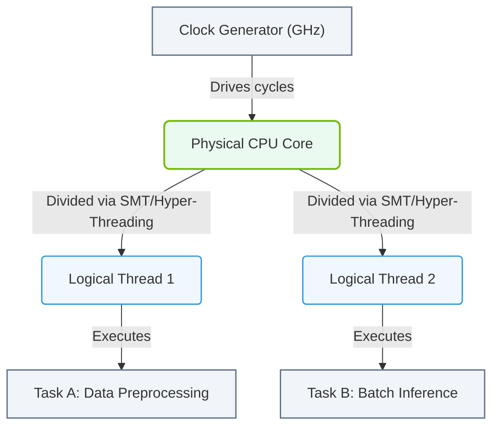

# 1.2a Cores, threads, and clock speed: understanding GHz and parallelism

  📦 Physical Realm
  📖 What Is a Computer? Core Architecture for Absolute Beginners

Welcome, new engineer! When you start working with AI infrastructure, you'll hear people talk about CPUs having "4 cores," "8 threads," or running at "3.5 GHz." These terms describe how fast and how much work a computer's brain (the CPU) can handle. Let's break them down simply.

---

## ⚙️ What Is a Core?

Think of a **core** as a single worker inside the CPU. Each worker can handle one task at a time.

- **Single-core CPU**: One worker. It does one thing, then the next.
- **Dual-core CPU**: Two workers. They can do two things at once.
- **Quad-core CPU**: Four workers. They can do four things at once.

For AI workloads, more cores mean the CPU can process more data simultaneously — like having more hands to carry boxes.

---

## 🧵 What Is a Thread?

A **thread** is a single sequence of instructions that the core can execute. Modern CPUs use a trick called **hyper-threading** (Intel) or **simultaneous multithreading** (AMD).

- **Without hyper-threading**: 1 core = 1 thread (one task at a time).
- **With hyper-threading**: 1 core = 2 threads (the core can juggle two tasks at once).

**Example**: A 4-core CPU with hyper-threading appears as **8 logical processors** to the operating system.

| CPU Type | Cores | Threads per Core | Total Threads |
|----------|-------|------------------|---------------|
| Basic laptop CPU | 2 | 1 | 2 |
| Standard desktop CPU | 4 | 2 | 8 |
| High-end server CPU | 16 | 2 | 32 |

> **For AI**: More threads help when running many small tasks in parallel, like data preprocessing or managing multiple model training runs.

---

## ⏱️ What Is Clock Speed (GHz)?

**Clock speed** is how fast each core can process instructions. It's measured in **gigahertz (GHz)**.

- **1 GHz** = 1 billion cycles per second.
- **3.5 GHz** = 3.5 billion cycles per second.

Think of it like a metronome: faster ticks mean the worker can do more actions per second.

### 🛠️ Key Points About GHz

- **Higher GHz = faster single-task performance**. Great for tasks that can't be split up (e.g., loading a single large file).
- **More cores = better multi-task performance**. Great for tasks that can be split (e.g., training multiple AI models at once).
- **Trade-off**: High clock speeds generate more heat. Servers often balance GHz with cooling needs.

---

## 🕵️ How Cores, Threads, and GHz Work Together

Imagine a factory:

- **Cores** = number of assembly lines.
- **Threads** = number of workers per assembly line.
- **Clock speed** = how fast each worker moves.

**Scenario A**: A 4-core CPU at 3.0 GHz with hyper-threading (8 threads) can handle 8 tasks at moderate speed.

**Scenario B**: A 2-core CPU at 4.5 GHz without hyper-threading (2 threads) handles 2 tasks very fast.

For AI infrastructure, you often want **more cores and threads** (Scenario A) because AI workloads involve lots of parallel math.

### 📊 Visual Representation: CPU Core and Thread Execution Model

This diagram illustrates how a clock generator drives a physical CPU core, which is split into logical threads to execute tasks like data preprocessing and batch inference in parallel.

---

## 📊 Comparison Table: Cores vs. GHz

| Feature | Best For | Example Use Case |
|---------|----------|------------------|
| High GHz (e.g., 5.0 GHz) | Single-threaded tasks | Loading a database, running a single model inference |
| Many cores (e.g., 32 cores) | Multi-threaded tasks | Training a neural network, processing large datasets |
| Many threads (e.g., 64 threads) | Highly parallel small tasks | Data augmentation, batch inference |

---

## 🧠 Real-World Example for AI Engineers

When you provision a server for AI training:

- **CPU with 16 cores, 32 threads, 2.5 GHz** is common.
- The **2.5 GHz** is modest (good for power efficiency).
- The **16 cores / 32 threads** allow you to run multiple data-loading workers in parallel while the GPU does the heavy math.

If you were running a single-threaded application (like a simple web server), a **4-core CPU at 4.0 GHz** might be better.

---

## ✅ Quick Recap

- **Cores** = number of physical workers.
- **Threads** = number of logical tasks each worker can handle.
- **GHz** = speed of each worker's movements.
- **Parallelism** = using multiple cores/threads to do work simultaneously.

As you grow in AI infrastructure, you'll learn to balance these three factors based on your workload. For now, remember: **more cores + more threads = better for parallel AI tasks**, while **higher GHz = better for quick, single tasks**.

---

*Next up: How memory (RAM) and storage work with the CPU to keep your AI workloads running smoothly.*