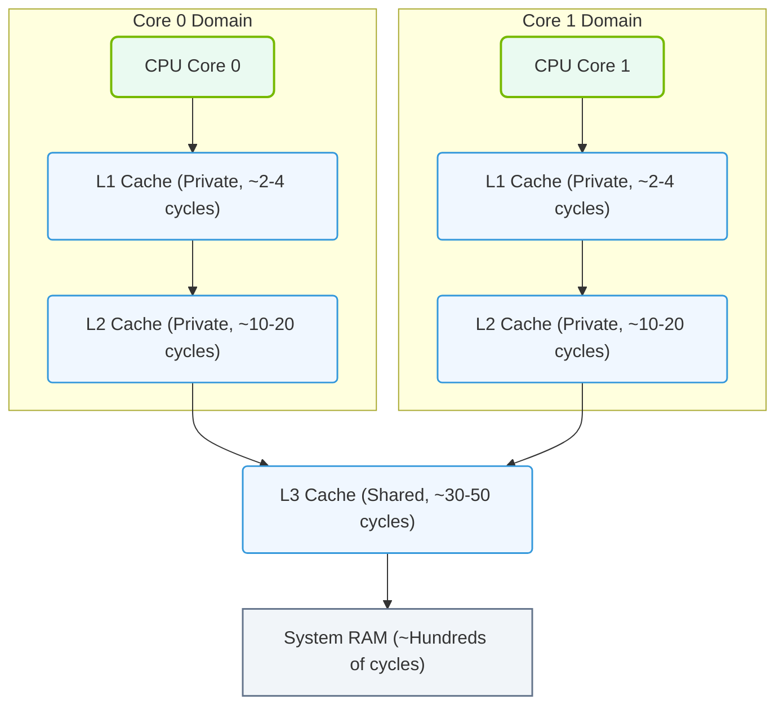

# 1.2b Cache hierarchy: L1, L2, L3 — why nearness to the core matters

  📦 Physical Realm
  📖 What Is a Computer? Core Architecture for Absolute Beginners

---

## 🧠 Context Introduction

Imagine you're working at a desk in a huge library. The books you need most often are right on your desk (L1 cache). Books you use less frequently are on a shelf a few steps away (L2 cache). Rarely used books are in a storage room down the hall (L3 cache). The main library stacks (main memory / RAM) are in another building entirely.

This is exactly how a modern CPU works. The **cache hierarchy** (L1, L2, L3) is a system of small, ultra-fast memory banks placed at different distances from the CPU core. The closer the cache is to the core, the faster the CPU can access the data — and speed is everything in computing.

---

## ⚙️ What Is Cache and Why Does It Exist?

- **Cache** is a small amount of very fast memory built directly into the CPU chip.
- Its purpose is to store copies of frequently used data and instructions from main memory (RAM).
- **Why it matters**: Accessing RAM takes hundreds of CPU cycles. Accessing L1 cache takes just a few cycles. This speed difference is the difference between a snappy application and a sluggish one.

---

## 📊 The Three Levels: L1, L2, L3

| Cache Level | Typical Size | Speed (Latency) | Location | Who Shares It |
|-------------|-------------|-----------------|----------|---------------|
| **L1** | 32–64 KB per core | ~2–4 CPU cycles | Inside each core | Private to one core |
| **L2** | 256–512 KB per core | ~10–20 cycles | Near each core (often on-die) | Private to one core (sometimes shared between two) |
| **L3** | 8–32 MB total | ~30–50 cycles | Shared across all cores on the chip | Shared by all cores in the CPU |

---

## 🕵️ Why Nearness to the Core Matters

The physical distance between the cache and the CPU core directly affects **latency** — the time it takes to fetch data.

- **L1 cache** sits right next to the core's execution units. Data travels less than a millimeter. This is why it's the fastest.
- **L2 cache** is slightly farther away, often on the same silicon die but not inside the core itself. It takes a few more cycles to reach.
- **L3 cache** is shared across all cores and sits even farther away. It's slower than L1 or L2, but still much faster than main memory (RAM).

**The golden rule**: Every millimeter of distance adds latency. Every cycle of latency slows down your application. Engineers design workloads to maximize "cache hits" (data found in L1) and minimize "cache misses" (data must be fetched from RAM).

### 📊 Visual Representation: CPU Cache Hierarchy and Latency Levels

This diagram visualizes the multi-level CPU cache hierarchy, showing how private L1 and L2 caches serve individual cores while a shared L3 cache acts as a buffer before main memory.

---

## 🛠️ How Engineers Use This Knowledge

- **Data locality**: Engineers write code that keeps data close together in memory so it stays in cache longer.
- **Thread affinity**: Engineers pin specific software threads to specific CPU cores so they reuse the same L1/L2 cache.
- **Cache-aware algorithms**: Some algorithms are designed to process data in blocks that fit entirely inside L1 or L2 cache.
- **Performance tuning**: When an application is slow, engineers check cache miss rates using tools like **perf** or **Intel VTune**.

---

## 🔍 Real-World Analogy

| Component | Analogy | Access Time |
|-----------|---------|-------------|
| L1 Cache | Your desk drawer | Instant |
| L2 Cache | A filing cabinet in your office | Very fast |
| L3 Cache | A shared cabinet in the hallway | Fast |
| RAM | The library across the street | Slow |
| Disk/SSD | A warehouse in another city | Extremely slow |

---

## ✅ Key Takeaways for New Engineers

- **L1 is fastest but smallest** — it holds only the most critical data for each core.
- **L2 is a middle ground** — bigger than L1, but still private to a core.
- **L3 is the largest cache** — shared by all cores, but slower than L1/L2.
- **Cache misses are expensive** — every time data isn't found in cache, the CPU must wait for RAM.
- **Understanding cache hierarchy helps you write faster code** — by keeping data access patterns predictable and localized.

---

## 📘 Summary

The cache hierarchy (L1 → L2 → L3 → RAM) is a speed-versus-size tradeoff. The closer the cache is to the CPU core, the faster the access. For engineers building or optimizing AI infrastructure, understanding this hierarchy is essential — because AI workloads (like training neural networks) are extremely data-intensive. Every cache miss can add milliseconds, and in AI training, those milliseconds multiply into hours of wasted time.

**Remember**: In computing, distance = delay. Cache is how we cheat physics to make CPUs faster.