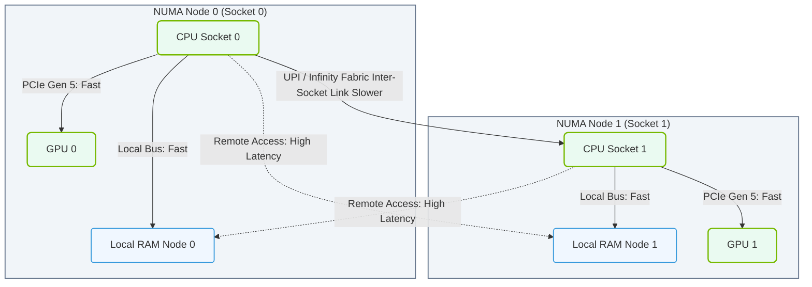

# 1.2d NUMA (Non-Uniform Memory Access): why socket locality matters for AI

<div class="lesson-completion" data-lesson-id="1_2d_numa_socket_locality_ai"></div>
<div class="lesson-tags">
  <span class="lesson-tag">📦 Physical Realm</span>
  <span class="lesson-tag">📖 What Is a Computer? Core Architecture for Absolute Beginners</span>
</div>


---

## 🧠 Context Introduction

Imagine you're working in a large office building with multiple floors. On each floor, there's a coffee machine. If you sit on floor 3, it's quick to walk to the coffee machine on floor 3. But if you walk to floor 1 for coffee, it takes much longer. That's exactly how **NUMA** works inside a modern server — and it matters a lot for AI workloads.

**NUMA** stands for **Non-Uniform Memory Access**. It describes how CPUs in a multi-socket server access memory. In a NUMA system, some memory is "close" to a CPU (fast access), and some memory is "far away" (slower access). This is different from older **UMA** (Uniform Memory Access) systems where all memory was equally fast for every CPU.

---

## ⚙️ What Is Socket Locality?

A **socket** is where a physical CPU chip sits on the motherboard. In modern servers, you often have 2 or 4 sockets. Each socket has its own **local memory** directly attached to it.

- **Local memory access**: The CPU reads/writes to memory on its own socket — very fast.
- **Remote memory access**: The CPU reads/writes to memory on another socket — slower because data must travel through interconnects (like Intel's UPI or AMD's Infinity Fabric).

**Socket locality** means keeping a CPU's data in its own local memory as much as possible.

---

## 📊 Why Socket Locality Matters for AI

AI workloads are **memory-hungry** and **data-intensive**. When training neural networks or running inference, the CPU (or GPU) constantly moves large amounts of data. If that data lives on a remote socket, performance drops significantly.

| Scenario | Local Memory Access | Remote Memory Access |
|----------|-------------------|---------------------|
| Latency | Very low (nanoseconds) | Higher (microseconds) |
| Bandwidth | Full memory bandwidth | Reduced bandwidth |
| AI Training Speed | Optimal | Slower by 20-40% |
| Power Efficiency | Better | Worse (more energy wasted) |

**Key takeaway**: For AI, you want your data and the processing unit on the **same socket** to avoid the "walk to another floor for coffee" problem.

---

## 🛠️ How NUMA Affects AI Workloads

Here's what happens in practice:

- **GPU placement**: When you attach GPUs to a server, each GPU is connected to a specific CPU socket. If your GPU is on socket 0, but your training data is allocated in memory on socket 1, every data transfer becomes slow.
- **Memory bandwidth saturation**: AI models often saturate memory bandwidth. Remote access reduces available bandwidth, creating a bottleneck.
- **Multi-GPU training**: In frameworks like NVIDIA NCCL, data must be transferred between GPUs. If GPUs are on different sockets, communication is slower.

**Real-world impact**: A 40% performance drop in AI training is common when NUMA is ignored.

### 📊 Visual Representation: NUMA Node Socket Locality and Interconnect

This diagram shows the dual-socket NUMA architecture where CPU Socket 0 and 1 access their respective local RAM and GPUs at high speed, while inter-socket requests suffer from higher latency over the UPI/Infinity Fabric link.




---

## 🕵️ Detecting NUMA Issues

Engineers can check NUMA topology using simple tools. Here's how to see your system's NUMA layout:

**For reference:**
```bash
numactl --hardware
```

📤 Output: Shows available NUMA nodes, their CPUs, and memory ranges. Example:
```
available: 2 nodes (0-1)
node 0 cpus: 0-7
node 0 size: 65536 MB
node 1 cpus: 8-15
node 1 size: 65536 MB
```

This tells you socket 0 has CPUs 0-7 with 64 GB local memory, and socket 1 has CPUs 8-15 with 64 GB local memory.

---

## 🧩 Best Practices for AI Engineers

To make AI workloads NUMA-aware:

- **Pin processes to a socket**: Use **numactl --cpunodebind=0 --membind=0** to force a process to use only socket 0's CPUs and memory.
- **Check GPU affinity**: In NVIDIA systems, use **nvidia-smi topo -m** to see which GPU is connected to which CPU socket.
- **Allocate memory locally**: When using frameworks like PyTorch or TensorFlow, ensure data loaders and model parameters are on the same NUMA node as the GPU.
- **Use NUMA-aware libraries**: NVIDIA's NCCL and CUDA are optimized for NUMA — but only if you configure them correctly.

**Simple rule**: Match your data, your CPU threads, and your GPU to the same socket.

---

## ✅ Summary

- **NUMA** means memory access speed depends on which socket the CPU and memory are on.
- **Socket locality** = keeping data close to the CPU that processes it.
- For AI workloads, ignoring NUMA can cause **20-40% performance loss**.
- Use **numactl** and **nvidia-smi** to check and control NUMA placement.
- Always pin AI processes to a specific socket for maximum performance.

Remember: In AI infrastructure, **where your data lives is just as important as how fast your hardware runs**.