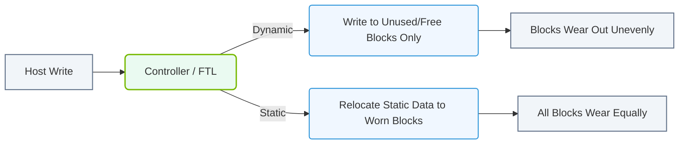

# 1.4b SSD internals: NAND Flash cells (SLC, MLC, TLC, QLC) and wear leveling

<div class="lesson-completion" data-lesson-id="1_4b_ssd_nand_flash_wear_leveling"></div>
<div class="lesson-tags">
  <span class="lesson-tag">📦 Physical Realm</span>
  <span class="lesson-tag">📖 What Is a Computer? Core Architecture for Absolute Beginners</span>
</div>


Welcome to the world of Solid-State Drives (SSDs). Unlike traditional hard drives that use spinning magnetic platters, SSDs store data using **NAND Flash memory**. Understanding how this memory works is key to grasping why SSDs are fast, why they wear out, and how engineers manage their lifespan. This guide breaks down the basics of NAND Flash cells and the critical process of wear leveling.

---

## 🧠 Context: Why This Matters for AI

In AI workloads, data is constantly being read and written. Training models involves loading massive datasets, saving checkpoints, and logging results. If your storage is slow or fails mid-training, you lose time and progress. NAND Flash technology determines an SSD's speed, endurance, and cost — all crucial factors when building or operating AI infrastructure.

---

## ⚙️ What is a NAND Flash Cell?

A NAND Flash cell is the smallest storage unit inside an SSD. Think of it as a tiny bucket that holds electrons. The number of electrons in the bucket determines whether the cell represents a **0** or a **1** (binary data).

- **Single-Level Cell (SLC):** Holds **1 bit** per cell (either 0 or 1).
- **Multi-Level Cell (MLC):** Holds **2 bits** per cell (00, 01, 10, or 11).
- **Triple-Level Cell (TLC):** Holds **3 bits** per cell.
- **Quad-Level Cell (QLC):** Holds **4 bits** per cell.

The more bits per cell, the more data you can store in the same physical space — but there's a trade-off.

---

## 📊 Comparison Table: SLC vs MLC vs TLC vs QLC

| Cell Type | Bits per Cell | Speed | Endurance (Writes) | Cost per GB | Best For |
|-----------|---------------|-------|--------------------|-------------|----------|
| **SLC** | 1 | Fastest | Highest (~100,000 cycles) | Most expensive | Enterprise caching, high-reliability systems |
| **MLC** | 2 | Fast | High (~10,000 cycles) | Moderate | High-performance workstations, servers |
| **TLC** | 3 | Moderate | Moderate (~3,000 cycles) | Affordable | Consumer SSDs, AI training scratch space |
| **QLC** | 4 | Slowest | Lowest (~1,000 cycles) | Cheapest | Archival storage, read-heavy workloads |

**Key Insight:** For AI training, TLC is a common sweet spot — it offers good capacity and reasonable endurance at a manageable cost. QLC is often used for storing large datasets that are read frequently but written rarely.

---

## 🕵️ How Does Wear Happen?

Every time you write data to a NAND Flash cell, the insulating layer around the cell degrades slightly. After enough write cycles, the cell can no longer reliably hold a charge. This is called **wear**.

- **Write amplification:** When the SSD writes more data internally than the host requested (due to garbage collection and other processes), it accelerates wear.
- **Cell wear is uneven:** Without management, some cells might be written to thousands of times while others sit idle. This would cause early failure of the drive.

---

## 🛠️ Wear Leveling: The Lifesaver

**Wear leveling** is a technique used by the SSD's controller to distribute write operations evenly across all memory cells. This prevents any single cell from wearing out prematurely.

### How It Works

- The SSD maintains a **map** that translates logical addresses (what the operating system sees) to physical addresses (where data is actually stored).
- When you overwrite a file, the SSD doesn't write to the same physical location. Instead, it writes the new data to a different, less-used cell and updates the map.
- The old cell is marked as "stale" and will be erased and reused later.

### Two Main Types of Wear Leveling

- **Dynamic wear leveling:** Only distributes writes across free (unused) blocks. Simpler but less effective over time.
- **Static wear leveling:** Also moves rarely-changed data (like operating system files) to different cells to ensure even wear across all cells. More complex but extends drive life significantly.

### 📊 Visual Representation: SSD Wear Leveling Mechanism
This diagram compares dynamic wear leveling (which cycles writes through free blocks) with static wear leveling (which actively relocates static data to optimize overall endurance).



---

## 🧪 Practical Takeaway for Engineers

When selecting SSDs for AI infrastructure:

- **For training data (heavy writes):** Use TLC or MLC drives with high endurance ratings.
- **For model storage (heavy reads, few writes):** QLC drives can save costs.
- **Always check the TBW (Total Bytes Written) rating** — this tells you how much data you can write to the drive before it's likely to fail.
- **Monitor drive health** using tools like **smartctl** (from the smartmontools package). Look for attributes like "Wear Leveling Count" or "Percentage Used."

For reference, a typical command to check SSD health:

```
smartctl -a /dev/nvme0n1
```

📤 **Output:** Look for lines like "Percentage Used" (0% = new, 100% = end of life) and "Available Spare" (should be 100% for a healthy drive).

---

## ✅ Summary

- **SLC, MLC, TLC, QLC** describe how many bits each NAND Flash cell stores — more bits = cheaper but slower and less durable.
- **Wear leveling** is the SSD's internal process to spread writes evenly, preventing early failure.
- For AI workloads, choose your SSD type based on the balance of speed, endurance, and cost that your specific task requires.

Understanding these fundamentals helps you make smarter decisions about storage in AI infrastructure — keeping your training runs fast and your data safe.