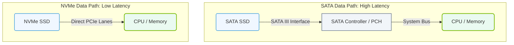

# 1.4c NVMe over PCIe: why NVMe is 5–7x faster than SATA SSDs for AI data pipelines

  📦 Physical Realm
  📖 What Is a Computer? Core Architecture for Absolute Beginners

---

## 🧠 Context Introduction

When you're building or operating AI data pipelines, the speed at which data moves from storage to the GPU or CPU is critical. Slow storage means your expensive GPUs sit idle waiting for data — a waste of time and money. This section explains why **NVMe (Non-Volatile Memory Express)** drives connected over **PCIe (Peripheral Component Interconnect Express)** are dramatically faster than older **SATA SSDs**, and why this matters for AI workloads.

---

## ⚙️ What is NVMe and PCIe?

- **NVMe** is a protocol designed specifically for flash-based storage (SSDs). It was built from the ground up to take advantage of the low latency and parallelism of modern NAND flash memory.
- **PCIe** is the high-speed serial expansion bus that connects components like GPUs, network cards, and NVMe drives directly to the CPU.
- Together, **NVMe over PCIe** allows the storage drive to communicate directly with the CPU using many parallel queues, instead of going through a slower controller.

---

## 🛠️ Why SATA SSDs Are Slower

- **SATA (Serial ATA)** was originally designed for mechanical hard disk drives (HDDs). It uses a single command queue and can only handle one read/write request at a time.
- SATA SSDs are limited by the SATA interface speed (typically 6 Gbps), which translates to a maximum throughput of about **550–600 MB/s**.
- The SATA protocol adds overhead because it was never optimized for flash memory — it was designed for spinning disks.

---

## 🚀 How NVMe over PCIe Achieves 5–7x Speed

| Feature | SATA SSD | NVMe over PCIe |
|---------|----------|----------------|
| Interface Speed | 6 Gbps (SATA III) | 32 Gbps (PCIe 3.0 x4) to 64 Gbps (PCIe 4.0 x4) |
| Max Sequential Read | ~550 MB/s | ~3,500–7,000 MB/s (depending on PCIe generation) |
| Command Queue Depth | 1 queue, 32 commands | Up to 64K queues, 64K commands per queue |
| Latency | ~100–200 microseconds | ~10–20 microseconds |
| Protocol Overhead | High (AHCI designed for HDDs) | Low (NVMe designed for flash) |

- **Parallelism**: NVMe can handle tens of thousands of simultaneous I/O requests, while SATA handles only a handful. This is critical for AI pipelines that read many small files (e.g., image datasets) concurrently.
- **Direct Connection**: NVMe drives connect directly to the PCIe lanes, bypassing the slower SATA controller and the motherboard's chipset.
- **Lower Latency**: Because NVMe eliminates the translation layers required by SATA, each read/write operation completes much faster.

### 📊 Visual Representation: Data Path Comparison — SATA vs. NVMe over PCIe
This diagram compares the data paths of SATA SSDs (which must pass through a SATA controller/PCH) and NVMe over PCIe SSDs (which connect directly to the CPU's PCIe lanes for lower latency).

---

## 📊 Why This Matters for AI Data Pipelines

- **Data Loading Bottleneck**: In AI training, the GPU processes data faster than a SATA SSD can feed it. NVMe reduces or eliminates this bottleneck.
- **Large File Handling**: AI models often read large files (e.g., checkpoint files, TFRecords, or HDF5 files). NVMe's sequential read speeds make this much faster.
- **Random I/O for Small Files**: Many AI datasets consist of thousands of small images or text files. NVMe's massive parallel queue depth handles random reads far better than SATA.
- **Mixed Workloads**: During training, you may read training data while writing logs, checkpoints, and validation results. NVMe handles this mixed I/O without slowing down.

---

## 🕵️ Real-World Impact for Engineers

- **Training Time Reduction**: Switching from SATA SSDs to NVMe can cut data loading time by 5–7x, directly reducing total training time.
- **GPU Utilization**: With NVMe, GPUs spend more time computing and less time waiting for data. This improves overall system efficiency.
- **Scalability**: In multi-GPU or multi-node setups, NVMe storage ensures that data pipelines don't become the bottleneck as you scale up.
- **Cost Efficiency**: While NVMe drives cost more per GB than SATA SSDs, the reduction in idle GPU time often justifies the investment for AI workloads.

---

## ✅ Key Takeaways

- **NVMe over PCIe** is 5–7x faster than SATA SSDs because of higher interface bandwidth, massive parallelism, lower latency, and a protocol designed for flash memory.
- For AI data pipelines, this speed difference directly translates to faster training, better GPU utilization, and more efficient use of compute resources.
- When selecting storage for AI infrastructure, prioritize NVMe drives connected via PCIe (Gen 3, 4, or 5) over SATA SSDs whenever possible.

---

*Next time you see an AI training job waiting on "data loading," remember — the storage interface might be the hidden bottleneck. NVMe over PCIe is the fix.*