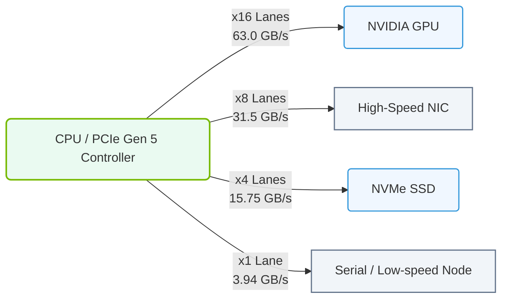

# 1.5b Lane widths: x1, x4, x8, x16 and bandwidth calculations per generation

  📦 Physical Realm
  📖 What Is a Computer? Core Architecture for Absolute Beginners

---

## 🧭 Context Introduction

Imagine a highway connecting a city (your CPU) to a factory (your GPU). The number of lanes on that highway determines how much traffic (data) can flow at once. In the world of AI servers, **PCIe (Peripheral Component Interconnect Express)** lanes are those highways. They connect your GPU, NVMe storage, and network cards to the CPU and memory.

For new engineers, understanding lane widths and bandwidth is critical because **AI workloads are data-hungry**. If your PCIe lanes are too narrow, your GPU will sit idle waiting for data — and that means slower training and inference.

---

## ⚙️ What Are PCIe Lanes?

- A **PCIe lane** is a single pair of wires (one for sending, one for receiving data).
- Lanes are grouped together to form wider connections: **x1, x4, x8, x16**.
- The "x" stands for the number of lanes in that slot or device.
- More lanes = more data can travel simultaneously.

**Key point:** A GPU typically uses **x16** lanes for maximum performance. A network card might use **x8**, and an NVMe SSD might use **x4**.

---

## 📊 Lane Widths Explained

| Lane Width | Number of Lanes | Typical Use Case |
|------------|-----------------|------------------|
| **x1** | 1 | Low-speed devices (Wi-Fi cards, sound cards) |
| **x4** | 4 | NVMe SSDs, some network cards |
| **x8** | 8 | High-end network cards, some RAID controllers |
| **x16** | 16 | **GPUs** — the most common for AI workloads |

**Visual analogy:** Think of x1 as a single-lane road, x4 as a 4-lane highway, x8 as an 8-lane freeway, and x16 as a 16-lane superhighway.

---

## 🛠️ Bandwidth Calculations Per Generation

PCIe has evolved through several generations. Each generation **doubles the data rate per lane**. Here's how to calculate the total bandwidth for any lane width:

**Formula:**  
**Total Bandwidth (GB/s)** = (Lane Width) × (Data Rate per Lane in GT/s) × (Encoding Efficiency)

- **GT/s** = Gigatransfers per second (billions of data transfers per second)
- **Encoding efficiency** accounts for overhead (e.g., 8/10 encoding in Gen 1/2, 128/130 in Gen 3+)

### 🚀 PCIe Generations at a Glance

| Generation | Data Rate per Lane | Encoding | Effective Data Rate per Lane | x1 Bandwidth | x4 Bandwidth | x8 Bandwidth | x16 Bandwidth |
|------------|-------------------|----------|-----------------------------|--------------|--------------|--------------|---------------|
| **Gen 1** | 2.5 GT/s | 8/10 (80%) | 0.25 GB/s | 0.25 GB/s | 1.0 GB/s | 2.0 GB/s | 4.0 GB/s |
| **Gen 2** | 5.0 GT/s | 8/10 (80%) | 0.5 GB/s | 0.5 GB/s | 2.0 GB/s | 4.0 GB/s | 8.0 GB/s |
| **Gen 3** | 8.0 GT/s | 128/130 (98.5%) | ~0.985 GB/s | ~0.985 GB/s | ~3.94 GB/s | ~7.88 GB/s | ~15.75 GB/s |
| **Gen 4** | 16.0 GT/s | 128/130 (98.5%) | ~1.969 GB/s | ~1.969 GB/s | ~7.88 GB/s | ~15.75 GB/s | ~31.5 GB/s |
| **Gen 5** | 32.0 GT/s | 128/130 (98.5%) | ~3.938 GB/s | ~3.938 GB/s | ~15.75 GB/s | ~31.5 GB/s | ~63.0 GB/s |

**How to read this table:**  
- A **Gen 4 x16** slot (typical for modern GPUs) provides **~31.5 GB/s** of bandwidth.
- A **Gen 3 x4** slot (common for NVMe SSDs) provides **~3.94 GB/s**.

### 📊 Visual Representation: PCIe Gen 5 Lane Allocation and Bandwidth Scaling
This diagram shows how a CPU's PCIe Gen 5 controller allocates different lane widths (x16, x8, x4) to system devices, showing the direct relationship between lane count and bandwidth.

---

## 🕵️ Why This Matters for AI

- **GPU-to-CPU communication:** When training a model, the GPU needs to load data from system memory. A Gen 4 x16 connection gives you 31.5 GB/s — enough for most workloads.
- **Multi-GPU setups:** If you connect multiple GPUs via PCIe switches, each GPU's lane width and generation determine how fast they can share data.
- **Storage bottlenecks:** If your NVMe drive is on a Gen 3 x4 slot (3.94 GB/s), but your GPU can handle 31.5 GB/s, the storage becomes the bottleneck.

**Real-world example:**  
An NVIDIA H100 GPU uses **PCIe Gen 5 x16**, giving it **63 GB/s** bandwidth to the CPU. If you accidentally plug it into a Gen 4 x8 slot, you'd only get **15.75 GB/s** — a 75% reduction in bandwidth.

---

## 🧮 Quick Calculation Practice

To calculate bandwidth for any combination:

**Step 1:** Find the data rate per lane for your generation (from the table above).  
**Step 2:** Multiply by the number of lanes (x1, x4, x8, x16).  
**Step 3:** The result is your total bandwidth in GB/s.

**Example:**  
- **Gen 4 x8:** 1.969 GB/s per lane × 8 lanes = **15.75 GB/s**  
- **Gen 5 x16:** 3.938 GB/s per lane × 16 lanes = **63.0 GB/s**

---

## ✅ Key Takeaways for New Engineers

- **Always check the PCIe generation and lane width** when installing GPUs, SSDs, or network cards.
- **x16 is the standard for GPUs** — never use less unless you're troubleshooting or have a very specific reason.
- **Bandwidth doubles every generation** — Gen 5 is 2x faster than Gen 4, which is 2x faster than Gen 3.
- **Mixing generations is possible** (e.g., a Gen 4 GPU in a Gen 3 slot), but it will run at the slower generation's speed.
- **Use the formula** to quickly estimate if your hardware is bottlenecked.

---

## 📚 Further Learning

- Check your motherboard or server manual for available PCIe slots and their lane configurations.
- Use system tools (like `lspci` on Linux) to see which devices are connected to which lanes.
- Remember: **Lane width + Generation = Total Bandwidth** — this is your starting point for understanding data flow in any AI server.