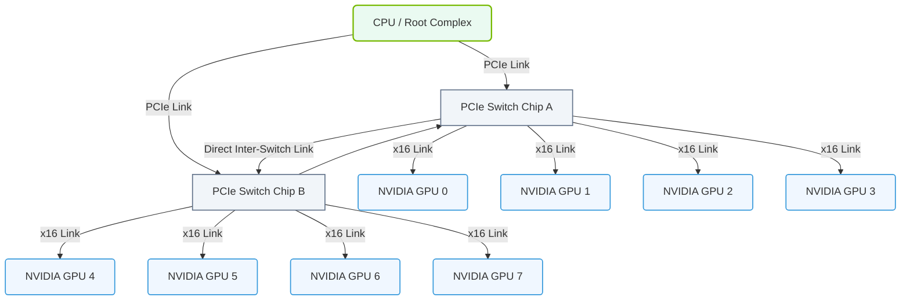

# 1.5c PCIe slots, risers, and switch chips: how multiple GPUs connect

  📦 Physical Realm
  📖 What Is a Computer? Core Architecture for Absolute Beginners

---

## 🧭 Context Introduction

When you start working with AI servers, you'll quickly notice they don't look like a typical desktop computer. Instead of one or two graphics cards, an AI server can hold **eight or more GPUs** working together. The secret to making this possible lies in three key components: **PCIe slots**, **risers**, and **switch chips**. Think of these as the highway system that lets GPUs talk to each other and to the CPU at incredible speeds.

---

## ⚙️ What Are PCIe Slots?

PCIe (Peripheral Component Interconnect Express) slots are the physical connectors on a motherboard where you plug in expansion cards like GPUs, network cards, or storage controllers.

**Key points about PCIe slots for AI:**

- Each slot has a certain number of **lanes** — think of lanes as data highways. Common sizes are **x1**, **x4**, **x8**, and **x16**.
- For AI workloads, GPUs almost always use **x16 slots** because they need maximum bandwidth.
- The **PCIe generation** (Gen 3, Gen 4, Gen 5) determines how fast each lane can transfer data. Gen 5 is roughly twice as fast as Gen 4.
- A single GPU in a x16 Gen 5 slot can transfer data at about **64 GB/s** in each direction.

**Why this matters for AI:** Training large AI models requires moving massive amounts of data between GPUs and memory. A faster PCIe connection means less waiting.

---

## 🛠️ Risers — The Space Savers

A standard motherboard only has a few PCIe slots. To fit 8 GPUs in a server, engineers use **riser cards** (often just called "risers").

**What risers do:**

- They **extend** the PCIe connection from the motherboard to a different physical location.
- They allow GPUs to be mounted **vertically** or **horizontally** in a server chassis, saving space.
- Risers can **split** a single x16 slot from the motherboard into multiple smaller slots (e.g., two x8 slots).

**Common riser configurations in AI servers:**

| Riser Type | Input from Motherboard | Output to GPUs | Use Case |
|------------|----------------------|----------------|----------|
| **1-to-1 riser** | 1 x16 slot | 1 x16 slot | Simple extension, no splitting |
| **1-to-2 riser** | 1 x16 slot | 2 x8 slots | Two GPUs sharing bandwidth |
| **1-to-4 riser** | 1 x16 slot | 4 x4 slots | Low-bandwidth devices (rare for GPUs) |

**Important note:** When a riser splits a x16 connection into two x8 connections, each GPU gets **half the bandwidth**. For most AI training, this is acceptable because the bottleneck is usually the GPU compute, not the PCIe link.

---

## 🔄 Switch Chips — The Traffic Directors

Switch chips are the most critical component for connecting multiple GPUs in a server. They act like a **smart network switch** but for PCIe traffic.

**How switch chips work:**

- A PCIe switch chip sits between the CPU and the GPUs.
- It has multiple **upstream ports** (connecting to the CPU) and multiple **downstream ports** (connecting to GPUs).
- The switch can **route data** between any connected devices without involving the CPU for every transaction.
- This allows **GPU-to-GPU communication** to happen directly and quickly.

**Why switch chips are essential for AI:**

- Without a switch, the CPU would have to manage all GPU-to-GPU traffic, creating a bottleneck.
- With a switch, GPUs can share data directly — critical for **distributed training** where each GPU works on a piece of the model.
- High-end AI servers use multiple switch chips to create a **full mesh** of connections.

---

## 🕵️ How Multiple GPUs Connect — A Real-World Example

Let's walk through how 8 GPUs connect in a typical NVIDIA DGX-style server:

**Step-by-step connection flow:**

1. **CPU** has a limited number of PCIe lanes (usually 64-128 on server CPUs).
2. **Root complex** in the CPU connects to **PCIe switch chips** (often 2-4 switches).
3. Each switch chip connects to **2-4 GPUs** via x16 links.
4. Switch chips also connect to **each other** for cross-switch GPU communication.
5. **Riser cards** physically mount the GPUs and carry the PCIe signals from the switch chips.

**The resulting topology looks like this:**

- CPU → Switch A → GPU 0, GPU 1, GPU 2, GPU 3
- CPU → Switch B → GPU 4, GPU 5, GPU 6, GPU 7
- Switch A ↔ Switch B (direct connection for cross-group traffic)

**Bandwidth summary for this setup:**

| Connection Type | Bandwidth (Gen 4 x16) |
|----------------|----------------------|
| GPU to local switch | 32 GB/s |
| Switch to CPU | 64 GB/s (aggregate) |
| Switch to switch | 64 GB/s |

### 📊 Visual Representation: Switched PCIe GPU Topology
This diagram shows how a CPU connects to multiple GPUs via PCIe switch chips, allowing fast, direct GPU-to-GPU communication that bypasses the CPU.

---

## 📊 Comparison: Direct vs. Switched GPU Connections

| Feature | Direct to CPU (Desktop) | Via Switch Chip (Server) |
|---------|------------------------|--------------------------|
| Max GPUs supported | 2-4 | 8-16 |
| GPU-to-GPU speed | Through CPU (slower) | Direct switch path (faster) |
| CPU involvement | High | Low |
| Cost | Lower | Higher |
| Typical use | Single GPU training | Multi-GPU distributed training |

---

## 🧪 How to Verify GPU Connections

When you're working with an AI server, you can check how GPUs are connected using simple tools.

**To see PCIe slot information:**

Use the command **lspci** with the **-vv** flag and filter for NVIDIA devices. The output will show the PCIe link speed and width for each GPU.

**To check GPU-to-GPU topology:**

Use the command **nvidia-smi topo -m**. This shows the connection type between each pair of GPUs. You'll see labels like:

- **NV** — NVLink connection (fastest, direct GPU-to-GPU)
- **PIX** — Connected via the same PCIe switch
- **PXB** — Connected via multiple PCIe switches
- **PHB** — Connected through different CPU sockets (slowest)

**Expected output example:**

The **nvidia-smi topo -m** command will display a matrix where each cell shows the connection type between two GPUs. A **PIX** connection means the GPUs share a switch and have low latency. A **PHB** connection means they are on different CPU sockets and have higher latency.

---

## ✅ Key Takeaways for New Engineers

- **PCIe slots** are the physical connectors — always look for **x16 Gen 4 or Gen 5** for GPUs.
- **Risers** let you fit many GPUs in a server by splitting or extending PCIe lanes.
- **Switch chips** are the unsung heroes — they enable fast, direct GPU-to-GPU communication.
- For AI training, **GPU-to-GPU bandwidth** is often more important than GPU-to-CPU bandwidth.
- Always check the **topology** of your server using **nvidia-smi topo -m** to understand how GPUs are connected.
- When troubleshooting slow training, look for **PHB** connections — they can be a bottleneck.

---

## 📚 Further Learning

- Read about **NVLink** — NVIDIA's proprietary high-speed GPU interconnect that bypasses PCIe entirely.
- Explore **PCIe bifurcation** — the ability to split a single PCIe slot into multiple smaller slots.
- Study **NUMA (Non-Uniform Memory Access)** — how CPU memory access affects GPU performance in multi-socket servers.

Remember: In AI infrastructure, **the connection between GPUs is just as important as the GPUs themselves**. Understanding PCIe slots, risers, and switch chips is your first step toward building and troubleshooting high-performance AI systems.