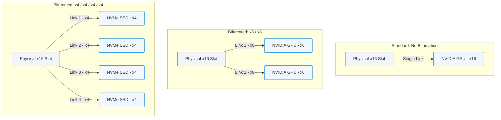

# 1.5d PCIe Bifurcation: Splitting One x16 Slot into Multiple x8 or x4 Links

  📦 Physical Realm
  📖 What Is a Computer? Core Architecture for Absolute Beginners

Welcome, new engineer! In the world of AI infrastructure, you'll quickly learn that PCIe (Peripheral Component Interconnect Express) slots are the highways connecting your server's CPU to high-performance devices like GPUs, NVMe storage, and network cards. But what happens when you need more devices than you have slots? That's where **PCIe bifurcation** comes in—a clever trick that lets you split one physical slot into multiple smaller, independent links.

---

## 🧠 What Is PCIe Bifurcation?

PCIe bifurcation (meaning "to split into two branches") is a feature supported by many server motherboards and CPUs. It allows a single **x16** physical slot (which normally provides 16 lanes of data) to be reconfigured into:

- **Two x8 links** (8 lanes each)
- **Four x4 links** (4 lanes each)

Think of it like taking a 16-lane highway and dividing it into two 8-lane roads or four 4-lane streets. Each new "road" operates independently, allowing you to connect multiple devices to what was once a single slot.

---

## ⚙️ Why Is This Important for AI Infrastructure?

AI workloads demand massive parallel processing. You often need multiple GPUs, high-speed storage, or network adapters in a single server. Bifurcation helps you:

- **Maximize slot usage** — Use one physical slot for two or four devices instead of leaving lanes unused.
- **Reduce server footprint** — Fit more accelerators into smaller chassis.
- **Enable flexible configurations** — Mix and match GPUs, NVMe drives, and network cards without needing a larger motherboard.

---

## 🛠️ Common Bifurcation Modes

Here are the typical configurations you'll encounter:

| Physical Slot Width | Bifurcation Mode | Resulting Links | Common Use Case |
|---------------------|------------------|-----------------|-----------------|
| x16 | None (x16) | 1 x16 link | Single high-end GPU |
| x16 | x8/x8 | 2 x8 links | Two mid-range GPUs or one GPU + one NVMe |
| x16 | x4/x4/x4/x4 | 4 x4 links | Four NVMe drives or four low-power network cards |
| x16 | x8/x4/x4 | 1 x8 + 2 x4 links | One GPU + two NVMe drives |

### 📊 Visual Representation: PCIe Bifurcation Modes
This diagram compares a standard non-bifurcated x16 slot with bifurcated configurations (x8/x8 and x4/x4/x4/x4), showing how physical traces are divided for separate devices.

---

## 🕵️ How Does Bifurcation Work Physically?

Bifurcation is handled at the **motherboard BIOS/UEFI level** and requires support from both the CPU and the chipset. Here's the flow:

1. **Physical slot** — A x16 slot has 16 electrical contacts (lanes) wired to the CPU or chipset.
2. **BIOS setting** — You enable bifurcation in the BIOS, selecting the desired mode (e.g., x8/x8 or x4/x4/x4/x4).
3. **Riser card or adapter** — You install a special **bifurcation riser card** that physically splits the slot's traces into multiple connectors.
4. **Devices connect** — Each connector now acts as an independent PCIe link (x8 or x4).

**Important:** Not all motherboards or CPUs support bifurcation. Always check your hardware documentation.

---

## 📊 Real-World Example: AI Server with 4 GPUs

Imagine you have a server with **two x16 slots** and want to install **four GPUs** (each requiring x8 lanes).

- **Without bifurcation** — You can only use two GPUs (one per slot).
- **With bifurcation** — Set each slot to **x8/x8** mode. Use a bifurcation riser card in each slot to connect two GPUs per slot. Now you have four GPUs running at x8 each.

**Result:** You doubled your GPU count without adding more physical slots.

---

## 🔍 Key Considerations for Engineers

- **Hardware compatibility** — Verify your CPU (e.g., Intel Xeon or AMD EPYC) and motherboard support bifurcation. Look for BIOS options like "PCIe Slot Bifurcation" or "Slot Configuration."
- **Riser card quality** — Use high-quality bifurcation risers that maintain signal integrity. Cheap risers can cause instability or data errors.
- **Power and cooling** — More devices mean more power draw and heat. Ensure your power supply and cooling system can handle the load.
- **BIOS updates** — Sometimes bifurcation support is added via firmware updates. Keep your BIOS current.
- **Operating system awareness** — The OS sees each bifurcated link as a separate PCIe device. No special drivers are needed, but you may need to configure device ordering.

---

## ✅ Quick Checklist for Setting Up Bifurcation

1. **Check hardware specs** — Confirm CPU and motherboard support bifurcation.
2. **Enter BIOS** — Reboot and access BIOS/UEFI settings.
3. **Find bifurcation settings** — Look under "Advanced," "PCI Subsystem," or "Slot Configuration."
4. **Select mode** — Choose the desired split (e.g., x8/x8 or x4/x4/x4/x4).
5. **Install riser card** — Physically install the bifurcation riser into the slot.
6. **Connect devices** — Attach your GPUs, NVMe drives, or network cards to the riser.
7. **Boot and verify** — Use the OS to confirm all devices are detected.

---

## 🧪 Testing Your Bifurcation Setup

After booting, verify your configuration using these methods:

- **Check device listing** — Run **lspci** (Linux) or **Device Manager** (Windows) to see all detected PCIe devices.
- **Verify link width** — Use **lspci -vv** (Linux) and look for "LnkSta" (Link Status) to confirm each device is running at the expected width (x8 or x4).
- **Monitor performance** — Run a bandwidth test (e.g., **nvidia-smi** for GPUs or **fio** for NVMe drives) to ensure full speed.

---

## 🚀 Final Thoughts

PCIe bifurcation is a powerful tool in your AI infrastructure toolkit. It lets you stretch your hardware budget, pack more acceleration into smaller spaces, and design flexible systems that adapt to evolving workloads. As you grow in your role, you'll encounter this concept frequently—especially when building GPU clusters or high-performance storage servers.

Remember: **Always verify compatibility first, and test thoroughly after configuration.** Happy building!