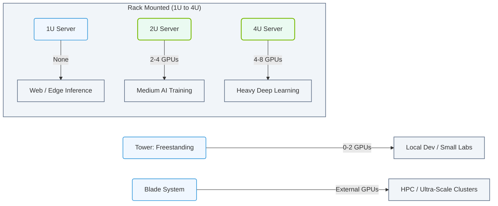

# 1.6a Server form factors: Tower, 1U, 2U, 4U, and blade systems

  📦 Physical Realm
  📖 What Is a Computer? Core Architecture for Absolute Beginners

---

## 🌱 Context Introduction

When you think of a computer, you probably picture a desktop tower sitting under a desk. In the world of AI and enterprise computing, servers look very different. The physical shape and size of a server — called its **form factor** — determines where it can live, how much power it consumes, how much heat it generates, and what kind of workloads it can handle.

For new engineers stepping into AI infrastructure, understanding server form factors is like learning the different types of vehicles: a compact car (tower), a sedan (1U), an SUV (2U), a truck (4U), and a train car (blade). Each has a specific purpose, and choosing the wrong one can lead to wasted space, poor cooling, or insufficient performance.

This guide will walk you through the five most common server form factors you'll encounter in data centers and AI labs.

---

## 🏢 Tower Servers — The Standalone Workhorse

**Tower servers** look like a traditional desktop PC but are built with enterprise-grade components. They stand upright on the floor or on a desk.

### Key Characteristics:
- **Size**: Similar to a mini-fridge or large desktop tower
- **Mounting**: Freestanding (no rack required)
- **Typical use**: Small offices, development labs, edge deployments
- **Cooling**: Internal fans, room air

### When to use a tower server:
- You have only 1–2 servers and no rack cabinet
- You need a quiet environment (e.g., office or lab)
- You want easy access to internal components for upgrades
- You're prototyping an AI model before scaling to a cluster

### Limitations:
- Takes up floor space inefficiently
- Harder to cable manage
- Not designed for high-density deployments

---

## 📏 Rack-Mounted Servers — 1U, 2U, and 4U

Most enterprise data centers use **rack-mounted servers**. These are designed to slide into a standardized metal frame called a **server rack**. The rack's height is measured in **rack units (U)**, where **1U = 1.75 inches (44.45 mm)**.

### 🟢 1U Servers — The Space Saver

**1U servers** are the thinnest standard rack servers. They are designed for maximum density — you can pack many of them into a single rack.

| Feature | Detail |
|---------|--------|
| **Height** | 1.75 inches |
| **Typical CPUs** | 1–2 processors |
| **RAM capacity** | Moderate (e.g., 256–512 GB) |
| **Storage bays** | 2–4 drives (2.5-inch or 3.5-inch) |
| **Cooling** | High-speed, noisy fans |
| **Best for** | Web servers, load balancers, lightweight compute nodes |

**Pros:**
- Highest density per rack (up to 42 units in a standard 42U rack)
- Lower power consumption per server
- Good for horizontal scaling (many small servers)

**Cons:**
- Limited expansion slots (PCIe cards)
- Restricted airflow — components run hotter
- Difficult to service (tight spaces)

### 🟡 2U Servers — The Balanced Performer

**2U servers** are twice as tall as 1U servers. They offer a sweet spot between density and capability.

| Feature | Detail |
|---------|--------|
| **Height** | 3.5 inches |
| **Typical CPUs** | 2 processors |
| **RAM capacity** | High (e.g., 512 GB – 2 TB) |
| **Storage bays** | 8–16 drives |
| **Cooling** | Better airflow, quieter than 1U |
| **Best for** | AI training nodes, database servers, virtualization hosts |

**Pros:**
- More room for GPU accelerators (e.g., NVIDIA A100, H100)
- Better thermal management
- More storage and memory options
- Easier to cable and maintain

**Cons:**
- Lower density than 1U (half the servers per rack)
- Heavier — may require two people to install

### 🔴 4U Servers — The Heavy Lifter

**4U servers** are the largest standard rack-mounted servers. They are built for extreme performance.

| Feature | Detail |
|---------|--------|
| **Height** | 7 inches |
| **Typical CPUs** | 2–4 processors |
| **RAM capacity** | Very high (e.g., 2–8 TB) |
| **Storage bays** | 24+ drives |
| **GPU support** | 4–8 full-size GPUs (e.g., NVIDIA HGX platforms) |
| **Cooling** | Large fans, liquid cooling options |
| **Best for** | Deep learning training, high-performance computing (HPC), large databases |

**Pros:**
- Maximum compute and memory per server
- Supports multiple high-power GPUs
- Excellent airflow and cooling
- Room for many expansion cards

**Cons:**
- Very heavy (50–100+ lbs)
- High power consumption (1000–3000+ watts)
- Low density (only ~10 units per rack)

---

## 🗡️ Blade Systems — The Ultra-Dense Solution

**Blade systems** take density to the extreme. Instead of individual servers, you have a **blade chassis** (a large enclosure) that holds many **blade servers** — thin, modular computer boards that slide in vertically.

### How blade systems work:
- **Chassis**: A shared enclosure that provides power, cooling, networking, and management
- **Blades**: Individual server modules (each about 0.5–1U thick, but stacked horizontally)
- **Shared resources**: Power supplies, fans, switches, and management controllers are shared across all blades

| Feature | Detail |
|---------|--------|
| **Density** | 8–16 blades per chassis (4–8U tall) |
| **Typical CPUs per blade** | 1–2 processors |
| **RAM per blade** | Moderate (e.g., 128–512 GB) |
| **Storage** | Usually 2–4 small drives per blade |
| **Cooling** | Shared high-velocity fans in chassis |
| **Best for** | Large-scale virtualization, HPC clusters, dense web farms |

### Pros:
- **Highest density** — hundreds of servers in a single rack
- **Simplified cabling** — all networking goes through the chassis backplane
- **Centralized management** — one interface for all blades
- **Hot-swappable** — replace blades without powering down the chassis

### Cons:
- **Vendor lock-in** — blades only work with their specific chassis (e.g., Dell, HPE, Cisco)
- **Higher upfront cost** — chassis is expensive
- **Single point of failure** — if the chassis fails, all blades go down
- **Limited expansion** — blades have no room for PCIe cards or GPUs

---

## 📊 Comparison Table — At a Glance

| Form Factor | Height | Typical CPUs | GPU Support | Density | Best Use Case |
|-------------|--------|--------------|-------------|---------|---------------|
| **Tower** | Freestanding | 1–2 | 1–2 | Very low | Small office, dev lab |
| **1U** | 1.75 in | 1–2 | None or low-power | Very high | Web servers, edge nodes |
| **2U** | 3.5 in | 2 | 2–4 | High | AI training, databases |
| **4U** | 7 in | 2–4 | 4–8 | Low | Deep learning, HPC |
| **Blade** | Chassis-based | 1–2 per blade | Rare | Extremely high | Large-scale virtualization |

---

## 🧠 How to Choose — A Simple Decision Flow

1. **Do you have a server rack?**
   - No → Use a **tower** server
   - Yes → Go to step 2

2. **Do you need GPUs for AI workloads?**
   - No → Consider **1U** (density) or **blade** (ultra-density)
   - Yes → Go to step 3

3. **How many GPUs per server?**
   - 1–2 GPUs → **2U** server
   - 4–8 GPUs → **4U** server
   - Need hundreds of GPUs → **Blade** system (with external GPU enclosures)

4. **What about power and cooling?**
   - Limited power/cooling → **Tower** or **1U** (lower wattage)
   - Good power/cooling → **2U** or **4U** (higher performance)
   - Best infrastructure → **Blade** system (shared resources)

### 📊 Visual Representation: Server Form Factor Selection Decision Flowchart
This flowchart guides engineers in choosing the appropriate server form factor based on their rack availability, GPU requirements, and GPU count.

---

## 🔍 Real-World Examples for AI Engineers

| Scenario | Recommended Form Factor | Why |
|----------|------------------------|-----|
| Training a small model on your desk | **Tower** with a single GPU | Quiet, easy to access, no rack needed |
| Running inference on 50 web servers | **1U** servers | Maximize servers per rack, low cost |
| Training a medium model (e.g., BERT) | **2U** server with 4 GPUs | Good balance of GPU count and cooling |
| Training a large model (e.g., GPT) | **4U** server with 8 GPUs | Maximum GPU density per server |
| Running 100 virtual machines | **Blade** system | High density, shared management |

---

## 🚀 Key Takeaway for New Engineers

- **Form factor is not just about size** — it affects power, cooling, density, and what hardware you can install.
- **1U = density, 4U = power, blade = scale**.
- For AI workloads, **2U and 4U** are the most common because they can accommodate NVIDIA GPUs.
- Always check your data center's **rack depth, power capacity, and cooling** before choosing a form factor.

As you grow in your role, you'll learn to match form factors to specific AI workloads. Start by recognizing the physical differences — soon you'll be able to walk into a data center and know exactly what each server is doing just by looking at its shape.