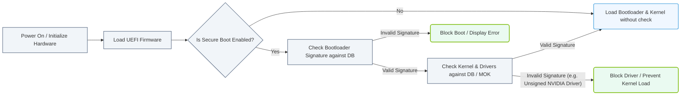

# 1.6e BIOS vs UEFI: firmware differences and Secure Boot implications for Linux

<div class="lesson-completion" data-lesson-id="1_6e_bios_vs_uefi"></div>
<div class="lesson-tags">
  <span class="lesson-tag">📦 Physical Realm</span>
  <span class="lesson-tag">📖 What Is a Computer? Core Architecture for Absolute Beginners</span>
</div>


When you press the power button on a server, the very first software that runs is not the operating system — it's the **firmware**. This firmware initializes hardware components and hands control over to the bootloader, which then loads the OS. For decades, the standard was **BIOS** (Basic Input/Output System). Today, most modern servers use **UEFI** (Unified Extensible Firmware Interface). Understanding the difference between these two is critical for engineers working with Linux deployments, especially when **Secure Boot** is involved.

---

## ⚙️ What is BIOS?

- **BIOS** stands for Basic Input/Output System.
- It is the older, legacy firmware standard dating back to the early 1980s.
- BIOS runs in **16-bit real mode**, which limits its capabilities.
- It reads the **Master Boot Record (MBR)** from the first sector of the boot drive.
- MBR supports drives up to **2 TB** and only **4 primary partitions**.
- BIOS initialization is relatively slow because it performs hardware checks sequentially.

---

## 🛠️ What is UEFI?

- **UEFI** stands for Unified Extensible Firmware Interface.
- It is the modern replacement for BIOS, designed to overcome BIOS limitations.
- UEFI runs in **32-bit or 64-bit mode**, enabling faster and more flexible operations.
- It reads the **GUID Partition Table (GPT)** instead of MBR.
- GPT supports drives larger than **2 TB** and up to **128 partitions**.
- UEFI can boot from drives formatted with GPT without needing a separate boot partition.
- It supports a graphical interface and network booting natively.

---

## 📊 BIOS vs UEFI — Quick Comparison Table

| Feature | BIOS | UEFI |
|---------|------|------|
| **Boot Mode** | 16-bit real mode | 32-bit or 64-bit protected mode |
| **Partition Scheme** | MBR (Master Boot Record) | GPT (GUID Partition Table) |
| **Max Disk Size** | 2 TB | 9.4 ZB (effectively unlimited) |
| **Max Partitions** | 4 primary | 128 |
| **Boot Speed** | Slower (sequential checks) | Faster (parallel initialization) |
| **User Interface** | Text-based, keyboard-only | Graphical, mouse-supported |
| **Network Boot** | Limited (PXE via BIOS) | Native (HTTP, iSCSI, PXE) |
| **Secure Boot** | Not supported | Supported (UEFI Secure Boot) |
| **Backward Compatibility** | N/A | Can emulate BIOS (CSM mode) |

---

## 🕵️ Secure Boot — What It Is and Why It Matters for Linux

- **Secure Boot** is a UEFI feature that prevents unauthorized code from running during the boot process.
- It works by checking digital signatures on bootloaders, drivers, and OS kernels against a database of trusted keys stored in the firmware.
- If a component is not signed by a trusted key, Secure Boot blocks it from loading.
- This protects against **bootkits** and **rootkits** that try to load malicious code before the OS starts.

### 🔐 Secure Boot Implications for Linux

- Most major Linux distributions (Ubuntu, Fedora, RHEL, SUSE) are **signed and compatible** with Secure Boot.
- When Secure Boot is enabled, the Linux bootloader (like GRUB) must be signed by a key recognized by the firmware.
- If you compile a custom kernel or use unsigned kernel modules (like NVIDIA proprietary drivers), Secure Boot may prevent them from loading.
- You have three options:
  - **Disable Secure Boot** in UEFI settings (simplest, but reduces security).
  - **Enroll your own keys** (MOK — Machine Owner Key) to sign custom kernels and modules.
  - **Use a signed bootloader** and only load signed modules.

### 📊 Visual Representation: UEFI Secure Boot Verification Chain
This flowchart depicts the step-by-step cryptographic validation process performed by UEFI Secure Boot when loading bootloaders, OS kernels, and device drivers.



---

## 🧩 How to Check Which Firmware Your Linux System Uses

To determine whether your system is booting in BIOS or UEFI mode, you can check the following:

- Look for the directory **/sys/firmware/efi**. If it exists, the system booted in UEFI mode.
- If that directory is missing, the system is using legacy BIOS.

For reference:
```
ls /sys/firmware/efi
```
📤 Output: If the command returns a list of files and directories, you are in UEFI mode. If it returns "No such file or directory," you are in BIOS mode.

---

## 🔄 Switching Between BIOS and UEFI

- Most modern servers support both modes, but you must choose one during OS installation.
- Switching after installation is **not trivial** — it often requires reinstalling the OS or converting the partition table from MBR to GPT (or vice versa).
- In server environments, **UEFI is strongly recommended** for its security features (Secure Boot) and support for large drives.

---

## ✅ Key Takeaways for New Engineers

- **BIOS is legacy** — limited to 2 TB drives and MBR partitioning.
- **UEFI is modern** — supports large drives, GPT, faster boot, and Secure Boot.
- **Secure Boot** adds a layer of security by verifying boot components, but may require extra steps for custom Linux kernels or unsigned drivers.
- Always check **/sys/firmware/efi** to confirm your boot mode.
- For new server deployments, choose **UEFI with Secure Boot enabled** unless you have a specific reason to use legacy BIOS.

---

## 📚 Summary

Understanding the difference between BIOS and UEFI is foundational for any engineer working with Linux servers. UEFI is not just an upgrade — it is a fundamentally different architecture that enables better security, larger storage support, and faster boot times. Secure Boot, while sometimes a hurdle for custom builds, is a valuable security feature that protects the boot chain from tampering. As you build and manage AI infrastructure, knowing how firmware choices affect your Linux deployments will save you time and prevent boot-time surprises.