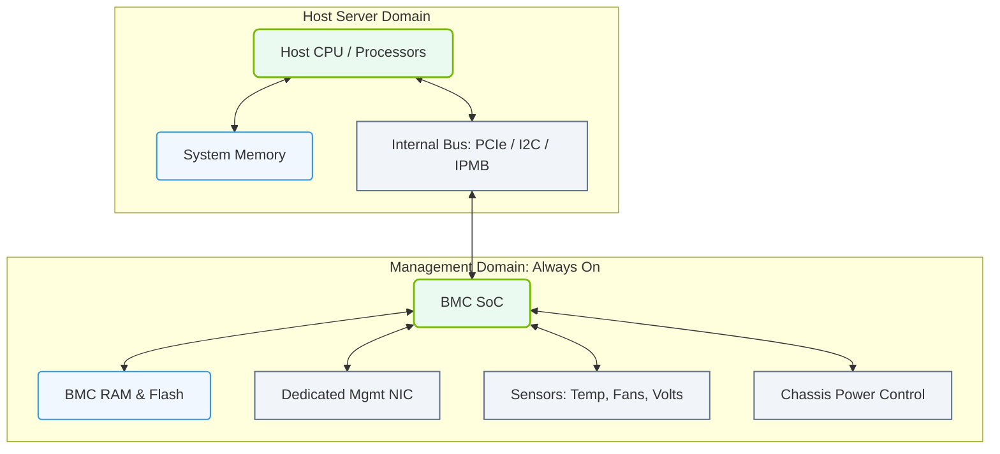

# 1.7a Baseboard Management Controller (BMC): the always-on embedded controller

  📦 Physical Realm
  📖 What Is a Computer? Core Architecture for Absolute Beginners

---

## 🔍 Context Introduction

Imagine you are responsible for a server that is hundreds of miles away in a data center. The server has crashed — the operating system is frozen, and you cannot log in remotely. Without a special tool, you would need to drive to the data center, connect a monitor and keyboard, and troubleshoot physically. This is where the **Baseboard Management Controller (BMC)** comes to the rescue.

The BMC is a **small, independent computer embedded on the server's motherboard**. It runs its own firmware, has its own network connection, and stays powered on **even when the main server is turned off or crashed**. This allows engineers to manage servers remotely — a capability called **out-of-band management**.

---

## ⚙️ What Does a BMC Do?

The BMC acts like a "digital remote control" for the physical server. Key capabilities include:

- **Power control** — Turn the server on, off, or perform a hard reset remotely
- **Console access** — View the server's screen and use keyboard/mouse as if you were physically present (via KVM — Keyboard, Video, Mouse)
- **Health monitoring** — Track temperatures, fan speeds, voltage levels, and power consumption
- **Event logging** — Record hardware errors, warnings, and system events in a persistent log
- **Firmware updates** — Update the server's BIOS, network cards, or storage controllers without booting the OS
- **Remote media mounting** — Attach an ISO file (like an operating system installer) as if it were a physical CD/DVD inserted into the server

---

## 🛠️ How Does a BMC Work?

The BMC is a **system-on-chip (SoC)** with its own:
- **CPU** — Usually an ARM or low-power x86 processor
- **Memory** — Dedicated RAM for its firmware and logs
- **Network interface** — A separate Ethernet port (often labeled "iLO," "iDRAC," "BMC," or "Mgmt")
- **Sensors** — Connected to temperature diodes, voltage regulators, and fan tachometers

The BMC communicates with the main server via a **dedicated internal bus** (like PCIe or I2C). It can read sensor data and send power control signals **without involving the main CPU or operating system**.

### 📊 Visual Representation: Out-of-Band BMC Architecture
This block diagram illustrates how the Baseboard Management Controller (BMC) operates as an independent system-on-chip (SoC) with its own resources, isolated from the host CPU and OS.

---

## 📊 BMC vs. In-Band Management

| Feature | BMC (Out-of-Band) | In-Band Management |
|---------|-------------------|-------------------|
| Requires OS to be running | ❌ No | ✅ Yes |
| Works when server is powered off | ✅ Yes | ❌ No |
| Uses separate network port | ✅ Yes | ❌ No (shares main NIC) |
| Can reset or power cycle server | ✅ Yes | ❌ No (if OS is hung) |
| Provides console access | ✅ Yes (KVM) | ✅ Yes (SSH/RDP) |
| Security risk | Lower (isolated network) | Higher (exposed on main network) |

---

## 🕵️ Common BMC Implementations

Different server vendors have their own branded BMC solutions:

- **iLO (Integrated Lights-Out)** — Hewlett Packard Enterprise (HPE) servers
- **iDRAC (Integrated Dell Remote Access Controller)** — Dell PowerEdge servers
- **BMC (Baseboard Management Controller)** — Generic term used on Supermicro and white-box servers
- **IPMI (Intelligent Platform Management Interface)** — An industry-standard protocol that BMCs use for communication

---

## 🔐 Security Considerations

Since the BMC has **full control over the server hardware**, it is a critical security component:

- **Always change the default password** — Factory credentials are widely known
- **Use a dedicated management network** — Isolate BMC traffic from production data
- **Disable unused protocols** — Turn off Telnet, HTTP, or other insecure services
- **Keep firmware updated** — BMC firmware can have security vulnerabilities
- **Use strong encryption** — Enable HTTPS, SSH, and secure KVM sessions

---

## ✅ Key Takeaways for New Engineers

- The BMC is a **separate computer inside your server** that runs independently of the main operating system
- It provides **"lights-out" management** — you can control the server even if it is completely frozen
- The BMC has its own **IP address and network port** — never connect it to the same network as your production traffic
- **IPMI** is the standard protocol used to communicate with BMCs (commands like **ipmitool** are common tools)
- Always **secure your BMC** — it is a powerful attack surface if left unprotected

---

## 📝 Quick Reference

| Term | Meaning |
|------|---------|
| BMC | Baseboard Management Controller — the embedded management chip |
| OOB | Out-of-Band — management that does not depend on the main OS |
| IPMI | Intelligent Platform Management Interface — protocol for BMC communication |
| KVM | Keyboard, Video, Mouse — remote console access |
| SOL | Serial Over LAN — text-based console access via network |
| SEL | System Event Log — hardware error log stored on BMC |

---

*The BMC is your best friend when a server goes down. Learn to use it, secure it, and you will save hours of physical travel to the data center.*