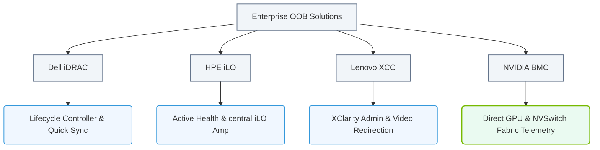

# 1.7d Vendor implementations: iDRAC (Dell), iLO (HPE), XCC (Lenovo), NVIDIA BMC

  📦 Physical Realm
  📖 What Is a Computer? Core Architecture for Absolute Beginners

---

## 🌐 Context Introduction

When you work with servers in a data center, you won't always be sitting right next to them. Sometimes they are in a different room, a different building, or even a different country. To manage these servers remotely, every major hardware vendor provides an **out-of-band management** solution. This is a special, independent computer built into the server motherboard that runs its own operating system and has its own network connection. It allows you to power cycle the server, check hardware health, install an operating system, or access the console — even if the main server is turned off or crashed.

For the NVIDIA-Certified Associate: AI Infrastructure and Operations exam, you need to know the four major implementations: **Dell iDRAC**, **HPE iLO**, **Lenovo XCC**, and **NVIDIA BMC**. Each does the same job, but with slightly different names, interfaces, and features.

---

## ⚙️ What is Out-of-Band Management?

- **Out-of-band (OOB)** means the management traffic uses a separate network path from the data traffic.
- The management controller has its own CPU, memory, and network interface.
- It is powered by the server's standby power, so it works even when the main server is off.
- Common capabilities:
  - Power on, off, or reset the server.
  - View hardware health (temperature, fan speed, voltage).
  - Access a virtual keyboard, video, and mouse (KVM) console.
  - Mount virtual media (ISO files) to install an OS.
  - View system event logs.
  - Update firmware.

---

## 🛠️ Vendor Implementation Overview

Each vendor calls their management controller by a different name, but the underlying concept is identical. Below is a quick reference.

| Vendor | Management Controller | Common Name | Web Interface Default Port |
|--------|----------------------|-------------|----------------------------|
| Dell   | Integrated Dell Remote Access Controller | **iDRAC** | 443 (HTTPS) |
| HPE    | Integrated Lights-Out | **iLO** | 443 (HTTPS) |
| Lenovo | Lenovo XClarity Controller | **XCC** | 443 (HTTPS) |
| NVIDIA | NVIDIA Baseboard Management Controller | **NVIDIA BMC** | 443 (HTTPS) |

### 📊 Visual Representation: Vendor BMC Implementation Features
This diagram outlines the major enterprise hardware vendors, their proprietary out-of-band management controllers, and their primary focus areas.

---

## 🖥️ Dell iDRAC (Integrated Dell Remote Access Controller)

- Found in Dell PowerEdge servers.
- **iDRAC** is the most widely deployed OOB controller in enterprise data centers.
- Key features:
  - **iDRAC Direct**: A dedicated USB port on the front of the server for direct laptop connection.
  - **Lifecycle Controller**: A GUI-based tool for firmware updates, OS deployment, and hardware configuration.
  - **Quick Sync 2**: Use a mobile app to configure iDRAC via NFC or Bluetooth.
- Licensing tiers:
  - **iDRAC Basic**: Included with every server (limited features).
  - **iDRAC Express**: Adds virtual console and virtual media.
  - **iDRAC Enterprise**: Full features including remote file share, dedicated NIC, and single sign-on.
- Default IP assignment: DHCP, but you can set a static IP via the front LCD panel or BIOS.

---

## 💡 HPE iLO (Integrated Lights-Out)

- Found in HPE ProLiant servers.
- **iLO** is known for its clean web interface and strong security features.
- Key features:
  - **iLO Amplifier Pack**: A centralized tool to manage multiple iLO controllers across your fleet.
  - **Active Health System**: Continuously monitors server health and logs data for proactive support.
  - **RESTful API**: Allows programmatic management (useful for automation).
- Licensing tiers:
  - **iLO Standard**: Included with every server (basic health monitoring and remote power).
  - **iLO Advanced**: Adds remote console, virtual media, and power management.
  - **iLO Scale-Out**: For large deployments, adds REST API and directory services.
- Default IP assignment: DHCP, or you can configure it during initial server setup via the **Intelligent Provisioning** tool.

---

## 🏢 Lenovo XCC (XClarity Controller)

- Found in Lenovo ThinkSystem servers.
- **XCC** is Lenovo's modern replacement for the older IMM (Integrated Management Module).
- Key features:
  - **Lenovo XClarity Administrator**: A centralized management platform for multiple servers.
  - **XClarity Mobile**: Mobile app for quick status checks.
  - **Video redirection**: Supports high-resolution remote console (up to 1920x1200).
  - **Hardware inventory**: Detailed component-level information (memory, storage, network).
- Licensing:
  - **XCC Standard**: Included with every server (basic features).
  - **XCC Enterprise**: Adds remote console, virtual media, and advanced power capping.
- Default IP assignment: DHCP, or you can set it via the **ThinkSystem System Manager** during boot.

---

## 🧠 NVIDIA BMC (Baseboard Management Controller)

- Found in NVIDIA DGX systems, HGX baseboards, and NVIDIA-Certified Systems.
- **NVIDIA BMC** is specifically designed for AI and GPU-accelerated workloads.
- Key features:
  - **GPU health monitoring**: Direct access to GPU temperature, power draw, memory usage, and error counts.
  - **NVSwitch monitoring**: For systems with NVLink switches, the BMC reports switch fabric health.
  - **Firmware update**: Supports updating GPU firmware (VBIOS) and system firmware.
  - **Power capping**: Can limit total system power to stay within data center power budgets.
- Licensing:
  - **NVIDIA BMC** is included with all NVIDIA enterprise systems. No additional licensing tiers.
- Default IP assignment: DHCP, or configured via the **NVIDIA System Management Interface (nvidia-smi)** or the front panel display on DGX systems.
- Unique capability: The BMC can report **GPU memory errors** (correctable and uncorrectable) directly to the system log, which is critical for AI training reliability.

---

## 🕵️ Common Tasks You Can Perform on Any BMC

Regardless of the vendor, you will use these tasks daily:

- **Power operations**: Turn server on/off, perform a hard reset, or schedule a power cycle.
- **Remote console**: Open a virtual KVM session to see the server's screen and use the keyboard/mouse.
- **Mount virtual media**: Upload an ISO file (e.g., Ubuntu Server, NVIDIA CUDA toolkit installer) and boot from it.
- **View hardware health**: Check CPU temperature, fan speeds, power supply status, and disk health.
- **View system logs**: Look at the System Event Log (SEL) for hardware errors or warnings.
- **Update firmware**: Upload firmware files (e.g., BIOS, BMC itself, network card firmware) and apply them.

---

## 🔐 Security Best Practices for All BMCs

- **Change the default password immediately**. Default credentials are widely known (e.g., root/calvin for iDRAC, Administrator/password for iLO).
- **Use a dedicated management network**. Do not connect the BMC to your production data network.
- **Enable HTTPS only**. Disable HTTP and other unencrypted protocols.
- **Use certificate-based authentication** if available (e.g., iDRAC supports Active Directory integration).
- **Keep firmware up to date**. Vendors release security patches regularly.
- **Disable unused services** (e.g., SNMP, IPMI over LAN if not needed).

---

## 📊 Quick Comparison Table

| Feature | Dell iDRAC | HPE iLO | Lenovo XCC | NVIDIA BMC |
|---------|------------|---------|------------|------------|
| Default IP | DHCP | DHCP | DHCP | DHCP |
| Remote Console | Yes (Enterprise) | Yes (Advanced) | Yes (Enterprise) | Yes (included) |
| Virtual Media | Yes (Enterprise) | Yes (Advanced) | Yes (Enterprise) | Yes (included) |
| GPU Monitoring | Limited (via PCIe) | Limited (via PCIe) | Limited (via PCIe) | Native (full GPU stats) |
| Mobile App | iDRAC Quick Sync | iLO Mobile | XClarity Mobile | NVIDIA DCGM (separate tool) |
| REST API | Yes | Yes | Yes | Yes (via Redfish) |
| Firmware Update | Lifecycle Controller | iLO Web GUI | XCC Web GUI | BMC Web GUI or nvidia-fwupd |

---

## ✅ Summary for New Engineers

- **iDRAC, iLO, XCC, and NVIDIA BMC** all do the same thing: let you manage a server remotely without needing physical access.
- The core features (power control, remote console, health monitoring) are identical across vendors.
- **NVIDIA BMC** is special because it gives you deep visibility into GPU health, which is critical for AI workloads.
- Always connect your BMC to a **secure, isolated management network**.
- Learn the default IP assignment method for your vendor (usually DHCP), and know how to find the IP address (front panel LCD, BIOS, or network scan).

As you start working with real hardware, practice logging into each BMC type. The web interfaces look different, but the buttons and menus are logically placed. Once you understand one, you can easily adapt to the others.