# 2.1d UPS (Uninterruptible Power Supplies): online double-conversion vs line-interactive

  📦 Physical Realm
  📖 Data Center Facility Operations

---

## 🌐 Context Introduction

When you're working with AI infrastructure, power reliability is not optional—it's critical. A single power glitch can corrupt training data, crash a GPU cluster, or damage sensitive electronics. That's where **Uninterruptible Power Supplies (UPS)** come in. They act as a bridge between the utility grid and your equipment, providing clean, stable power during outages, sags, surges, and frequency fluctuations.

For new engineers, understanding the two most common UPS topologies—**online double-conversion** and **line-interactive**—is essential. They differ in how they handle power conditioning, efficiency, and battery usage. This guide breaks down the differences in simple terms.

---

## ⚙️ What is a UPS?

A UPS is a battery-backed power system that:
- Provides immediate power when the main supply fails
- Conditions the incoming power to remove noise, spikes, and dips
- Gives you time to safely shut down equipment or switch to a generator

---

## 🛠️ Line-Interactive UPS

**How it works:**
- Normally, the UPS passes utility power directly to your equipment.
- It uses a **voltage regulator** (automatic voltage regulation, or AVR) to correct minor sags or surges without switching to battery.
- When the power fails completely, it switches to battery power in **2–4 milliseconds**.

**Key characteristics:**
- ✅ More efficient (97–99% efficiency) because power flows directly through
- ✅ Lower cost and smaller footprint
- ❌ No isolation from utility power noise or frequency issues
- ❌ Battery is used only during outages or severe fluctuations

**Best for:**
- Office environments, workstations, network switches
- Equipment that can tolerate brief transfer times
- Budget-conscious deployments

---

## ⚡ Online Double-Conversion UPS

**How it works:**
- Incoming AC power is **converted to DC**, then **converted back to AC** (hence "double-conversion").
- The battery is always connected to the DC bus, so there is **zero transfer time** to battery.
- The output is completely regenerated—clean, stable, and isolated from the grid.

**Key characteristics:**
- ✅ Perfect power conditioning—removes all noise, harmonics, and fluctuations
- ✅ Zero transfer time—critical for sensitive AI hardware (GPUs, storage arrays)
- ✅ Protects against frequency variations and waveform distortion
- ❌ Lower efficiency (90–95%) due to constant conversion
- ❌ Higher cost and generates more heat

**Best for:**
- AI training clusters, GPU servers, HPC nodes
- Data centers with sensitive or mission-critical loads
- Environments with unstable grid power

---

## 📊 Comparison Table: Online Double-Conversion vs Line-Interactive

| Feature | Line-Interactive | Online Double-Conversion |
|---------|------------------|--------------------------|
| **Power conditioning** | Basic (voltage regulation only) | Full (noise, spikes, frequency) |
| **Transfer time to battery** | 2–4 ms | Zero (always on battery) |
| **Efficiency** | 97–99% | 90–95% |
| **Cost** | Lower | Higher |
| **Heat generation** | Low | Moderate |
| **Isolation from grid** | No | Yes |
| **Best use case** | Workstations, switches | GPU clusters, AI servers |

---

## 🕵️ When to Use Which in AI Infrastructure

For AI workloads, here's a simple rule of thumb:

- **Line-interactive** is acceptable for:
  - Management servers, monitoring stations, network gear
  - Non-critical storage or backup nodes
  - Development workstations

- **Online double-conversion** is strongly recommended for:
  - GPU compute nodes (e.g., NVIDIA DGX systems, A100/H100 clusters)
  - High-speed storage arrays (NVMe, all-flash)
  - Any equipment running long training jobs (hours or days)
  - Systems where a power glitch could corrupt data in memory

**Why GPUs need online double-conversion:**
- GPUs draw high, variable power—line-interactive units may struggle with voltage regulation
- A 2 ms transfer gap can cause GPU memory errors or training job failures
- Double-conversion provides clean sine wave output, which modern PSUs prefer

### 📊 Visual Representation: UPS Topology Comparison
This diagram illustrates the difference between Line-Interactive and Online Double-Conversion UPS systems, highlighting why sensitive GPU compute loads require the zero-transfer-time, continuous regeneration pathway.

```mermaid
flowchart TD
    subgraph LI["Line-Interactive UPS (Direct Flow with Bypass/AVR)"]
        direction LR
        GridLI["Utility AC Grid"] -->|Direct Path| AVR["AVR (Voltage Regulator)"]
        AVR -->|Normal Ops| LoadLI["Non-Critical Load"]
        BattLI["Battery / Inverter"] -->|"Power Outage (2-4ms Gap)"| LoadLI
    end

    subgraph DC["Online Double-Conversion UPS (Continuous Regeneration)"]
        direction LR
        GridDC["Utility AC Grid"] --> Rect["Rectifier (AC to DC)"]
        Rect --> DCBus["DC Bus & Battery"]
        DCBus --> Inv["Inverter (DC to AC)"]
        Inv -->|Zero Transfer Time| LoadDC["Sensitive GPU Load"]
    end

    classDef cpu fill:#eafaf1,stroke:#76b900,stroke-width:2px,rx:6px,ry:6px;
    classDef memory fill:#f0f7ff,stroke:#3498db,stroke-width:1.5px,rx:4px,ry:4px;
    classDef system fill:#f1f5f9,stroke:#64748b,stroke-width:1.5px;

    class LoadDC cpu;
    class LoadLI memory;
    class GridLI,AVR,BattLI,GridDC,Rect,DCBus,Inv,LI,DC system;
```

---

## 🔌 Real-World Example

Imagine you're setting up a small AI lab with:
- **4x NVIDIA A100 GPUs** in a server
- **1x network switch**
- **1x management workstation**

**Recommended approach:**
- Put the GPU server on an **online double-conversion UPS** (e.g., 10–15 kVA)
- Put the switch and workstation on a **line-interactive UPS** (e.g., 1500 VA)
- This balances cost while protecting the most critical load

---

## ✅ Key Takeaways for New Engineers

1. **Line-interactive** = efficient, affordable, good for less sensitive gear
2. **Online double-conversion** = maximum protection, essential for AI compute
3. **Always check the load type**—GPUs and storage arrays need clean, zero-transfer power
4. **Efficiency matters**—online units waste more heat, so plan cooling accordingly
5. **Battery runtime** is separate from topology—both can support extended runtimes with external battery packs

---

## 📚 Further Reading (for your own study)

- UPS sizing calculators (e.g., APC, Eaton, Vertiv)
- Power quality standards (IEEE 519, ITIC curve)
- NVIDIA DGX system power requirements documentation

---

*Remember: In AI infrastructure, power is the foundation. A well-chosen UPS protects not just hardware, but the hours of compute time and data integrity behind every training run.*