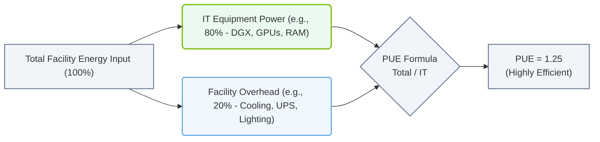

# 2.1e Power Usage Effectiveness (PUE): the efficiency metric of a data center

  📦 Physical Realm
  📖 Data Center Facility Operations

## 🌍 Context Introduction

When you walk into a data center, you see rows of servers, GPUs, and networking gear. But behind the walls, there's a massive amount of power being consumed just to keep everything running — cooling systems, lighting, backup power, and more. **Power Usage Effectiveness (PUE)** is the industry-standard metric that tells you how much of that total power is actually going to your compute equipment versus how much is "wasted" on facility overhead. For new engineers, think of PUE as a **fuel efficiency rating** for your data center — the lower the number, the more efficient your facility is.

---

## ⚙️ What is PUE?

PUE is a ratio that compares the **total energy entering the data center** to the **energy used by the IT equipment** (servers, GPUs, storage, networking).

**Formula:**
- **PUE = Total Facility Energy / IT Equipment Energy**

**Example:**
- If your data center uses **1,000 kW** total, and your IT equipment uses **800 kW**, then:
  - **PUE = 1,000 / 800 = 1.25**

**What does this mean?**
- A PUE of **1.0** is perfect — all power goes to IT equipment (theoretical, impossible in practice).
- A PUE of **2.0** means for every 1 watt used by IT, another 1 watt is used for cooling, lights, etc.
- The **industry average** is around **1.5 to 1.8**.
- **Modern, well-optimized data centers** aim for **1.1 to 1.3**.

---

## 📊 Why PUE Matters for AI Infrastructure

AI workloads, especially GPU-based training and inference, are **power-hungry**. A single NVIDIA H100 GPU can draw up to **700 watts**. Multiply that by thousands of GPUs, and you're looking at megawatts of power. Here's why PUE is critical:

- **Cost savings:** Lower PUE means lower electricity bills for the same compute output.
- **Sustainability:** Less wasted energy = lower carbon footprint.
- **Capacity planning:** A more efficient facility can support more GPUs within the same power budget.
- **Operational health:** A rising PUE can signal problems (e.g., failing cooling systems, blocked airflow).

---

## 🛠️ How to Measure PUE

### Step 1: Collect Data
- **Total Facility Energy:** Measured at the utility meter or main switchboard.
- **IT Equipment Energy:** Measured at the power distribution units (PDUs) or rack-level power meters.

### Step 2: Calculate
- Use the formula above. Most data centers use **automated monitoring tools** (e.g., DCIM software) to calculate PUE in real-time.

### Step 3: Track Over Time
- PUE is not static — it changes with workload, weather, and equipment efficiency.
- **Best practice:** Measure PUE monthly or quarterly, and look for trends.

---

## 🕵️ Common PUE Values & What They Mean

| PUE Value | Efficiency Level | Typical Scenario |
|-----------|------------------|------------------|
| 1.0 – 1.1 | **Excellent** | Hyperscale data centers with advanced cooling (e.g., liquid cooling, free air cooling) |
| 1.1 – 1.3 | **Very Good** | Modern, well-designed facilities with efficient cooling and power distribution |
| 1.3 – 1.6 | **Good** | Typical enterprise data center with standard cooling |
| 1.6 – 2.0 | **Fair** | Older facilities, poor airflow management, or inefficient cooling |
| > 2.0 | **Poor** | Significant waste; urgent optimization needed |

---

## 🔧 How Engineers Can Improve PUE

- **Optimize cooling:** Raise temperature setpoints, use hot/cold aisle containment, or switch to liquid cooling for high-density GPU racks.
- **Reduce power conversion losses:** Use high-efficiency UPS systems and power distribution.
- **Eliminate idle equipment:** Turn off or power down unused servers and GPUs.
- **Improve airflow:** Seal cable gaps, use blanking panels, and ensure proper floor tile placement.
- **Use renewable energy:** While this doesn't change PUE directly, it reduces the carbon impact of the overhead energy.

### 📊 Visual Representation: PUE Energy Allocation
This diagram shows how total incoming facility energy is divided between active IT equipment (compute and memory) and infrastructure overhead, which forms the basis of the PUE ratio.

---

## ⚠️ Important Caveats for New Engineers

- **PUE is a facility metric, not an IT metric.** A low PUE doesn't mean your GPUs are running efficiently — it just means the building is efficient.
- **PUE can be misleading in small samples.** A single day's measurement may be skewed by weather or maintenance. Always look at long-term averages.
- **Don't chase PUE at the expense of reliability.** Over-optimizing cooling can lead to hot spots and hardware failures.
- **For AI workloads, consider partial PUE.** Some facilities measure PUE only for the cooling and power systems serving the GPU clusters, excluding office areas.

---

## 📚 Summary for New Engineers

- **PUE = Total Power / IT Power**
- **Lower is better** — aim for 1.1 to 1.3 in modern facilities.
- **It's a health check** for your data center's power and cooling efficiency.
- **Monitor it regularly** to catch problems early.
- **Remember:** PUE tells you about the building, not the compute. Use it alongside GPU utilization metrics for a complete picture.

---

*Next time you walk through a data center, look at the power meters and ask: "How much of this is actually going to the GPUs?" That's the PUE story.*