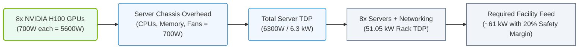

# 2.1f Calculating TDP (Thermal Design Power) and rack wattage for GPU dense configurations

  📦 Physical Realm
  📖 Data Center Facility Operations

---

## 🌱 Context Introduction

When you're setting up a GPU cluster for AI workloads, one of the first real-world challenges you'll face is understanding how much power everything needs. **Thermal Design Power (TDP)** is the maximum amount of heat a component (like a GPU or CPU) is expected to generate under a heavy workload. It's measured in **watts (W)**.

For new engineers, think of TDP as the "appetite" of a component — how much electricity it will consume and how much heat it will produce. If you get this wrong, you risk tripping circuit breakers, overheating your hardware, or wasting money on oversized power infrastructure.

This guide will walk you through calculating TDP for a single GPU, then scaling up to an entire rack.

---

## ⚙️ What is TDP and Why Does It Matter?

**TDP** is a specification provided by the manufacturer (e.g., NVIDIA, Intel, AMD) that tells you the maximum power a component will draw under a realistic workload. It's not the absolute peak (which can be higher), but it's the number you use for planning power and cooling.

**Key points:**
- TDP is measured in **watts (W)**.
- It includes the GPU core, memory, and voltage regulators.
- For NVIDIA GPUs, TDP varies by model:
  - **NVIDIA A100 (80GB):** 400W
  - **NVIDIA H100 (80GB):** 700W
  - **NVIDIA L40S:** 350W
  - **NVIDIA A40:** 300W
- TDP is **not** the same as "peak power" — always leave a safety margin (typically 10–20%).

**Why it matters for engineers:**
- Determines the **power supply unit (PSU)** size for each server.
- Drives **cooling requirements** (airflow, liquid cooling).
- Dictates **rack power distribution** (PDU capacity, circuit breaker sizing).
- Impacts **data center facility power** (UPS, generator, transformer sizing).

---

## 📊 Step-by-Step: Calculating TDP for a Single GPU Server

Let's start simple. You have a server with **8x NVIDIA H100 GPUs**. Here's how to calculate the total TDP for that server.

### 1. Identify GPU TDP
- **NVIDIA H100 TDP:** 700W per GPU
- **Number of GPUs:** 8
- **GPU subtotal:** 8 × 700W = **5,600W**

### 2. Add CPU and System Overhead
- **CPU TDP (dual socket, e.g., Intel Xeon Platinum):** 2 × 250W = 500W
- **Memory (DDR5, 2TB):** ~50W
- **Storage (NVMe SSDs):** ~20W
- **Networking (NIC, switch module):** ~30W
- **Fans, motherboard, misc:** ~100W
- **System subtotal:** 500W + 50W + 20W + 30W + 100W = **700W**

### 3. Calculate Server Total TDP
- **Total server TDP:** GPU subtotal + System subtotal
- **Total:** 5,600W + 700W = **6,300W** (6.3 kW)

**Important:** This is the **thermal design power** — the heat you need to remove. The actual electrical draw may be slightly higher due to inefficiencies (PSU losses). A good rule of thumb is to add **10%** for PSU efficiency (e.g., 6.3 kW × 1.1 = 6.93 kW electrical draw).

---

## 🛠️ Scaling Up: Rack Wattage Calculation

Now let's take that server and put it in a rack. A standard 42U rack can hold multiple servers, plus networking and other equipment.

### Example Rack Configuration
- **8x GPU servers** (each with 8x H100 GPUs)
- **1x Top-of-Rack (ToR) switch** (e.g., NVIDIA Spectrum SN5600, ~500W)
- **1x Management switch** (~100W)
- **1x KVM or console server** (~50W)

### Step 1: Calculate Server Power
- **Per server TDP:** 6,300W (from above)
- **8 servers:** 8 × 6,300W = **50,400W** (50.4 kW)

### Step 2: Add Networking and Misc
- **ToR switch:** 500W
- **Management switch:** 100W
- **KVM:** 50W
- **Networking subtotal:** 650W

### Step 3: Total Rack TDP
- **Rack TDP:** 50,400W + 650W = **51,050W** (51.05 kW)

### Step 4: Apply Safety Margin
- **Recommended margin:** 20% for peak loads and future expansion
- **Rack wattage with margin:** 51.05 kW × 1.2 = **61.26 kW**

**Result:** You need a rack capable of delivering **~61 kW** of power and cooling.

### 📊 Visual Representation: TDP and Rack Power Rollup
This diagram shows the sequential aggregation of power consumption from individual NVIDIA GPUs up to the complete rack and facility power allocation including safety margins.

---

## 📋 Comparison Table: Common GPU TDP Values

| GPU Model | TDP (Watts) | Typical Use Case |
|-----------|-------------|------------------|
| NVIDIA H100 (80GB) | 700W | Large language model training |
| NVIDIA A100 (80GB) | 400W | General AI training & inference |
| NVIDIA L40S | 350W | AI inference & graphics |
| NVIDIA A40 | 300W | AI inference & rendering |
| NVIDIA RTX 6000 Ada | 300W | Workstation AI & graphics |
| NVIDIA H200 (141GB) | 700W | Next-gen LLM training |

---

## 🕵️ Practical Tips for New Engineers

**Tip 1: Always check the GPU datasheet**
- TDP can vary by cooling configuration (air vs. liquid). For example, the H100 has a **700W TDP for air-cooled** and **700W for liquid-cooled** (same TDP, but cooling method affects rack density).

**Tip 2: Don't forget the "hidden" power consumers**
- **PDU efficiency loss:** ~3-5%
- **UPS battery charging:** ~5-10% overhead
- **Cooling system (CRAC/CRAH):** ~30-40% of IT load (for air cooling)
- **Lighting, security, fire suppression:** ~5-10 kW per data hall

**Tip 3: Use the "80% rule" for circuit breakers**
- Never load a circuit breaker to more than 80% of its rating.
- Example: A 30A 208V circuit can handle 30A × 208V × 0.8 = **4,992W** safely.

**Tip 4: Plan for power redundancy**
- **N+1 redundancy:** One extra PDU or UPS module in case of failure.
- **2N redundancy:** Two completely independent power paths (each capable of handling full load).

**Tip 5: Use manufacturer tools for accuracy**
- NVIDIA provides a **Power Calculator** for their GPU servers (available on NVIDIA's website).
- For a quick estimate, use this formula:
  - **Rack wattage (kW)** = (Number of GPUs × GPU TDP) + (CPU TDP × 2) + 200W (system overhead) × Number of servers + 1,000W (networking)

---

## ✅ Summary Checklist for Engineers

1. **Identify GPU model and TDP** from NVIDIA's datasheet.
2. **Calculate server-level TDP** (GPUs + CPU + memory + storage + networking + fans).
3. **Add 10% for PSU inefficiency** to get electrical draw.
4. **Scale to rack level** (multiply by number of servers, add networking).
5. **Apply 20% safety margin** for peak loads and future growth.
6. **Check circuit breaker capacity** (80% rule).
7. **Plan for cooling** (air or liquid) based on total rack TDP.
8. **Document everything** — power calculations are critical for capacity planning.

---

## 📚 Additional Resources

- **NVIDIA Data Center GPU TDP Datasheets** (available on NVIDIA's official site)
- **Data Center Power Infrastructure Standards** (Uptime Institute, TIA-942)
- **ASHRAE Thermal Guidelines** for data center cooling

---

*Remember: Power and cooling are the two most expensive operational costs in an AI data center. Getting TDP calculations right from the start saves money, prevents downtime, and keeps your GPUs running at peak performance.*