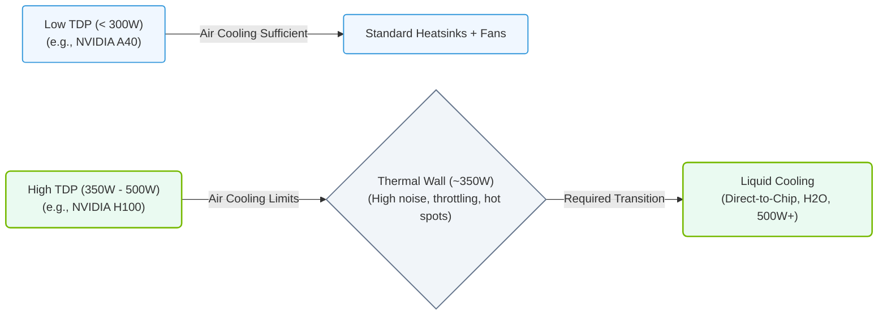

# 2.2e Why air cooling hits a wall: TDP limits approaching 500W per GPU

  📦 Physical Realm
  📖 Data Center Facility Operations

---

## 🌡️ Context: The Heat Problem in Modern AI Hardware

Modern GPUs used for AI training and inference are incredibly powerful—but they also generate massive amounts of heat. This heat is measured as **Thermal Design Power (TDP)** , which tells you how much heat a cooling system must remove to keep the chip running safely. As of 2024–2025, high-end GPUs like the NVIDIA H100 and upcoming B200 are approaching **500W TDP per GPU**. For context, a typical household space heater runs at about 1,500W. A single server rack with 8 such GPUs can generate as much heat as several space heaters running at full blast.

Air cooling—using fans to blow air over heatsinks—has been the standard for decades. But at these power densities, air cooling is hitting a fundamental physical wall.

---

## ⚙️ Why Air Cooling Works (For Now)

Air cooling is simple, cheap, and reliable. Here’s how it works:

- **Heatsink**: A metal block (usually aluminum or copper) sits on top of the GPU. It absorbs heat from the chip.
- **Fans**: Fans blow cooler air across the heatsink fins. The air picks up heat and carries it away.
- **Airflow**: The hot air is then exhausted out of the server chassis or data center room.

**The key limitation**: Air has very low **heat capacity** and **thermal conductivity**. It simply cannot absorb and carry away heat as efficiently as liquids can.

---

## 📊 The Wall: Why Air Cooling Fails at 500W TDP

As TDP per GPU climbs past 300W and approaches 500W, air cooling encounters three major problems:

### 🧱 Problem 1: Diminishing Returns on Fan Speed
- **Faster fans** move more air, but the relationship is not linear.
- Doubling fan speed does **not** double cooling capacity—it increases noise and power consumption dramatically.
- At high fan speeds, the air moves so fast it doesn't have time to absorb heat from the heatsink fins.
- **Result**: You can only push air cooling so far before it becomes inefficient and deafening.

### 🔥 Problem 2: Thermal Density
- A 500W GPU generates heat in a very small area (the die, roughly the size of a postage stamp).
- Air cannot remove heat fast enough from such a concentrated source.
- **Result**: The GPU core temperature rises above safe limits (typically 85–100°C), causing **thermal throttling**—the chip slows down to protect itself.

### 🌬️ Problem 3: Airflow Resistance
- Dense server racks with multiple GPUs create **airflow resistance**.
- The hot air from one GPU gets sucked into the next GPU's intake.
- **Result**: A cascade of overheating—each GPU sees hotter air than the one before it.

---

## 🛠️ Comparison: Air Cooling vs. Liquid Cooling at 500W

| Feature | Air Cooling | Liquid Cooling |
|---------|-------------|----------------|
| **Max TDP per GPU** | ~300–350W (practical limit) | 500W+ (easily) |
| **Noise Level** | Very loud (80+ dB) | Quiet (40–50 dB) |
| **Cooling Efficiency** | Low (air is a poor conductor) | High (water has 30x better thermal conductivity than air) |
| **Space Needed** | Large heatsinks and fans | Compact cold plates and radiators |
| **Complexity** | Simple, plug-and-play | Requires plumbing, pumps, and leak prevention |
| **Cost** | Low upfront | Higher upfront, but lower energy costs |
| **Maintenance** | Clean fans and filters | Check coolant levels, pumps, and seals |

### 📊 Visual Representation: Air Cooling TDP Wall Progression
This diagram displays the shift from standard air cooling to liquid cooling as GPU TDP exceeds the thermal threshold of ~350W.

---

## 🕵️ Real-World Impact: What Engineers See

When air cooling hits the wall, engineers observe these symptoms:

- **Thermal throttling**: GPU clock speeds drop to prevent damage. Training jobs take longer.
- **Fan noise**: Server rooms become unbearably loud. Hearing protection may be required.
- **Hot spots**: Some GPUs in a rack run 10–15°C hotter than others due to poor airflow.
- **Higher energy bills**: Fans consume significant power (100–200W per server) just to move air.
- **Reduced hardware lifespan**: Constant high temperatures degrade GPU components faster.

---

## ✅ What This Means for Engineers

- **Plan for liquid cooling** if your GPUs exceed 350W TDP. Most modern AI clusters (NVIDIA DGX, HGX) now support liquid cooling as standard.
- **Monitor GPU temperatures** closely. Use tools like **nvidia-smi** to check thermal status.
- **Design for airflow** even with air cooling—leave gaps between servers, use hot/cold aisle containment.
- **Understand TDP trends**: Next-gen GPUs will likely exceed 500W. Air cooling will become obsolete for high-density AI workloads.

---

## 📝 Key Takeaway

> Air cooling is hitting a physical wall because air simply cannot move heat fast enough from a 500W GPU. The industry is shifting to **direct-to-chip liquid cooling** and **immersion cooling** to handle these power densities. For engineers, this means learning new cooling technologies and rethinking data center layout—but it also means unlocking the full performance of modern AI hardware without thermal limits.