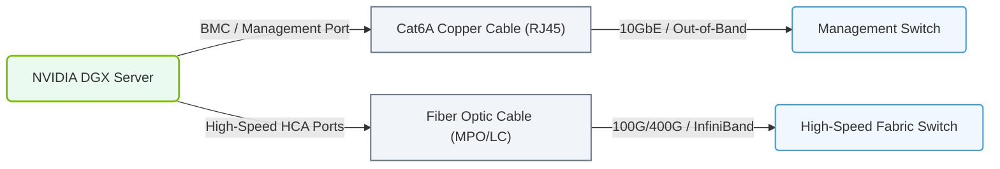

# 2.3c Structured cabling: Cat6A copper for 10GbE management, fiber for high-speed networks

  📦 Physical Realm
  📖 Data Center Facility Operations

---

## 🌐 Context Introduction

In any AI data center, the physical cabling is the nervous system that connects compute, storage, and networking gear. For new engineers, understanding the difference between copper and fiber cabling is essential. Copper (specifically Cat6A) is used for shorter, lower-speed connections like management networks, while fiber optics carry high-speed data across longer distances. This topic covers when to use each type and why it matters for AI workloads.

---

## ⚙️ Why Cabling Matters in AI Infrastructure

- **Data throughput** — AI training and inference generate massive data flows between GPUs, storage, and switches.
- **Latency** — Poor cabling choices can introduce delays that slow down model training.
- **Reliability** — Proper cabling reduces signal loss, electromagnetic interference (EMI), and physical failures.
- **Scalability** — Choosing the right cable type today avoids costly upgrades tomorrow.

---

## 🛠️ Cat6A Copper for 10GbE Management Networks

Cat6A (Augmented Category 6) is a twisted-pair copper cable standard that supports **10 Gigabit Ethernet (10GbE)** up to 100 meters.

### Key Characteristics

- **Speed** — Supports up to 10 Gbps
- **Distance** — Maximum 100 meters (328 feet)
- **Connector** — Standard RJ45
- **Shielding** — Often shielded (STP) to reduce EMI in dense data centers
- **Use case** — Management network connections (e.g., IPMI, BMC, switch management ports)

### When to Use Cat6A

- Connecting server management ports (iLO, iDRAC, BMC)
- Linking switches for out-of-band management
- Short-distance connections between racks (under 100 meters)
- Environments where fiber transceivers are cost-prohibitive

### Pros and Cons

| ✅ Advantages | ❌ Disadvantages |
|--------------|-----------------|
| Lower cost than fiber for short runs | Limited to 100 meters |
| Easy termination with RJ45 connectors | Heavier and less flexible than fiber |
| Works with existing copper infrastructure | Susceptible to EMI without shielding |
| Supports Power over Ethernet (PoE) | Not suitable for 40/100/400 GbE speeds |

---

## 🔦 Fiber Optic Cabling for High-Speed Networks

Fiber optics use light pulses to transmit data, enabling much higher speeds and longer distances than copper.

### Key Characteristics

- **Speed** — Supports 10 Gbps, 40 Gbps, 100 Gbps, 400 Gbps, and beyond
- **Distance** — From 300 meters (multimode) to 40+ kilometers (single-mode)
- **Connector** — LC, SC, MPO (for high-density)
- **Types** — Multimode (OM3, OM4, OM5) for short distances; Single-mode (OS2) for long distances
- **Use case** — GPU-to-switch connections, storage fabric, spine-leaf interconnects

### When to Use Fiber

- Connecting GPU servers to top-of-rack (ToR) switches at 100 GbE or higher
- Linking racks across data center halls (longer than 100 meters)
- Building spine-leaf or Clos network topologies
- Environments with high EMI (e.g., near power distribution)

### Pros and Cons

| ✅ Advantages | ❌ Disadvantages |
|--------------|-----------------|
| Extremely high bandwidth (400 GbE+) | Higher cost for transceivers and termination |
| Long distance capability (km range) | More fragile than copper |
| Immune to electromagnetic interference | Requires specialized tools for termination |
| Lighter and thinner than copper | Active components (lasers) can fail |

---

## 📊 Comparison Table: Cat6A vs. Fiber

| Feature | Cat6A Copper | Fiber Optic |
|---------|--------------|-------------|
| **Max Speed** | 10 Gbps | 400 Gbps+ |
| **Max Distance** | 100 meters | 40+ km (single-mode) |
| **Typical Use** | Management, 10GbE | GPU fabric, storage, spine |
| **Cost per meter** | Low | Medium to high |
| **EMI Immunity** | Low (needs shielding) | High (immune) |
| **Termination** | Easy (RJ45 crimp) | Requires fusion splicing |
| **Power over Cable** | Yes (PoE) | No |

### 📊 Visual Representation: Structured Cabling Paths in AI Racks
This diagram shows the dual cabling path from an NVIDIA DGX server, routing management traffic via Cat6A copper and high-speed compute traffic via fiber optics.

---

## 🕵️ Practical Guidance for New Engineers

### In an AI Data Center, You Will See:

- **Cat6A cables** running from server management ports to a dedicated management switch (often colored blue or yellow).
- **Fiber cables** (usually orange for multimode, yellow for single-mode) connecting GPU server NICs to ToR switches.
- **Patch panels** where cables are terminated neatly in racks.
- **Cable management trays** to keep airflow unobstructed.

### Common Mistakes to Avoid

- Using copper for long runs (over 100 meters) — signal degrades.
- Using fiber for short management connections — overkill and more expensive.
- Mixing cable types without proper transceivers (e.g., using a multimode cable with a single-mode transceiver).
- Pulling cables too tight — both copper and fiber have bend radius limits.

### Quick Decision Flow

1. **Is the distance under 100 meters and speed 10 Gbps or less?** → Use Cat6A copper.
2. **Is the distance over 100 meters or speed 25 Gbps+?** → Use fiber (multimode for under 300m, single-mode for longer).
3. **Is it a management port (IPMI/BMC)?** → Always use Cat6A copper.
4. **Is it a GPU-to-switch connection?** → Always use fiber (typically OM4 or OM5 multimode).

---

## ✅ Summary

- **Cat6A copper** is the workhorse for 10GbE management networks — cheap, easy, and reliable for short distances.
- **Fiber optics** are essential for high-speed AI fabric — they handle the massive bandwidth and long distances required for GPU clusters.
- **Always match the cable type to the speed, distance, and purpose** of the connection.
- **Proper cable management** (labeling, bend radius, separation from power) prevents performance issues and simplifies troubleshooting.

> 💡 **Key takeaway for new engineers:** When you see a blue cable going to a server's management port, think Cat6A. When you see a bright orange or yellow cable connecting a GPU server to a switch, think fiber. Knowing which is which will help you quickly understand the data center's architecture.