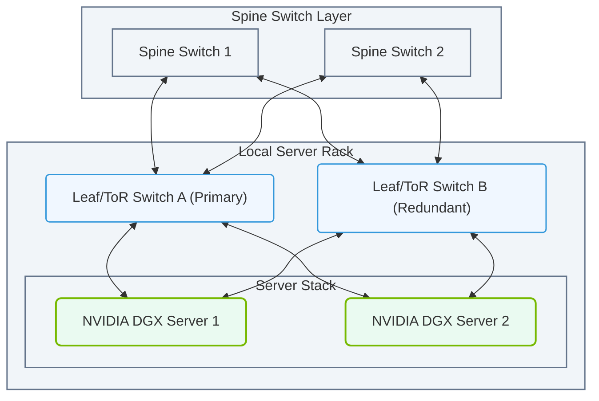

# 2.3d Top-of-Rack (ToR) switches: how servers connect to the network fabric

  📦 Physical Realm
  📖 Data Center Facility Operations

---

### 🌐 Context Introduction

In a modern data center, servers don't just plug into the network randomly. They connect through a specific type of switch called a **Top-of-Rack (ToR) switch**. Think of a ToR switch as the "front door" for every server in a rack — it's the first network device a server talks to when sending data to another server or to the internet. For new engineers, understanding how servers connect to the network fabric through ToR switches is essential because it affects everything from cabling to performance.

---

### ⚙️ What is a Top-of-Rack (ToR) Switch?

A ToR switch is a network switch placed at the top of a server rack (or near the top) that connects all the servers in that rack to the rest of the data center network.

- **Physical location**: Mounted at the top of a 42U or 48U rack, usually in the first few rack units.
- **Role**: Acts as the aggregation point for all server traffic within that rack.
- **Connection type**: Typically uses **Ethernet** cables (e.g., Cat6, Cat6a, or fiber optics) to connect each server to the switch.
- **Uplink**: The ToR switch itself connects to higher-level switches (like spine switches) to reach other racks or the internet.

---

### 🛠️ How Servers Connect to a ToR Switch

The connection process is straightforward but involves several key components:

- **Network Interface Card (NIC)**: Each server has one or more NICs, which are physical ports on the server's motherboard or a separate card.
- **Cabling**: A network cable (usually **SFP+** or **QSFP+** for fiber, or **RJ45** for copper) runs from the server's NIC to a port on the ToR switch.
- **Port mapping**: Each server is assigned a specific port on the ToR switch. For example, Server A might use port 1, Server B port 2, and so on.
- **Link speed**: Common speeds are **1 Gbps**, **10 Gbps**, **25 Gbps**, or **100 Gbps**, depending on the server and switch capabilities.

**Example of a typical connection flow:**

1. Server boots up and initializes its NIC.
2. The NIC sends a link signal to the ToR switch.
3. The ToR switch detects the link and establishes a connection.
4. The server receives an IP address (via DHCP or static configuration) and can now communicate with other devices.

---

### 📊 ToR Switch vs. Other Switch Types

To help you understand where ToR fits, here's a simple comparison:

| Feature | Top-of-Rack (ToR) Switch | End-of-Row (EoR) Switch | Spine Switch |
|---------|--------------------------|--------------------------|--------------|
| **Location** | At the top of each rack | At the end of a row of racks | Centralized in the data center |
| **Servers connected** | Only servers in the same rack | Servers from multiple racks in a row | No direct server connections |
| **Cabling distance** | Short (within the same rack) | Longer (across a row) | Very long (across the data center) |
| **Scalability** | Easy to add new racks | Requires more cabling | Scales horizontally |
| **Latency** | Very low (direct connection) | Low (but longer cables) | Low (but depends on hops) |

### 📊 Visual Representation: Dual-Homed Leaf-Spine Network Topology
This diagram shows how individual DGX servers in a rack are dual-homed to redundant Leaf/ToR switches, which uplink to the centralized Spine switch layer.

---

### 🕵️ Why ToR Switches Matter for Network Fabric

The **network fabric** is the overall interconnection of all switches and servers. ToR switches are the first layer of this fabric.

- **Redundancy**: Most racks have two ToR switches (A and B) to ensure if one fails, servers can still communicate through the other.
- **Leaf-Spine Architecture**: In modern data centers, ToR switches act as **leaf** switches, connecting to a **spine** switch layer. This creates a non-blocking, high-bandwidth fabric.
- **Traffic flow**: Server-to-server traffic within the same rack stays on the ToR switch (fast). Traffic to other racks goes through the ToR switch to the spine layer.

---

### 🔌 Common Cabling and Port Types

Here are the typical components you'll see when connecting a server to a ToR switch:

- **Copper cables (Cat6/Cat6a)**: Used for short distances (up to 100 meters) and speeds up to 10 Gbps.
- **Fiber optic cables (LC/SC connectors)**: Used for longer distances and higher speeds (25 Gbps, 100 Gbps).
- **SFP+ transceivers**: Small pluggable modules that convert electrical signals to optical signals for fiber connections.
- **QSFP+ transceivers**: Used for 40 Gbps or 100 Gbps connections, often with four lanes.

**Typical server-to-ToR connection setup:**

- Server NIC port → **SFP+ transceiver** → **Fiber patch cable** → **ToR switch port**
- Or: Server NIC port → **Cat6 cable** → **ToR switch RJ45 port**

---

### ✅ Key Takeaways for New Engineers

- **ToR switches are the first hop** for every server in a rack — they're the gateway to the network.
- **Cabling is critical**: Use the right cable type and length for the speed and distance required.
- **Redundancy is common**: Two ToR switches per rack provide failover protection.
- **ToR switches are part of a larger fabric**: They connect to spine switches to enable communication across the entire data center.
- **Always check link lights**: A solid green or blue light on the switch port means the connection is active.

---

### 📚 Further Learning

- Explore **leaf-spine architecture** to understand how ToR switches fit into larger network designs.
- Practice identifying **SFP+ and QSFP+ modules** in a data center environment.
- Learn about **VLANs and link aggregation** (LACP) to optimize server-to-ToR connections.

---

*This guide is part of the NVIDIA-Certified Associate: AI Infrastructure and Operations curriculum. For more topics, refer to the full course outline.*