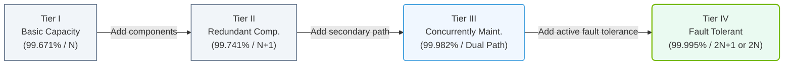

# 2.3f Data center tiers: Tier I–IV (Uptime Institute) and availability percentages

  📦 Physical Realm
  📖 Data Center Facility Operations

---

## 🌱 Context Introduction

When you're starting out in AI infrastructure and operations, one of the first things you'll encounter is the concept of **data center tiers**. Think of these tiers like hotel star ratings — but for data centers. They tell you how reliable, redundant, and fault-tolerant a facility is. The **Uptime Institute** created this classification system to standardize how we measure data center performance and availability.

For new engineers, understanding these tiers helps you know what level of **uptime** (the percentage of time a system is operational) you can expect from a facility. This directly impacts how you design, deploy, and maintain AI workloads.

---

## ⚙️ What Are Data Center Tiers?

Data center tiers are a standardized ranking system (I through IV) that defines:

- **Redundancy** — backup components (power, cooling, network)
- **Fault tolerance** — ability to keep running when something fails
- **Maintainability** — ease of performing repairs without downtime
- **Availability** — the expected uptime percentage

Higher tiers mean more resilience, but also higher cost and complexity.

---

## 📊 The Four Tiers Explained

### 🟢 Tier I — Basic Capacity

- **Availability:** 99.671% (about 28.8 hours of downtime per year)
- **Redundancy:** None (single path for power and cooling)
- **Fault tolerance:** None — any planned or unplanned activity causes downtime
- **Best for:** Small businesses, development environments, non-critical workloads

### 🔵 Tier II — Redundant Capacity Components

- **Availability:** 99.741% (about 22 hours of downtime per year)
- **Redundancy:** Some redundant components (e.g., extra cooling units)
- **Fault tolerance:** Partial — can survive some component failures
- **Best for:** Small to medium businesses, batch processing

### 🟡 Tier III — Concurrently Maintainable

- **Availability:** 99.982% (about 1.6 hours of downtime per year)
- **Redundancy:** Multiple independent paths for power and cooling
- **Fault tolerance:** High — any single component can be removed for maintenance without shutting down operations
- **Best for:** Enterprise applications, most AI training workloads

### 🔴 Tier IV — Fault Tolerant

- **Availability:** 99.995% (about 26 minutes of downtime per year)
- **Redundancy:** Fully redundant with multiple active paths
- **Fault tolerance:** Maximum — can survive any single failure (including human error) without impact
- **Best for:** Mission-critical AI inference, financial trading, healthcare systems

---

## 🛠️ Comparison Table

| Feature | Tier I | Tier II | Tier III | Tier IV |
|---------|--------|---------|----------|---------|
| **Availability %** | 99.671% | 99.741% | 99.982% | 99.995% |
| **Annual Downtime** | ~28.8 hours | ~22 hours | ~1.6 hours | ~26 minutes |
| **Redundancy** | None | Partial (N+1) | Full (N+1) | 2N (fully duplicated) |
| **Fault Tolerance** | None | Partial | High | Maximum |
| **Maintainability** | Requires shutdown | Requires shutdown | Concurrent maintenance | Concurrent + fault tolerant |
| **Cost Factor** | Low | Medium | High | Very High |

### 📊 Visual Representation: Data Center Tier Progression
This diagram shows the evolution of data center tiers from basic capacity to fully fault-tolerant systems, outlining the redundancy configurations and availability goals.

---

## 🕵️ Why This Matters for AI Infrastructure

AI workloads — especially training large models — are **resource-intensive and time-sensitive**. Here's how tier choice affects your operations:

- **Tier I or II** — Acceptable for experimental training or batch jobs where a few hours of downtime is tolerable
- **Tier III** — The sweet spot for most AI training clusters; allows maintenance without stopping long-running jobs
- **Tier IV** — Essential for production AI inference systems (e.g., real-time recommendation engines) where even minutes of downtime means lost revenue

---

## 🔑 Key Takeaways for New Engineers

- **Availability percentages** are not just marketing numbers — they represent real downtime expectations
- **Higher tiers** require more physical infrastructure (generators, UPS batteries, cooling loops), which means more things to monitor and maintain
- **Your AI application's SLA** (Service Level Agreement) should match the data center tier — don't put a Tier IV workload in a Tier I facility
- **Tier III is the most common** for modern AI data centers because it balances cost with concurrent maintainability

---

## 📝 Quick Memory Aid

Think of it like this:

- **Tier I** = A single power strip — one failure and you're down
- **Tier II** = A power strip with a backup battery — some protection
- **Tier III** = Two independent power strips — you can fix one while using the other
- **Tier IV** = Two fully separate electrical rooms — nothing stops you

---

## ✅ Final Thought

As a new engineer, always check the **tier certification** of any data center you work with. It tells you the **maximum uptime** you can expect — and helps you plan for failures accordingly. Remember: even Tier IV data centers have downtime, just very little of it.