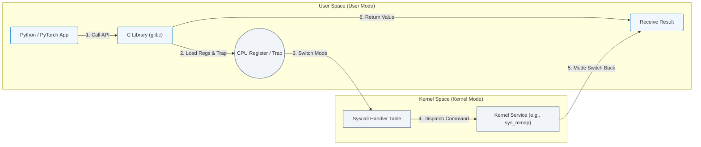

# 3.1c System calls: how user programs request kernel services

  📦 Operating System Layer
  📖 Linux System Fundamentals

---

## 🧭 Context Introduction

When you run a program on a Linux system — whether it's a Python script training an AI model, a command to list files, or a container starting up — that program runs in **user space**. But user space programs cannot directly access hardware, memory, or other protected resources. To do anything useful (like read a file, send network data, or allocate memory), the program must ask the **kernel** — the core of the operating system — to do it on its behalf. This request is made through a **system call**.

Think of system calls as the **official bridge** between your application and the kernel. They are the only way a user program can safely interact with the system's hardware and protected resources.

---

## ⚙️ What Is a System Call?

A **system call** is a controlled entry point into the kernel. When a user program needs a kernel service, it triggers a special instruction (often called a **trap** or **interrupt**) that switches the CPU from **user mode** to **kernel mode**. The kernel then performs the requested operation and returns the result to the user program.

Key characteristics:
- System calls are **atomic** — they either complete fully or fail cleanly.
- They are **synchronous** — the calling program waits for the kernel to finish.
- Each system call has a unique **number** (not a name) that the kernel uses to look up the correct handler.

---

## 🛠️ How System Calls Work — Step by Step

Here is the simplified flow of a system call:

1. **User program calls a library function** (e.g., `fopen()` in C, or `open()` in Python's `os` module).
2. **The library function prepares the system call** — it places the system call number and arguments into specific CPU registers.
3. **A trap instruction is executed** — this switches the CPU to kernel mode and jumps to a predefined kernel entry point.
4. **The kernel identifies the system call** — it reads the system call number from the register and looks up the correct handler in a table.
5. **The kernel executes the requested operation** — this might involve reading a disk, sending a network packet, or allocating memory.
6. **The kernel returns control to user space** — it places the result (or an error code) in a register and switches the CPU back to user mode.
7. **The user program receives the result** — the library function returns the value to the original program.

### 📊 Visual Representation: System Call Lifecycle

This horizontal flowchart illustrates the transition of execution privilege between user space and kernel space during a system call.

---

## 📊 User Space vs. Kernel Space — A Quick Comparison

| Feature | User Space | Kernel Space |
|---------|------------|--------------|
| **Who runs here** | Applications, scripts, containers | Operating system core, drivers |
| **Hardware access** | ❌ Not allowed directly | ✅ Full access |
| **Memory access** | Restricted to own memory | Can access all memory |
| **CPU mode** | User mode (restricted) | Kernel mode (privileged) |
| **Failure impact** | Program crashes only | Can crash the entire system |
| **Example** | Your AI training script | The Linux kernel itself |

---

## 🕵️ Common System Calls You Encounter Every Day

Even if you don't write system calls directly, every command and program you run uses them constantly. Here are some of the most common ones:

- **`read()`** — Reads data from a file or input device.
- **`write()`** — Writes data to a file or output device.
- **`open()`** — Opens a file for reading or writing.
- **`close()`** — Closes an open file descriptor.
- **`fork()`** — Creates a new process (used by every shell command).
- **`exec()`** — Replaces the current process with a new program.
- **`mmap()`** — Maps files or devices into memory (critical for AI workloads).
- **`sched_yield()`** — Voluntarily gives up the CPU (used in multi-threaded apps).

---

## 🔍 How to See System Calls in Action

You can observe system calls happening in real time using tools that trace them. For example, if you run a simple command like listing files in a directory, the system will make dozens of system calls — from opening the directory to reading its contents to writing the output to your terminal.

A common tool for this is **strace** (system call trace). It intercepts and records every system call made by a program. This is invaluable for debugging why an AI application is slow, why a file operation fails, or what resources a container is using.

---

## 🧠 Why This Matters for AI Infrastructure and Operations

As an engineer working with AI infrastructure, understanding system calls helps you:

- **Diagnose performance bottlenecks** — If your AI training is slow, system call tracing can reveal whether the bottleneck is file I/O, network communication, or memory allocation.
- **Understand container behavior** — Containers share the host kernel, so all container operations go through the same system call interface. Knowing this helps you troubleshoot container resource limits.
- **Optimize storage and networking** — AI workloads often involve massive file reads/writes and network transfers. Each of these operations triggers system calls, and reducing the number of system calls (e.g., by using buffered I/O) can dramatically improve performance.
- **Debug permission issues** — Many "permission denied" errors are actually failed system calls. Understanding the system call layer helps you interpret error messages correctly.

---

## ✅ Key Takeaways

- System calls are the **only way** user programs can request kernel services.
- They involve a **mode switch** from user space to kernel space and back.
- Every file operation, network send, memory allocation, and process creation goes through a system call.
- Tools like **strace** let you observe system calls in real time for debugging and performance analysis.
- For AI infrastructure, system calls are the foundation of all I/O operations — understanding them helps you build faster, more reliable systems.