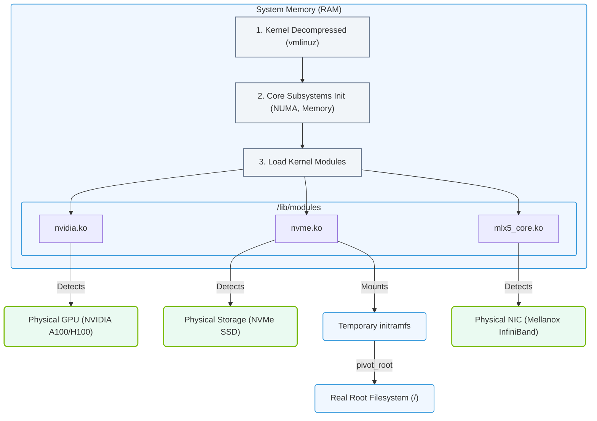

# 3.2c Stage 3: Kernel loading, module initialization, and mounting root filesystem

  📦 Operating System Layer
  📖 Linux System Fundamentals

---

## 📘 Context Introduction

After the bootloader (Stage 2) locates and loads the kernel image into memory, Stage 3 begins. This is where the Linux kernel itself takes over the boot process. For engineers new to AI infrastructure, understanding this stage is critical because it determines how the operating system initializes hardware, loads essential drivers (modules), and ultimately mounts the root filesystem — the foundation upon which all AI workloads run.

Think of Stage 3 as the moment when the "engine" of your AI server starts running. Without proper kernel loading, module initialization, and root filesystem mounting, your GPU drivers, storage systems, and AI frameworks cannot function.

---

## ⚙️ Kernel Loading — The Core Starts Running

The kernel is the central component of any Linux system. During this phase:

- The bootloader (GRUB) decompresses the kernel image (typically named **vmlinuz**) from the boot partition into system memory
- The kernel sets up essential memory management structures
- CPU features are detected and initialized
- Interrupt handlers are established

For AI infrastructure, the kernel must support:
- **Large memory addressing** (for GPU memory and large datasets)
- **NUMA (Non-Uniform Memory Access)** awareness for multi-socket servers
- **IOMMU** support for GPU passthrough in virtualized environments

---

## 🛠️ Module Initialization — Loading the Drivers

Once the kernel is running, it needs to load modules — these are drivers and kernel extensions that enable hardware support.

### Key Points About Module Initialization:

- **Built-in vs. Loadable modules**: Some drivers are compiled directly into the kernel (built-in), while others are loaded as needed from the **/lib/modules/** directory
- **Module dependencies**: Some modules require others to load first (e.g., a GPU driver depends on PCIe support)
- **Hardware detection**: The kernel probes connected hardware (PCIe devices, USB controllers, storage controllers) and loads matching modules

### 🖥️ Critical Modules for AI Infrastructure:

| Module Type | Examples | Purpose |
|-------------|----------|---------|
| GPU Driver | **nvidia**, **amdgpu** | Enables GPU compute for AI workloads |
| Storage Driver | **nvme**, **megaraid_sas** | Access to high-speed NVMe or RAID storage |
| Network Driver | **mlx5_core** (Mellanox), **bnxt_en** (Broadcom) | High-bandwidth networking for distributed training |
| Filesystem | **ext4**, **xfs**, **btrfs** | Support for different filesystem types |

---

## 📂 Mounting the Root Filesystem — Making Storage Accessible

After modules are loaded, the kernel must mount the root filesystem (designated as **/**). This is where all system files, applications, and user data reside.

### The Process:

1. **Locate the root device**: The kernel uses parameters passed from the bootloader (e.g., **root=/dev/nvme0n1p2** or **root=UUID=...**)
2. **Load the filesystem driver**: If not built-in, the kernel loads the appropriate module (e.g., **ext4.ko**)
3. **Mount the filesystem**: The root partition is mounted as read-only initially for integrity checking
4. **Switch to root**: The kernel hands control to the **init** process (or **systemd** on modern systems)

### 🕵️ Common Root Filesystem Scenarios for AI:

- **Local NVMe/SSD**: Fastest option for AI training data and model storage
- **Network Filesystem (NFS)**: Used in shared storage environments for multi-node training
- **Initramfs (Initial RAM Filesystem)**: A temporary root filesystem loaded into memory that contains essential drivers and scripts needed to mount the real root filesystem

---

## 🔄 The Initramfs Role in Stage 3

For many AI servers, the kernel cannot directly mount the root filesystem because:

- The storage controller driver is not built into the kernel
- The root filesystem is on a complex RAID or LVM (Logical Volume Manager) volume
- Encryption (LUKS) must be unlocked first

In these cases, an **initramfs** (initial RAM filesystem) is used:

- It is a small, compressed filesystem loaded into memory by the bootloader
- It contains the necessary kernel modules and scripts to:
  - Load storage drivers
  - Unlock encrypted volumes
  - Assemble RAID arrays
  - Mount the real root filesystem
- Once the real root is mounted, the system performs a **pivot_root** operation to switch from the temporary initramfs to the actual root filesystem

---

## ✅ Summary — Why This Matters for AI Infrastructure

| Stage 3 Component | AI Infrastructure Impact |
|-------------------|--------------------------|
| Kernel Loading | Determines CPU/NUMA support for GPU communication |
| Module Initialization | GPU drivers, high-speed networking, and storage drivers must load correctly |
| Root Filesystem Mount | AI datasets, model checkpoints, and container images must be accessible |

Without successful completion of Stage 3, your AI server cannot proceed to start services, launch containers, or run training jobs. Engineers should verify kernel parameters and module loading when troubleshooting boot failures on GPU servers.

### 📊 Visual Representation: Kernel Initialization & Module Loading

This diagram shows how the Linux kernel loads into memory, initializes core systems (such as NUMA and CPU structures), dynamically loads drivers for GPUs, storage, and networking, and mounts the real root filesystem.

---

## 🔍 Quick Troubleshooting Tips

- If the system hangs after kernel loading, check for missing GPU or storage drivers
- If the root filesystem fails to mount, verify the **root=** parameter in the bootloader configuration
- Use kernel boot parameters like **rd.debug** to get verbose initramfs debugging output
- Ensure that **initramfs** is regenerated after installing new GPU drivers or changing storage configurations

---

*Stage 3 is the bridge between hardware initialization and the operating system services that AI workloads depend on. Mastering this phase helps engineers build reliable, high-performance AI infrastructure.*