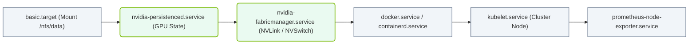

# 3.2d Stage 4: systemd PID 1 — the init system that bootstraps all services

  📦 Operating System Layer
  📖 Linux System Fundamentals

## 🧭 Context Introduction

By the time the Linux kernel finishes loading, your AI server has initialized hardware, detected storage, and mounted a temporary root filesystem. But the system is still not "alive" yet — there are no services running, no network, no user interface. The final critical stage is handing control to **systemd**, the very first user-space process (Process ID 1). systemd is the **init system** — its job is to bootstrap every other service, daemon, and process that makes your AI infrastructure operational.

For engineers new to AI infrastructure, think of systemd as the **orchestrator** that wakes up all the components your AI workloads depend on: GPU drivers, container runtimes, networking stacks, monitoring agents, and storage mounts. Without systemd, nothing else starts.

---

## ⚙️ What is systemd PID 1?

- **PID 1** means systemd is the very first process launched by the kernel after the boot process completes.
- It runs continuously until the system shuts down.
- It is the **parent of all other processes** — every service, daemon, and user session is a child of systemd.
- systemd replaces older init systems like SysV init and Upstart, offering **parallel service startup**, **dependency management**, and **better logging**.

---

## 📊 How systemd Bootstraps All Services

systemd does not start everything at once. It follows a structured, dependency-driven approach:

- **Targets** — systemd uses "targets" instead of runlevels. A target is a group of services that should be active for a certain system state.
- **Units** — every resource systemd manages is a "unit" (service, socket, mount, timer, etc.).
- **Dependency resolution** — systemd reads unit files to determine what must start before something else.
- **Parallel startup** — services that do not depend on each other start simultaneously, dramatically speeding up boot time.

The typical boot sequence after systemd takes over:

1. **default.target** is activated (usually equivalent to multi-user or graphical mode).
2. **basic.target** starts — mounts filesystems, sets up swap, loads kernel modules.
3. **sysinit.target** — initializes system settings like hostname, time synchronization, and udev device management.
4. **multi-user.target** — starts all essential services (SSH, networking, logging, monitoring).
5. **graphical.target** (if applicable) — starts the display manager and desktop environment.

For AI infrastructure, the critical targets often include services for NVIDIA drivers, Docker or containerd, and cluster orchestration agents.

---

## 🛠️ Key systemd Concepts for AI Infrastructure

| Concept | Description | Why It Matters for AI |
|---------|-------------|-----------------------|
| **Service Units** | Files ending in `.service` that define how to start, stop, and restart a daemon | GPU driver services, container runtime services |
| **Socket Units** | Activate services on-demand when a network socket is accessed | Useful for AI inference endpoints |
| **Timer Units** | Schedule recurring tasks (like cron replacements) | Automate model retraining or data cleanup |
| **Mount Units** | Control filesystem mounting | Ensure NFS or GPFS storage is ready before AI jobs start |
| **Dependencies** | `Wants`, `Requires`, `After` directives in unit files | Guarantee NVIDIA drivers load before Docker starts |
| **Journald** | systemd's logging system — captures all service output | Debugging AI service failures |

---

## 🕵️ How Engineers Interact with systemd

Engineers managing AI infrastructure use systemd commands to:

- **Check service status** — verify that critical AI services (like the NVIDIA Persistence Daemon or a model-serving container) are running.
- **Start/Stop/Restart services** — apply configuration changes or recover from failures.
- **Enable/Disable services** — control which services start automatically at boot.
- **View logs** — inspect service output to diagnose why an AI workload failed to start.
- **Analyze boot performance** — identify which services are slowing down the boot process.

---

## 🔄 Comparison: systemd vs. Traditional Init

| Feature | Traditional Init (SysV) | systemd |
|---------|------------------------|---------|
| Startup method | Sequential, one service at a time | Parallel, dependency-driven |
| Configuration | Shell scripts (complex, error-prone) | Declarative unit files (simple, predictable) |
| Logging | Separate log files per service | Centralized journald logging |
| Service dependencies | Manual ordering in scripts | Automatic dependency resolution |
| Performance monitoring | Not built-in | Built-in `systemd-analyze` tool |
| Socket/timer activation | Not available | Native support |

---

## 🧩 Practical Example: AI Service Startup Order

For a typical AI training node, systemd ensures this order:

1. **basic.target** — mounts `/nfs/data` (shared storage for datasets)
2. **nvidia-persistenced.service** — initializes GPU state
3. **nvidia-fabricmanager.service** — enables NVLink/NVSwitch for multi-GPU communication
4. **docker.service** or **containerd.service** — container runtime starts
5. **kubelet.service** (if Kubernetes) — joins the node to the cluster
6. **prometheus-node-exporter.service** — starts hardware monitoring

If any of these fail, systemd can automatically restart them (based on `Restart=` policy in the unit file) or prevent dependent services from starting.

### 📊 Visual Representation: AI Node Startup Order

This horizontal flowchart illustrates the dependency-driven startup sequence orchestrating hardware mounts, GPU subsystems, container runtimes, and cluster agents during node boot.

---

## ✅ Key Takeaways for New Engineers

- **systemd is PID 1** — it is the first and most important user-space process.
- **It manages all other processes** — every service you interact with is a child of systemd.
- **Targets replace runlevels** — they define what state the system should be in.
- **Unit files are the configuration language** — learn to read and write `.service` files.
- **Logging is centralized** — use journald instead of hunting for log files.
- **Dependencies matter** — AI infrastructure often requires strict service ordering (GPU drivers before containers).
- **Boot performance can be analyzed** — use systemd tools to find bottlenecks.

---

## 📚 Next Steps

After systemd finishes bootstrapping all services, the system presents a login prompt (or starts a display manager). The boot process is complete, and your AI infrastructure is ready for workloads. As an engineer, you will spend significant time writing and debugging systemd unit files for custom AI services, ensuring they start reliably and in the correct order.

Understanding systemd is not optional — it is the foundation of service management on every modern Linux-based AI platform.