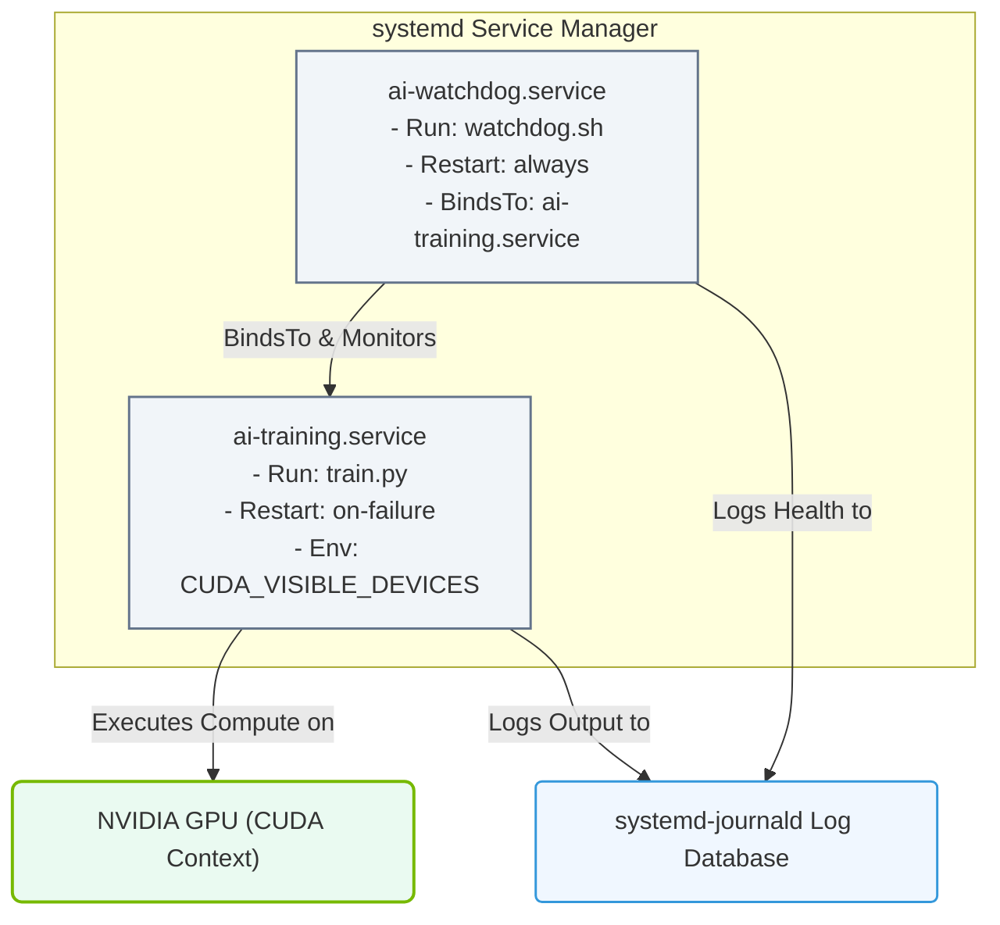

# 3.4e Creating custom unit files for AI training services and watchdog processes

<div class="lesson-completion" data-lesson-id="3_4e_custom_systemd_services"></div>
<div class="lesson-tags">
  <span class="lesson-tag">📦 Operating System Layer</span>
  <span class="lesson-tag">📖 Linux System Fundamentals</span>
</div>


---

## 🌐 Context Introduction

When you manage AI infrastructure, you often need to run long‑lived training jobs or critical monitoring processes that must start automatically, restart on failure, and log their activity cleanly. **systemd** is the standard service manager on modern Linux distributions, and it gives you a powerful way to define exactly how these AI workloads should behave. By creating custom **unit files**, you can turn a training script or a watchdog process into a reliable, production‑ready service.

This guide will walk you through the essential concepts and practical steps for writing unit files tailored to AI training services and watchdog processes.

---

## ⚙️ What Is a systemd Unit File?

A **unit file** is a plain‑text configuration file that tells systemd how to manage a process. Each unit file describes one service, timer, socket, or other resource. For AI workloads, you will most often create **service units** (`.service` files).

Key characteristics:
- Unit files live in **/etc/systemd/system/** for custom services.
- They follow a simple **INI‑style** format with sections like **[Unit]**, **[Service]**, and **[Install]**.
- systemd reads these files at boot or when you reload its configuration.

---

## 🛠️ Anatomy of a Custom Service Unit File

A typical service unit file has three main sections:

| Section | Purpose | Example Directives |
|---------|---------|-------------------|
| **[Unit]** | Describes the service and its dependencies | **Description**, **After**, **Requires** |
| **[Service]** | Defines how to run the process | **ExecStart**, **Restart**, **User**, **WorkingDirectory** |
| **[Install]** | Controls when the service is enabled | **WantedBy** |

---

## 🧠 Creating a Unit File for an AI Training Service

AI training jobs are often resource‑intensive and may run for hours or days. Your unit file should ensure the process runs with the correct environment, restarts if it crashes, and logs output properly.

### 🔧 Key Directives for Training Services

- **ExecStart** — The full command to launch your training script (e.g., a Python script or a container).
- **User** — Run the service as a specific non‑root user for security.
- **WorkingDirectory** — Set the working directory so relative paths work.
- **Restart** — Use **on-failure** to automatically restart the training job if it exits with an error.
- **RestartSec** — Wait a few seconds before restarting.
- **Environment** — Set environment variables like **CUDA_VISIBLE_DEVICES** or **PYTHONPATH**.
- **StandardOutput** and **StandardError** — Redirect logs to journald or a file.

### 📝 Example Structure (Conceptual)

For reference:
```
[Unit]
Description=AI Training Service for Model X
After=network.target

[Service]
Type=simple
User=aiuser
WorkingDirectory=/home/aiuser/training
ExecStart=/usr/bin/python3 train.py --epochs 100
Restart=on-failure
RestartSec=10
Environment=CUDA_VISIBLE_DEVICES=0,1
Environment=PYTHONUNBUFFERED=1
StandardOutput=journal
StandardError=journal

[Install]
WantedBy=multi-user.target
```

📤 Output: When enabled and started, this service runs **train.py** as user **aiuser**, restarts automatically on failure, and logs all output to the systemd journal.

---

## 🕵️ Creating a Watchdog Process Unit File

A **watchdog** is a separate process that monitors the health of your AI training service. It can check for heartbeats, resource usage, or model convergence. The watchdog itself should be resilient and restart if it fails.

### 🔧 Key Directives for Watchdog Services

- **ExecStart** — Point to your watchdog script (e.g., a Python or Bash script).
- **Restart=always** — The watchdog should always restart, even if it exits cleanly.
- **StartLimitInterval** and **StartLimitBurst** — Prevent rapid restart loops.
- **TimeoutStopSec** — Give the watchdog time to shut down gracefully.
- **BindsTo** — Optionally link the watchdog to the training service so they start/stop together.

### 📝 Example Structure (Conceptual)

For reference:
```
[Unit]
Description=Watchdog for AI Training Service
BindsTo=ai-training.service
After=ai-training.service

[Service]
Type=simple
User=aiuser
ExecStart=/usr/local/bin/watchdog.sh
Restart=always
RestartSec=5
StartLimitInterval=60
StartLimitBurst=3
TimeoutStopSec=30

[Install]
WantedBy=multi-user.target
```

📤 Output: This watchdog starts after the **ai-training.service**, restarts on any exit, and limits restart attempts to 3 within 60 seconds.

---

## 📊 Comparison: Training Service vs. Watchdog Service

| Aspect | Training Service | Watchdog Service |
|--------|------------------|------------------|
| **Primary goal** | Run a long‑lived training job | Monitor and react to the training job |
| **Restart policy** | **on-failure** (restart only on errors) | **always** (restart even on clean exit) |
| **Dependency** | Usually independent | Often **BindsTo** the training service |
| **Resource usage** | High (GPU, CPU, memory) | Low (periodic checks) |
| **Logging focus** | Training metrics, errors | Health status, alerts |

### 📊 Visual Representation: Training Service & Watchdog Architecture

This block diagram illustrates how systemd co-manages a resource-heavy AI training service and its low-overhead health watchdog using systemd-specific bindings.



---

## 🚀 Enabling and Managing Your Custom Units

Once you have written your unit files, you need to tell systemd about them and control their lifecycle.

### 🔄 Basic Workflow

1. **Place the unit file** in **/etc/systemd/system/** with a **.service** extension.
2. **Reload systemd** so it reads the new file.
3. **Enable the service** so it starts automatically at boot.
4. **Start the service** immediately.
5. **Check the status** to verify it is running.
6. **View logs** using journalctl to monitor output.

---

## 🧪 Testing and Debugging Tips

- Use **systemctl status** to see if the service is active, failed, or in a restart loop.
- Check the journal with **journalctl -u your-service.service** for detailed logs.
- If the service fails immediately, verify the **ExecStart** path and permissions.
- For GPU‑related services, ensure the **User** has access to the GPU devices.
- Use **RestartSec** to avoid rapid restart cycles that can flood logs.

---

## ✅ Summary

Creating custom systemd unit files for AI training services and watchdog processes gives you a robust, automated way to manage critical workloads. By defining clear directives for execution, restart behavior, logging, and dependencies, you turn ad‑hoc scripts into reliable, production‑ready services. This approach ensures that your AI infrastructure runs consistently, recovers from failures, and provides clear visibility into its operation.