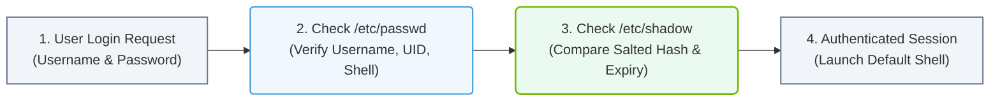

# 4.2a /etc/passwd and /etc/shadow: anatomy of user account files

<div class="lesson-completion" data-lesson-id="4_2a_passwd_and_shadow_files"></div>
<div class="lesson-tags">
  <span class="lesson-tag">📦 Operating System Layer</span>
  <span class="lesson-tag">📖 Core Linux Administration for AI Operators</span>
</div>


---

## 📘 Context Introduction

When managing AI infrastructure, every process, container, and service runs under a specific user account. Understanding how Linux stores user information is essential for troubleshooting permissions, managing access to GPUs, and securing model training environments. Two critical files—**/etc/passwd** and **/etc/shadow**—hold the blueprint for every user on the system. This guide breaks down their structure so you can confidently inspect and interpret user account details.


---

## ⚙️ What is /etc/passwd?

The **/etc/passwd** file is a plain-text database that contains basic information about every user account on the system. It is world-readable (any user can view it) but should never store passwords directly.

### 🔍 Anatomy of a Single Entry

Each line in **/etc/passwd** represents one user and is divided into seven fields, separated by colons (`:`).

**Field structure (from left to right):**

- **Username** – The login name used to identify the user (e.g., `nvidia`, `root`).
- **Password placeholder** – Historically stored the hashed password; now almost always contains an `x` to indicate the real password is in **/etc/shadow**.
- **User ID (UID)** – A numeric identifier. UID 0 is reserved for `root`. Regular users typically start at UID 1000.
- **Group ID (GID)** – The primary group ID for the user.
- **GECOS field** – A comma-separated comment field (often holds the user's full name, office, phone, etc.).
- **Home directory** – The absolute path to the user's home folder (e.g., `/home/nvidia`).
- **Login shell** – The default shell program (e.g., `/bin/bash`, `/usr/sbin/nologin` for service accounts).

### 📊 Example Breakdown

For reference, a typical line might look like this:

```
nvidia:x:1001:1001:NVIDIA AI User,,,:/home/nvidia:/bin/bash
```

📤 **Output:**  
- **Username:** `nvidia`  
- **Password placeholder:** `x`  
- **UID:** `1001`  
- **GID:** `1001`  
- **GECOS:** `NVIDIA AI User,,,`  
- **Home directory:** `/home/nvidia`  
- **Login shell:** `/bin/bash`

---

## 🛡️ What is /etc/shadow?

The **/etc/shadow** file stores sensitive password-related data and is only readable by the `root` user or users with `sudo` privileges. This file protects hashed passwords and password aging policies.

### 🔍 Anatomy of a Single Entry

Each line in **/etc/shadow** corresponds to a user in **/etc/passwd** and contains nine fields, also separated by colons.

**Field structure (from left to right):**

- **Username** – Must match the username in **/etc/passwd**.
- **Hashed password** – The encrypted password (using algorithms like SHA-512). An `!` or `*` means the account is locked.
- **Last password change** – The number of days since January 1, 1970 (epoch) when the password was last changed.
- **Minimum password age** – Minimum number of days before the password can be changed again.
- **Maximum password age** – Maximum number of days the password is valid before a change is required.
- **Password warning period** – Number of days before password expiry that the user is warned.
- **Password inactivity period** – Number of days after password expiry before the account is disabled.
- **Account expiration date** – The date (in epoch days) when the account will be disabled.
- **Reserved field** – Currently unused, reserved for future use.

### 📊 Example Breakdown

For reference, a typical line might look like this:

```
nvidia:$6$xyz123hashvalue...:18934:0:99999:7:::
```

📤 **Output:**  
- **Username:** `nvidia`  
- **Hashed password:** `$6$xyz123hashvalue...` (SHA-512 hash)  
- **Last password change:** `18934` days since epoch  
- **Minimum age:** `0` (no minimum)  
- **Maximum age:** `99999` (effectively never expires)  
- **Warning period:** `7` days  
- **Inactivity period:** (empty – not set)  
- **Expiration date:** (empty – not set)  
- **Reserved:** (empty)

---

## 🕵️ Key Differences Between /etc/passwd and /etc/shadow

| Feature | /etc/passwd | /etc/shadow |
|---------|-------------|-------------|
| **Purpose** | Stores basic user account info | Stores password hashes and aging policies |
| **Readable by** | All users (world-readable) | Only root and privileged users |
| **Password storage** | Placeholder (`x`) | Hashed password string |
| **Password aging** | Not included | Included (min/max age, warning, inactivity) |
| **Account expiration** | Not included | Included |
| **Typical fields** | 7 fields | 9 fields |

### 📊 Visual Representation: User Authentication Flow
This flowchart maps the verification sequence performed by the Linux PAM system using `/etc/passwd` for identity metadata and `/etc/shadow` for secure credentials.



---

## 🛠️ Why This Matters for AI Infrastructure

- **GPU access control** – User accounts must be part of the `video` or `render` groups to access NVIDIA GPUs. Inspecting **/etc/passwd** and **/etc/group** helps verify group membership.
- **Service accounts** – AI frameworks (e.g., TensorFlow, PyTorch) often run under dedicated service accounts. These accounts typically have `/usr/sbin/nologin` as their shell and locked passwords in **/etc/shadow**.
- **Security hardening** – Never store plain-text passwords in **/etc/passwd**. Always ensure the `x` placeholder is present and that **/etc/shadow** has proper permissions (readable only by root).
- **Container environments** – When running AI workloads in containers, user IDs inside the container must map correctly to host UIDs for file permissions on shared volumes.

---

## ✅ Quick Tips for New Engineers

- Use **bolded** `getent passwd` and **bolded** `getent shadow` to view entries without reading raw files.
- If a user cannot log in, check **/etc/shadow** for a locked password (`!` or `*` in the second field).
- The **UID 0** is reserved for `root` — never assign it to a regular user.
- For AI model training jobs, create dedicated user accounts with limited privileges and no login shell for security.

---

## 📚 Summary

- **/etc/passwd** holds basic user info and is world-readable.
- **/etc/shadow** holds password hashes and aging rules, and is root-only.
- Both files use colon-separated fields with specific meanings.
- Understanding these files helps you manage user access, secure AI infrastructure, and troubleshoot permission issues.