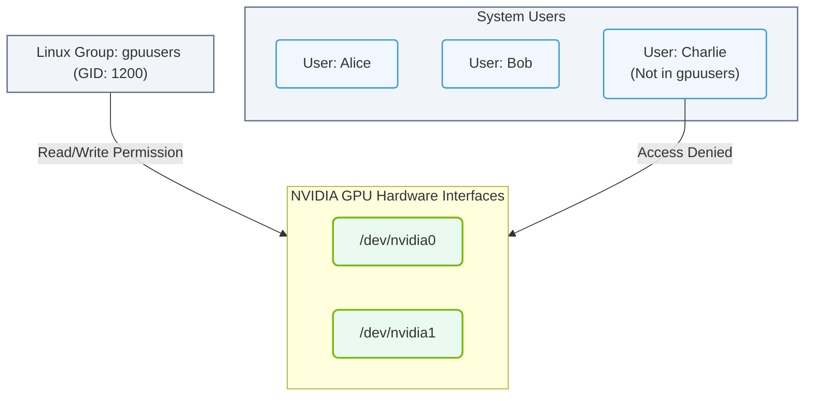

# 4.2c groupadd, gpasswd: managing groups for shared GPU access

<div class="lesson-completion" data-lesson-id="4_2c_group_management_gpu_access"></div>
<div class="lesson-tags">
  <span class="lesson-tag">📦 Operating System Layer</span>
  <span class="lesson-tag">📖 Core Linux Administration for AI Operators</span>
</div>


---

In AI infrastructure, GPUs are expensive and powerful resources that often need to be shared among multiple users. Instead of giving every user direct access to the GPU devices (which can lead to conflicts or security issues), Linux groups provide a clean way to control who can use the GPUs. This section covers two essential commands — **groupadd** and **gpasswd** — that help you create and manage these groups for shared GPU access.

Think of a group as a "club membership." Once a user is added to the GPU group, they automatically get permission to use the GPU devices without needing special administrative rights every time.


---

## ⚙️ What is a Group in Linux?

- A **group** is a collection of user accounts that share common permissions.
- In AI infrastructure, a common group name for GPU access is **video** or **render** (or a custom group like **gpuusers**).
- When a user is added to the GPU group, they can access GPU devices (like **/dev/nvidia0**, **/dev/nvidia1**) without being a superuser (root).
- Groups make it easy to add or remove GPU access for multiple users at once.

---

## 🛠️ Creating a New Group with groupadd

The **groupadd** command is used to create a new group on the system.

**Key points:**
- You must have root or sudo privileges to create a group.
- The group name should be descriptive, such as **gpuusers** or **nvidia-access**.
- Each group gets a unique **Group ID (GID)** automatically.

**Example scenario:**
An engineer needs to create a group called **gpuusers** so that team members can share access to two NVIDIA GPUs installed on the server.

For reference:
```
groupadd gpuusers
```
📤 Output: No output if successful (the group is created silently).

---

## 🕵️ Managing Group Membership with gpasswd

The **gpasswd** command is used to manage group membership — adding or removing users from a group.

**Key points:**
- Use **gpasswd -a username groupname** to add a user to a group.
- Use **gpasswd -d username groupname** to remove a user from a group.
- Changes take effect immediately, but the user may need to log out and log back in for the new group membership to be recognized.

**Example scenario:**
An engineer wants to add two users — **alice** and **bob** — to the **gpuusers** group so they can run AI training jobs on the shared GPUs.

For reference:
```
gpasswd -a alice gpuusers
gpasswd -a bob gpuusers
```
📤 Output:  
Adding user alice to group gpuusers  
Adding user bob to group gpuusers

---

## 📊 Comparison: groupadd vs gpasswd

| Feature | groupadd | gpasswd |
|---------|----------|---------|
| **Purpose** | Creates a new group | Manages membership of an existing group |
| **When to use** | First-time setup of a GPU access group | Adding/removing users from that group |
| **Requires root?** | Yes | Yes |
| **Example use case** | Creating **gpuusers** group for the first time | Adding **alice** to **gpuusers** so she can use GPUs |
| **Frequency of use** | Once (or rarely) | Frequently (as users join/leave projects) |

---

## 🔄 How Groups Enable Shared GPU Access

Here is the logical flow of how groups work with GPUs:

1. **Create the group** — Use **groupadd** to create a group like **gpuusers**.
2. **Set GPU device permissions** — The system administrator ensures that GPU devices (e.g., **/dev/nvidia0**) are owned by the group or have group-read/write permissions.
3. **Add users to the group** — Use **gpasswd -a** to add each engineer who needs GPU access.
4. **User logs in again** — The user logs out and back in (or starts a new session) so the group membership takes effect.
5. **User runs AI workloads** — The user can now run GPU-accelerated applications (like TensorFlow or PyTorch) without permission errors.

### 📊 Visual Representation: Group-Based GPU Access Control
This diagram shows how users are consolidated into a dedicated Linux group (e.g., `gpuusers`) to securely share write/read access to physical NVIDIA GPU device files, while unauthorized users are blocked.



---

## ✅ Best Practices for Engineers

- **Use descriptive group names** — Name the group something clear like **gpuusers** or **nvidia-team** so everyone understands its purpose.
- **Keep group membership minimal** — Only add users who genuinely need GPU access to avoid resource contention.
- **Document group members** — Maintain a simple list of which users belong to which GPU group for auditing purposes.
- **Test after adding a user** — Have the user run **nvidia-smi** (after logging out and back in) to confirm they can see the GPUs.
- **Use gpasswd for temporary access** — If a user only needs GPU access for a short project, use **gpasswd -d** to remove them when the project ends.

---

## 🧪 Quick Reference Summary

| Command | What it does |
|---------|--------------|
| **groupadd gpuusers** | Creates a new group named **gpuusers** |
| **gpasswd -a alice gpuusers** | Adds user **alice** to the **gpuusers** group |
| **gpasswd -d alice gpuusers** | Removes user **alice** from the **gpuusers** group |

---

## 🚀 Final Thought

Managing groups with **groupadd** and **gpasswd** is a foundational skill for any engineer working with shared AI infrastructure. It allows you to grant or revoke GPU access cleanly without modifying system permissions for each user individually. Once you master these commands, you can efficiently onboard new team members to GPU resources and maintain secure, organized access control across your AI environment.