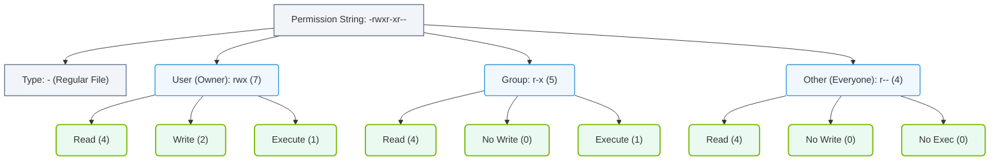

# 4.3a Read, Write, Execute bits for User, Group, Other — decoding ls -la output

  📦 Operating System Layer
  📖 Core Linux Administration for AI Operators

---

## 🧠 Context Introduction

When working with AI infrastructure, you will frequently need to manage access to critical files — model weights, training datasets, configuration files, and scripts. Linux permissions determine **who** can read, write, or execute these resources. The command **ls -la** is your primary tool for inspecting these permissions. This section breaks down how to decode that output, so you can confidently control access to AI assets.

---

## ⚙️ The Anatomy of a Permission String

Every file and directory in Linux has a permission string displayed in the first column of **ls -la** output. It looks like this:

**-rwxr-xr--**

This string is **10 characters long** and is divided into four parts:

| Position(s) | Meaning | Example |
|-------------|---------|---------|
| 1 | File type | **-** (file), **d** (directory) |
| 2-4 | User (owner) permissions | **rwx** |
| 5-7 | Group permissions | **r-x** |
| 8-10 | Other (everyone else) permissions | **r--** |

---

## 🕵️ Decoding the Three Permission Bits

Each set of three characters (positions 2-4, 5-7, 8-10) uses the same pattern:

- **r** = Read permission (view file contents or list directory)
- **w** = Write permission (modify file or create/delete files in directory)
- **x** = Execute permission (run a script or enter a directory)
- **-** = Permission is denied (no access for that bit)

For example, **rwx** means full access: read, write, and execute. **r--** means read-only. **---** means no access at all.

---

## 📊 Permission Breakdown Table

Here is how to interpret the full permission string **-rwxr-xr--**:

| Segment | Characters | Meaning | Numeric Value |
|---------|------------|---------|---------------|
| File type | **-** | Regular file | N/A |
| User | **rwx** | Owner can read, write, execute | 7 |
| Group | **r-x** | Group can read and execute only | 5 |
| Other | **r--** | Everyone else can read only | 4 |

Each permission set can also be represented as a **numeric (octal) value**:
- **r** = 4
- **w** = 2
- **x** = 1
- **-** = 0

Add the values together for each segment. **rwx** = 4+2+1 = 7. **r-x** = 4+0+1 = 5. **r--** = 4+0+0 = 4.

## 🛠️ Reading a Full ls -la Line

When you run **ls -la**, you see output like this (formatted as bolded inline text):

**-rwxr-xr-- 1 alice ml-team 2048 Mar 15 09:30 train_model.py**

Breaking this down:

- **-rwxr-xr--** — Permission string (file type + user + group + other)
- **1** — Number of hard links
- **alice** — File owner (User)
- **ml-team** — Group owner
- **2048** — File size in bytes
- **Mar 15 09:30** — Last modification timestamp
- **train_model.py** — File name

The key takeaway: **alice** (the user) can read, write, and execute this script. Anyone in the **ml-team** group can read and execute it. Everyone else can only read it.

### 📊 Visual Representation: Linux Permission String Anatomy
This diagram maps out a standard 10-character file permission string (`-rwxr-xr--`), breaking it down by entity class (User, Group, Other) and individual permission bits with their numeric weight.

---

## 🔐 Common Permission Scenarios for AI Infrastructure

Here are typical permission patterns you will encounter:

- **Model weights file** — **-rw-------** (Owner only can read/write; protects sensitive model data)
- **Training script** — **-rwxr-xr-x** (Owner can modify; group and others can execute)
- **Dataset directory** — **drwxr-x---** (Owner full access; group can read/list; others denied)
- **Configuration file** — **-rw-r--r--** (Owner can edit; everyone else can read)
- **Log file** — **-rw-rw----** (Owner and group can read/write; others denied)

---

## 🧪 Quick Reference: What Each Permission Allows

| Permission | On a File | On a Directory |
|------------|-----------|----------------|
| **r** (read) | View file contents | List directory contents (with **ls**) |
| **w** (write) | Modify or delete file | Create, rename, or delete files inside |
| **x** (execute) | Run as a program/script | Enter the directory (with **cd**) |

---

## ✅ Summary Checklist for Decoding ls -la

- ✅ First character tells you if it is a file (**-**) or directory (**d**)
- ✅ Next three characters = User (owner) permissions
- ✅ Next three characters = Group permissions
- ✅ Last three characters = Other (everyone else) permissions
- ✅ A dash (**-**) means that specific permission is denied
- ✅ Use the numeric values (4, 2, 1) to quickly calculate permission sets
- ✅ Always check permissions before running AI scripts or accessing datasets to avoid errors

Understanding these bits is essential for securing AI infrastructure — you control exactly who can read training data, who can modify model code, and who can execute inference scripts.