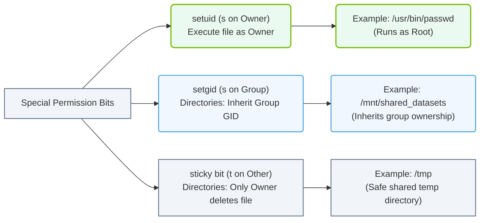

# 4.3d Special bits: setuid, setgid, and the sticky bit

<div class="lesson-completion" data-lesson-id="4_3d_special_permission_bits"></div>
<div class="lesson-tags">
  <span class="lesson-tag">📦 Operating System Layer</span>
  <span class="lesson-tag">📖 Core Linux Administration for AI Operators</span>
</div>


---

In AI infrastructure operations, you will often manage shared storage, model repositories, and training scripts that multiple users or automated processes need to access. Standard Linux permissions (read, write, execute) are not always enough. This is where **special permission bits** come in — they allow you to control *how* permissions are inherited or applied when files and directories are accessed.

For example, you might want a training script to always run with the permissions of its owner (not the person executing it), or you might want to prevent users from deleting each other's files in a shared dataset folder. The three special bits — **setuid**, **setgid**, and the **sticky bit** — solve these exact problems.


## ⚙️ What Are Special Bits?

Special bits are extra permission flags that modify the behavior of executable files and directories. They sit alongside the standard read (r), write (w), and execute (x) permissions.

There are three special bits:

| Special Bit | Symbol | Effect on Files | Effect on Directories |
|-------------|--------|----------------|----------------------|
| **setuid** | **s** (in owner's execute position) | Runs the file with the file owner's permissions, not the user who runs it | (No effect) |
| **setgid** | **s** (in group's execute position) | Runs the file with the file group's permissions | New files inherit the directory's group |
| **sticky bit** | **t** (in others' execute position) | (No effect) | Only file owners (or root) can delete or rename files inside |

---

## 🕵️ How to Identify Special Bits

When you list files with **ls -l**, special bits appear in the permission string where execute bits normally go.

- **setuid** — The owner's execute position shows **s** instead of **x** (lowercase) or **S** (if no execute bit is set).
- **setgid** — The group's execute position shows **s** instead of **x** (lowercase) or **S** (if no execute bit is set).
- **sticky bit** — The others' execute position shows **t** instead of **x** (lowercase) or **T** (if no execute bit is set).

**Example permission strings:**

- **-rwsr-xr-x** — setuid is set (owner has execute and setuid)
- **-rwxr-sr-x** — setgid is set (group has execute and setgid)
- **drwxrwxrwt** — sticky bit is set on a directory (others have execute and sticky bit)

### 📊 Visual Representation: Linux Special Permission Bits
This diagram summarizes the roles and practical system applications of the three special permission bits: setuid, setgid, and the sticky bit.



---

## 🛠️ When to Use Each Special Bit in AI Infrastructure

### 🔑 setuid (Set User ID)

Use setuid when you need a program to run with elevated privileges, regardless of who launches it.

**Common AI use case:** A monitoring script that reads GPU metrics from a protected system file. The script is owned by root, but regular engineers need to run it. With setuid, the script runs as root even when a non-root engineer executes it.

**Important security note:** setuid on scripts (shell scripts, Python files) is often ignored by modern Linux kernels for security reasons. It works reliably only on compiled binaries.

### 👥 setgid (Set Group ID)

Use setgid on directories to ensure all new files and subdirectories automatically belong to a specific group.

**Common AI use case:** A shared project folder for a team of engineers working on a model training pipeline. Set the directory's group to **ml-team** and enable setgid. Any file created inside automatically gets **ml-team** as its group, so everyone in the team can access it without manual permission changes.

### 📌 Sticky Bit

Use the sticky bit on shared directories to prevent users from deleting or renaming files they do not own.

**Common AI use case:** A shared dataset repository where multiple engineers upload and modify files. With the sticky bit set, Engineer A cannot delete Engineer B's uploaded dataset, even if the directory permissions allow write access to everyone.

---

## 🔍 Viewing Special Bits in Practice

To check if special bits are set on a file or directory, use the **ls -l** command.

**For reference:**
```
ls -l /usr/bin/passwd
```

📤 Output: **-rwsr-xr-x 1 root root 59976 Feb 6 2024 /usr/bin/passwd**

The **s** in the owner's execute position tells you setuid is active. This is why any user can change their own password — the **passwd** command runs as root temporarily.

**For reference:**
```
ls -ld /shared/datasets
```

📤 Output: **drwxrwsrwt 2 root ml-team 4096 Mar 10 10:30 /shared/datasets**

Here you see:
- **s** in the group position → setgid is set
- **t** in the others position → sticky bit is set

---

## ✅ Summary Checklist for Engineers

- ✅ Use **setuid** only on compiled binaries that need to run with owner privileges (e.g., root-owned monitoring tools).
- ✅ Use **setgid** on shared directories so new files automatically inherit the correct group.
- ✅ Use the **sticky bit** on shared writable directories to protect files from accidental deletion by other users.
- ✅ Always verify special bits with **ls -l** after setting them.
- ✅ Never set setuid on shell scripts or interpreted scripts — it will not work and creates a false sense of security.

---

## 📖 Quick Reference

| Special Bit | Set with Command | Visible as | Common AI Use |
|-------------|------------------|------------|---------------|
| setuid | **chmod u+s filename** | **s** in owner's x position | Run monitoring tools as root |
| setgid | **chmod g+s directory** | **s** in group's x position | Shared project folders |
| sticky bit | **chmod +t directory** | **t** in others' x position | Shared dataset repositories |

By mastering these three special bits, you gain fine-grained control over how permissions behave in your AI infrastructure — keeping data secure while enabling smooth collaboration across teams.