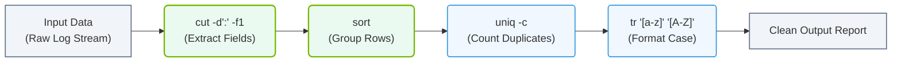

# 4.5c cut, sort, uniq, wc, tr: building command pipelines with pipes and redirection

  📦 Operating System Layer
  📖 Core Linux Administration for AI Operators

---

In AI infrastructure operations, you will constantly work with configuration files, log files, and datasets. These files often contain thousands of lines of text. Manually reading through them is impractical. Instead, you need to process, filter, sort, count, and transform text efficiently.

This topic introduces five essential text-processing commands — **cut**, **sort**, **uniq**, **wc**, and **tr** — and shows you how to combine them using **pipes** and **redirection** to build powerful command pipelines. These pipelines allow you to extract meaningful information from raw data without writing complex scripts.

## ⚙️ The Five Core Commands

Each command has a specific purpose. Understanding them individually is the first step to building pipelines.

### ✂️ cut — Extract Specific Columns

The **cut** command extracts specific fields (columns) from each line of a file or input stream. It is commonly used to parse structured text like CSV or log files.

- **Key option**: **-d** (delimiter) specifies the character that separates fields (e.g., comma, space, colon).
- **Key option**: **-f** (field) specifies which field numbers to extract (e.g., **-f1,3** for fields 1 and 3).
- **Common use case**: Extracting usernames from the **/etc/passwd** file where fields are separated by colons.

---

### 🔢 sort — Arrange Lines in Order

The **sort** command arranges lines of text alphabetically or numerically.

- **Key option**: **-n** sorts numerically instead of alphabetically.
- **Key option**: **-r** reverses the sort order (descending).
- **Key option**: **-k** sorts by a specific column (field).
- **Common use case**: Sorting a list of error codes or timestamps in a log file.

---

### 🧹 uniq — Remove or Count Duplicate Lines

The **uniq** command filters out repeated lines that are adjacent to each other. It is almost always used after **sort** because duplicates must be consecutive to be detected.

- **Key option**: **-c** counts how many times each line appears.
- **Key option**: **-d** shows only duplicate lines.
- **Common use case**: Finding the most frequent IP addresses in an access log.

---

### 📊 wc — Count Lines, Words, and Characters

The **wc** command counts the number of lines, words, and characters in a file or input stream.

- **Key option**: **-l** counts only lines (most common use).
- **Key option**: **-w** counts only words.
- **Key option**: **-c** counts only bytes/characters.
- **Common use case**: Checking how many lines are in a configuration file or how many log entries exist.

---

### 🔄 tr — Translate or Delete Characters

The **tr** command translates (replaces) or deletes characters from the input stream. It works on individual characters, not words or lines.

- **Common use**: Converting lowercase to uppercase with **tr 'a-z' 'A-Z'**.
- **Common use**: Deleting specific characters with **-d** option.
- **Common use**: Squeezing repeated characters into a single character with **-s** option.
- **Common use case**: Cleaning up messy log output by removing extra spaces or converting delimiters.

---

## 🛠️ Building Command Pipelines with Pipes

A **pipe** (represented by the **|** symbol) sends the output of one command directly into the input of the next command. This allows you to chain multiple commands together in a single line.

### 🔗 How Pipes Work

- The command on the left of the pipe produces output.
- That output becomes the input for the command on the right of the pipe.
- You can chain as many commands as needed.

### 🧪 Example Pipeline Concept

Imagine you have a log file with thousands of lines. You want to:

1. Extract the third column (IP addresses).
2. Sort those IP addresses.
3. Count how many times each unique IP appears.
4. Sort the results by frequency (most frequent first).

The pipeline would look like this conceptually:

**cut -d' ' -f3 logfile.txt | sort | uniq -c | sort -nr**

- **cut** extracts the IP addresses.
- **sort** arranges them alphabetically so duplicates are adjacent.
- **uniq -c** counts each unique IP.
- **sort -nr** sorts the counts numerically in reverse order (highest first).

---

## 📂 Using Redirection

Redirection controls where input comes from and where output goes. It uses the symbols **>**, **<**, and **>>**.

### ➡️ Output Redirection (> and >>)

- **>** sends the output of a command to a file, overwriting the file if it exists.
- **>>** appends the output to the end of a file without overwriting.

### ⬅️ Input Redirection (<)

- **<** takes the content of a file as input to a command.

### 🔄 Combining Pipes and Redirection

You can use pipes to process data and redirection to save the final result to a file.

**Conceptual example**: Extract the second column from a CSV file, sort it, count duplicates, and save the result to a new file.

**cut -d',' -f2 data.csv | sort | uniq -c > result.txt**

- The pipe chain processes the data.
- The **>** saves the final output to **result.txt**.

---

## 🕵️ Practical Use Cases in AI Infrastructure

### 📋 Analyzing Log Files

- Count unique error messages in a system log.
- Find the top 10 most frequent IP addresses accessing a GPU server.
- Extract timestamps to identify peak usage periods.

### ⚙️ Processing Configuration Files

- Extract all enabled service names from a configuration file.
- Count how many GPU nodes are listed in a cluster configuration.
- Transform configuration values from lowercase to uppercase.

### 📊 Data Preparation

- Remove duplicate entries from a dataset before training.
- Count the number of rows in a CSV file.
- Extract specific columns from a large dataset for analysis.

### 📊 Visual Representation: Linux Command Pipeline Workflow
This horizontal flowchart shows how individual text-manipulation utilities are chained together using pipes (`|`) to incrementally ingest, filter, count, and format raw text data.

---

## 🆚 Comparison Table: When to Use Each Command

| Command | Primary Purpose | Typical Use Case |
|---------|----------------|------------------|
| **cut** | Extract columns/fields | Get the first column from a CSV file |
| **sort** | Arrange lines in order | Sort error codes numerically |
| **uniq** | Remove or count duplicates | Find unique IP addresses in a log |
| **wc** | Count lines, words, characters | Count total log entries |
| **tr** | Translate or delete characters | Convert text to uppercase |

---

## ✅ Key Takeaways for New Engineers

- **Pipes** (**|**) connect commands together, passing output from one to the next.
- **Redirection** (**>**, **>>**, **<**) controls where data comes from and where results go.
- **cut** extracts specific fields; **sort** orders them; **uniq** removes or counts duplicates; **wc** counts totals; **tr** transforms characters.
- Always use **sort** before **uniq** to ensure duplicates are adjacent.
- Build pipelines step by step — test each command individually first, then chain them together.
- These commands are lightweight and fast, making them ideal for processing large log files without loading them into memory entirely.

---

## 📚 Next Steps

Practice building simple pipelines on sample log files. Start with a two-command pipeline (e.g., **cut | sort**), then add a third command (e.g., **cut | sort | uniq -c**). As you become comfortable, you will be able to extract complex insights from raw text data in seconds — a critical skill for managing AI infrastructure at scale.