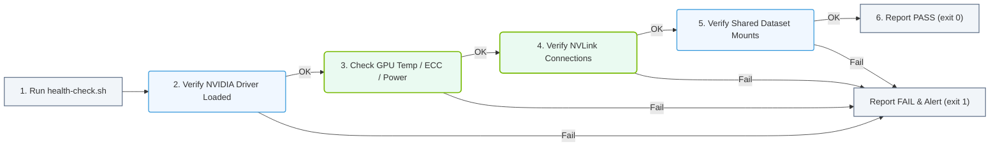

# 4.6e Writing health-check scripts for GPU cluster nodes

  📦 Operating System Layer
  📖 Core Linux Administration for AI Operators

---

In an AI infrastructure environment, GPU cluster nodes are the workhorses that power training and inference workloads. These nodes contain expensive and sensitive hardware — GPUs, high-speed interconnects (like NVLink or InfiniBand), and large memory pools. A single failing component can disrupt an entire training job or degrade performance silently.

Health-check scripts are automated Bash or Python scripts that periodically verify that every component of a GPU node is operating within acceptable parameters. They act as the first line of defense, alerting operators before a small issue becomes a major outage. For new engineers, writing these scripts is a foundational skill to ensure cluster reliability and uptime.

## ⚙️ What a GPU Node Health-Check Script Should Cover

A comprehensive health-check script for a GPU cluster node typically verifies the following layers:

- **GPU Hardware State** — Checks if all GPUs are present, not in a "failed" or "removed" state, and are responding to driver queries.
- **GPU Temperature and Power** — Ensures temperatures are below thermal thresholds and power draw is within expected ranges (no overcurrent or undervoltage).
- **Memory Health** — Validates that GPU memory (VRAM) is not reporting errors (e.g., ECC errors) and that system RAM is sufficient.
- **Interconnect Health** — Confirms that NVLink or PCIe links between GPUs are active and at full bandwidth.
- **Driver and Kernel Module Status** — Verifies that the NVIDIA driver and related kernel modules (nvidia, nvidia-uvm, nvidia-drm) are loaded correctly.
- **Filesystem and Storage** — Checks that critical mount points (e.g., shared storage for datasets) are accessible and not full.
- **Network Connectivity** — Ensures the node can reach the cluster manager, storage servers, and other nodes.
- **Process and Service Health** — Confirms that essential services (e.g., Docker, NVIDIA Container Toolkit, monitoring agents) are running.

---

## 🛠️ Structure of a Simple Health-Check Script

A well-written health-check script follows a modular pattern:

- **Header Section** — Defines the script name, version, and author. Sets shell options like **set -e** (exit on error) or **set -o pipefail**.
- **Configuration Variables** — Stores thresholds (e.g., max GPU temperature, minimum free disk space) and paths to tools (e.g., nvidia-smi, nvlink-status).
- **Individual Check Functions** — Each function performs one specific check and returns a pass/fail status. For example, a function named **check_gpu_temperature** would query GPU sensors and compare against the configured threshold.
- **Main Execution Loop** — Calls each check function in sequence, collects results, and prints a summary.
- **Exit Status** — Returns a non-zero exit code if any check fails, so automation tools (like Ansible or Kubernetes) can react.

---

## 🕵️ Example Health-Check Logic (Without Code Blocks)

Here is how you would describe the logic for a GPU temperature check in a health-check script:

- First, the script queries the NVIDIA driver using the **nvidia-smi** command with the **--query-gpu=temperature.gpu** flag.
- It captures the output, which is a single number (e.g., 72) representing degrees Celsius.
- The script compares this value against a predefined threshold, such as **85°C**.
- If the temperature exceeds the threshold, the script logs a **FAIL** message with the current temperature and the threshold.
- If the temperature is within range, it logs a **PASS** message.
- The script then moves to the next check, such as GPU power draw or memory ECC errors.

---

## 📊 Comparison: Manual Checks vs. Automated Health-Check Scripts

| Aspect | Manual Checks (SSH into each node) | Automated Health-Check Script |
|--------|------------------------------------|-------------------------------|
| **Speed** | Slow — minutes per node | Fast — seconds per node |
| **Consistency** | Varies by operator | Identical every run |
| **Error Detection** | Misses intermittent issues | Catches patterns over time |
| **Scalability** | Impossible for 100+ nodes | Runs on all nodes in parallel |
| **Integration** | Requires human action | Feeds into monitoring dashboards |
| **History** | No record unless logged | Logs and timestamps every check |

---

## 🧩 Common Failure Modes Detected by Health-Check Scripts

- **GPU Xid Errors** — A critical hardware or driver error that causes the GPU to reset. The script checks the **nvidia-smi** output for "Xid" messages.
- **PCIe Link Degradation** — The GPU is connected at a lower PCIe speed (e.g., Gen2 instead of Gen4). The script queries **nvidia-smi** for **pcie.link.gen.current** and compares it to the expected generation.
- **NVLink Failure** — One or more NVLink bridges are down, reducing GPU-to-GPU bandwidth. The script runs **nvidia-smi nvlink --status** and checks for "Active" state on all links.
- **Memory ECC Errors** — Single-bit or double-bit errors in GPU VRAM. The script reads **nvidia-smi --query-gpu=ecc.errors.volatile.dram** and alerts if the count increases.
- **Driver Timeout** — The NVIDIA driver stops responding. The system log will report "GPU has fallen off the bus."

### 📊 Visual Representation: GPU Node Health-Check Script Pipeline
This flowchart illustrates the sequence of validation checks executed by an automated node health monitoring script, detailing how a failure at any stage triggers an immediate alert and a non-zero exit code.

---

## 📝 Best Practices for Writing Health-Check Scripts

- **Keep it idempotent** — Running the script multiple times should produce the same result and not change system state.
- **Use clear exit codes** — Return **0** for all healthy, **1** for warnings, and **2** for critical failures.
- **Log everything** — Write results to a local file with timestamps so you can review history.
- **Avoid destructive commands** — Never run commands that modify hardware state (like GPU reset) inside a health-check script. That belongs in a separate recovery script.
- **Test on a single node first** — Before deploying to the entire cluster, run the script manually on one node and verify each check.
- **Include a summary report** — At the end of the script, print a table showing which checks passed and which failed, so operators can quickly scan results.

---

## 🔁 Integration with Cluster Management

Health-check scripts are typically not run manually. They are integrated into:

- **Scheduled cron jobs** — Runs every few minutes and alerts if a check fails.
- **Kubernetes node-problem-detector** — A DaemonSet that runs health checks and reports node conditions to the control plane.
- **Ansible playbooks** — Executed before a node is added to the cluster or before starting a training job.
- **Slurm prolog/epilog scripts** — Runs before and after a job to ensure the node is healthy.

---

## ✅ Summary

Writing health-check scripts for GPU cluster nodes is a practical skill that directly impacts the reliability of AI infrastructure. By systematically verifying GPU hardware, drivers, interconnects, and system resources, these scripts catch problems early and reduce downtime. For new engineers, start with simple checks (temperature, GPU count, driver version) and gradually add more sophisticated tests as you learn the behavior of your cluster. Remember: a good health-check script is not just about detecting failures — it is about building confidence that every node is ready to do its job.