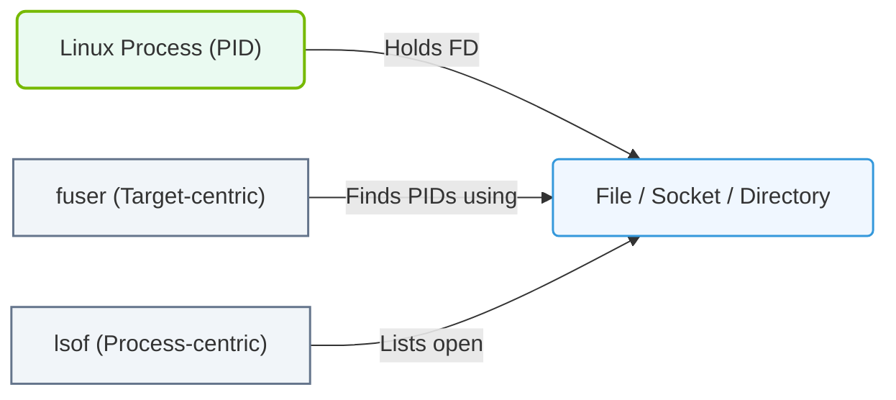

# 5.1d lsof and fuser: finding open files and processes using GPU device files

  📦 Operating System Layer
  📖 Storage & Resource Management for AI Workloads

---

## 🧠 Context Introduction

When running AI workloads on NVIDIA GPUs, each GPU is represented as a special device file on the Linux system. These files live under the **/dev** directory (for example, **/dev/nvidia0**, **/dev/nvidia1**, etc.). Sometimes, a GPU might appear busy or unavailable, and you need to find out *which process* is holding it open. This is where two powerful Linux commands come in: **lsof** and **fuser**. Both help you discover which processes are using GPU device files, allowing you to troubleshoot resource contention or safely terminate stuck jobs.

---

## ⚙️ What Are GPU Device Files?

- GPU device files are special files in Linux that represent physical or virtual GPUs.
- They are located at paths like **/dev/nvidia0**, **/dev/nvidia1**, **/dev/nvidiactl**, and **/dev/nvidia-uvm**.
- When a process (like a training script or inference server) accesses a GPU, it opens one or more of these device files.
- If a process crashes or hangs, it may leave the device file open, blocking other processes from using that GPU.

---

## 🕵️ Using lsof to Find Open GPU Files

**lsof** stands for **List Open Files**. It shows which processes have which files open.

- To see all processes using any NVIDIA device file, run: **lsof /dev/nvidia***
- This will display a list of processes, including their PID (Process ID), the user running them, and the exact device file they have open.
- You can also filter by a specific GPU device, for example: **lsof /dev/nvidia0**
- The output will show columns like **COMMAND**, **PID**, **USER**, **FD** (file descriptor), **TYPE**, **DEVICE**, and **NAME**.

📤 **Output example:**  
A line might show **python3** with **PID 12345** and **NAME /dev/nvidia0**, meaning a Python script is using GPU 0.

---

## 🛠️ Using fuser to Identify Processes on GPU Files

**fuser** is a simpler, more focused tool. It identifies processes using files or sockets.

- To find which process is using a specific GPU device, run: **fuser /dev/nvidia0**
- The output will show only the **PID** numbers of processes using that file.
- To see the process names alongside PIDs, add the **-v** (verbose) flag: **fuser -v /dev/nvidia0**
- You can also check multiple devices at once: **fuser /dev/nvidia0 /dev/nvidia1**

📤 **Output example:**  
**/dev/nvidia0: 12345 12346** means two processes (PIDs 12345 and 12346) are using GPU 0.

---

### 📊 Visual Representation: Process and File Descriptor Mapping
This diagram displays how lsof and fuser inspect the mappings between active system processes and open files or network sockets.

## 📊 Comparison: lsof vs fuser

| Feature | lsof | fuser |
|---------|------|-------|
| **Output detail** | Shows full process info (command, PID, user, file type) | Shows only PIDs (or verbose with names) |
| **Best use case** | Investigating *what* is using a GPU and *who* owns it | Quickly checking *if* a GPU is in use and getting PIDs |
| **Filtering** | Can filter by device, user, or process name | Focused on file or socket paths |
| **Speed** | Slightly slower due to detailed output | Faster for simple checks |
| **Kill capability** | No built-in kill option | Can kill processes with **-k** flag (use with caution) |

---

## 🔍 Practical Workflow for Engineers

1. **Check if a GPU is busy** — Run **nvidia-smi** to see GPU utilization and processes.
2. **Find the exact device file** — If GPU 0 is busy, note the device path **/dev/nvidia0**.
3. **Identify the process** — Use **fuser /dev/nvidia0** to get the PID quickly.
4. **Get more details** — Use **lsof /dev/nvidia0** to see the full command and user.
5. **Decide next steps** — If the process is stuck or unwanted, you can kill it using **kill -9 <PID>** (only after confirming it is safe to terminate).

---

## ⚠️ Important Safety Notes

- Always verify which process is using a GPU before killing it. Accidentally terminating a training job can waste hours of computation.
- Use **fuser -k** with extreme caution — it will kill all processes using the specified file without asking for confirmation.
- For multi-GPU systems, check all device files (**/dev/nvidia0**, **/dev/nvidia1**, etc.) to get a complete picture.
- These commands work on the file system level, so they can detect processes that **nvidia-smi** might miss (for example, processes that have crashed but left the file handle open).

---

## 🧪 Quick Reference Summary

| Task | Command |
|------|---------|
| List all processes using any NVIDIA device | **lsof /dev/nvidia*** |
| Find PIDs using GPU 0 | **fuser /dev/nvidia0** |
| Find PIDs with process names on GPU 0 | **fuser -v /dev/nvidia0** |
| Get detailed info on GPU 0 usage | **lsof /dev/nvidia0** |
| Check multiple GPUs at once | **fuser /dev/nvidia0 /dev/nvidia1** |

---

## 🎯 Key Takeaway

**lsof** and **fuser** are your go-to tools for investigating GPU file usage in Linux. They help you answer the critical question: *"Who is holding my GPU?"* By mastering these commands, you can quickly diagnose resource conflicts, identify runaway processes, and keep your AI infrastructure running smoothly.
