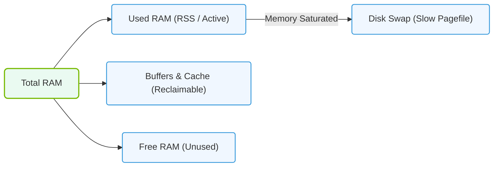

# 5.1e free, /proc/meminfo: dissecting memory usage — buffers, cache, available

  📦 Operating System Layer
  📖 Storage & Resource Management for AI Workloads

---

## 🧠 Context Introduction

When you run AI workloads on Linux systems, understanding memory usage is critical. The **free** command and the **/proc/meminfo** file are your two best friends for diagnosing how memory is being consumed. New engineers often get confused by terms like "buffers," "cache," and "available" — they sound similar but mean very different things.

This guide will break down each component so you can confidently interpret memory reports and spot potential issues before they affect your AI training or inference jobs.

---

## ⚙️ What is the **free** Command?

The **free** command gives you a quick snapshot of total, used, and available memory in your system. It pulls its data directly from **/proc/meminfo**.

Key columns you will see:

- **total** — Physical RAM installed
- **used** — Memory currently in use by processes
- **free** — Memory not used at all
- **shared** — Memory used by tmpfs (temporary filesystems)
- **buff/cache** — Memory used by kernel buffers and page cache
- **available** — Memory available for starting new applications without swapping

> 💡 **Important:** The "free" column is misleading. Just because memory shows as "used" in buff/cache does not mean it is unavailable. Linux uses free RAM for caching to speed up operations.

---

## 📊 Dissecting /proc/meminfo

The **/proc/meminfo** file contains detailed memory statistics. Here are the key fields you need to understand:

| Field | What It Means | Why It Matters for AI |
|-------|---------------|------------------------|
| **MemTotal** | Total physical RAM | Know your hardware limit |
| **MemFree** | Completely unused RAM | Very low = potential issue |
| **Buffers** | Temporary storage for raw disk blocks | Helps with I/O operations |
| **Cached** | Page cache (file data kept in RAM) | Speeds up repeated data access |
| **SwapCached** | Memory swapped out and then read back | Indicates swap pressure |
| **Active** | Recently used memory | High = actively used |
| **Inactive** | Memory not recently used | Can be reclaimed if needed |
| **Available** | Estimated memory for new processes | Most useful metric for capacity planning |

---

## 🕵️ Buffers vs. Cache vs. Available — The Critical Difference

### 🧱 Buffers
- **Purpose:** Store raw disk block metadata
- **Behavior:** Small in size, used for filesystem metadata
- **Reclaimable?** Yes, but not as quickly as cache
- **AI Impact:** Minimal — buffers are usually under 1% of total RAM

### 📦 Cache (Page Cache)
- **Purpose:** Store file contents read from disk
- **Behavior:** Grows as you read/write files (datasets, model weights)
- **Reclaimable?** Yes, instantly — kernel frees it when applications need memory
- **AI Impact:** Huge — loading large datasets fills cache, which speeds up repeated training epochs

### ✅ Available
- **Purpose:** Shows how much memory can be allocated to new processes without swapping
- **Calculation:** MemFree + (reclaimable cache) + (reclaimable slab)
- **Reclaimable?** This is the "safe" number for capacity planning
- **AI Impact:** This is the number you should watch — not "free"

---

### 📊 Visual Representation: Linux RAM Allocation Breakdown
This diagram illustrates the allocation of physical memory (RAM) in Linux, highlighting the difference between free memory, buffered/cached space, and swap.

## 🛠️ How to Interpret Memory for AI Workloads

When you run an AI training job, here is what typically happens:

1. **Before training:** Your system shows high "free" memory
2. **During data loading:** Cache grows as dataset files are read from disk
3. **During training:** GPU memory is separate, but CPU RAM is used for data preprocessing
4. **After training:** Cache remains high — this is normal and good

**Red flags to watch for:**

- **Available memory drops below 10%** of total RAM — risk of swapping
- **Swap usage increases** — performance will tank
- **Buffers grow unusually large** — could indicate a filesystem issue
- **MemFree stays near zero but Available is healthy** — this is normal

---

## 📋 Comparison Table: Memory Terms at a Glance

| Term | Reclaimable? | Typical Size | AI Relevance |
|------|--------------|--------------|--------------|
| MemFree | N/A | Small (5-10%) | Not useful alone |
| Buffers | Yes (slow) | Very small | Low |
| Cached | Yes (instant) | Large (40-70%) | High — speeds up data loading |
| Available | Yes | Best metric | Critical — use for planning |
| Used (by processes) | No | Variable | Monitor for leaks |

---

## 🧪 Practical Scenario: Reading Memory on an AI Server

Imagine you run a memory check and see:

- **total:** 256 GB
- **free:** 2 GB
- **buff/cache:** 200 GB
- **available:** 180 GB

**What does this mean?**

- Only 2 GB is truly unused — but that is fine
- 200 GB is being used for caching datasets and files
- 180 GB is available for new processes — plenty of headroom
- Your AI job can still start without swapping

**What if you see:**

- **total:** 256 GB
- **free:** 1 GB
- **buff/cache:** 50 GB
- **available:** 5 GB

**Problem:** Only 5 GB available — your next AI job may trigger swapping. Investigate what processes are consuming memory.

---

## ✅ Key Takeaways for New Engineers

- **Ignore "free" memory** — focus on "available" instead
- **Cache is your friend** — it speeds up AI data loading
- **Buffers are rarely a concern** for AI workloads
- **Watch available memory** — if it drops below 10-15%, investigate
- **Use /proc/meminfo** for detailed analysis when troubleshooting
- **High cache usage is normal** — Linux is doing its job efficiently

---

## 📚 Quick Reference

| Command / File | What It Shows | Best Use Case |
|----------------|---------------|---------------|
| **free -h** | Human-readable memory summary | Quick daily check |
| **free -w** | Wide output with swap details | When swap is a concern |
| **cat /proc/meminfo** | Full memory breakdown | Deep troubleshooting |
| **vmstat 1** | Memory + CPU + I/O in real time | Live monitoring during training |

---

> **Final thought:** Memory management in Linux is designed to maximize performance. A system with high cache usage and low free memory is often a *healthy* system — especially when running data-intensive AI workloads. Learn to read "available" and you will avoid many false alarms.