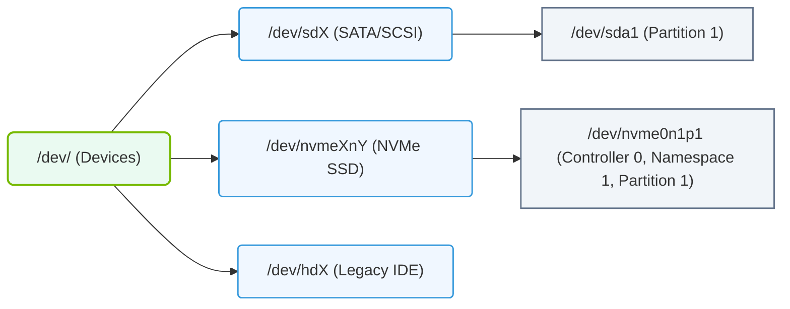

# 5.2a Block device naming: /dev/sda, /dev/nvme0n1 and partition naming conventions

<div class="lesson-completion" data-lesson-id="5_2a_block_device_naming"></div>
<div class="lesson-tags">
  <span class="lesson-tag">📦 Operating System Layer</span>
  <span class="lesson-tag">📖 Storage & Resource Management for AI Workloads</span>
</div>


When you work with AI infrastructure, you will frequently need to identify and manage storage devices. In Linux, every storage device is represented as a file inside the **/dev/** directory. Understanding how these devices are named — like **/dev/sda** or **/dev/nvme0n1** — is essential for configuring storage for AI workloads, such as attaching data drives for training datasets or setting up high-speed NVMe storage for model caching.

---

## ⚙️ What Is a Block Device?

A **block device** is any storage device that reads and writes data in fixed-size chunks (blocks). Common examples include:
- Hard disk drives (HDDs)
- Solid-state drives (SSDs)
- NVMe drives
- USB flash drives
- Virtual disks in cloud or virtualized environments

These devices are accessed through special files in **/dev/**, and their names follow predictable conventions based on the hardware interface and driver used.

---

## 📊 Traditional Naming: /dev/sdX

The **sd** prefix stands for **SCSI disk** or **SATA disk**. This naming scheme is used for:
- SATA hard drives and SSDs
- SCSI drives
- USB storage devices
- Virtual disks in hypervisors (e.g., VMware, KVM)

### How it works:
- The first detected SATA/SCSI disk is named **/dev/sda**
- The second is **/dev/sdb**, then **/dev/sdc**, and so on
- Letters continue alphabetically: **sda**, **sdb**, **sdc**, **sdd**, etc.

### Partitions on sdX devices:
- The first partition on **/dev/sda** is named **/dev/sda1**
- The second partition is **/dev/sda2**, third is **/dev/sda3**, etc.
- This applies to all **sdX** devices

### Example naming pattern:
- **/dev/sda** — the entire first SATA/SCSI disk
- **/dev/sda1** — first partition on that disk
- **/dev/sda2** — second partition
- **/dev/sdb** — the entire second disk
- **/dev/sdb1** — first partition on the second disk

---

## 🛠️ Modern Naming: /dev/nvmeXnY

**NVMe** (Non-Volatile Memory Express) drives are much faster than traditional SATA SSDs and are commonly used in AI servers for high-speed data access. Their naming convention is different.

### How it works:
- **nvme** indicates the drive uses the NVMe protocol
- The number after **nvme** is the **controller number** (starts at 0)
- The number after **n** is the **namespace** (usually 1 for a single drive)

### Example breakdown:
- **/dev/nvme0n1** — first NVMe controller, first namespace (the whole drive)
- **/dev/nvme1n1** — second NVMe controller, first namespace
- **/dev/nvme0n2** — first controller, second namespace (rare, used in multi-tenant setups)

### Partitions on NVMe devices:
- Partitions are appended with **p** followed by the partition number
- **/dev/nvme0n1p1** — first partition on the first NVMe drive
- **/dev/nvme0n1p2** — second partition
- **/dev/nvme1n1p1** — first partition on the second NVMe drive

### Example naming pattern:
- **/dev/nvme0n1** — the entire first NVMe drive
- **/dev/nvme0n1p1** — first partition on that drive
- **/dev/nvme0n1p2** — second partition
- **/dev/nvme1n1** — the entire second NVMe drive
- **/dev/nvme1n1p1** — first partition on the second NVMe drive

---

### 📊 Visual Representation: Linux Block Device Naming Conventions
This diagram details the device path naming schemes for SCSI/SATA drives, NVMe drives, and legacy IDE disks in Linux.



## 🕵️ Comparison Table: sdX vs nvmeX

| Feature | **/dev/sdX** | **/dev/nvmeXnY** |
|---------|--------------|------------------|
| **Drive type** | SATA, SCSI, USB, virtual disks | NVMe SSDs |
| **Speed** | Moderate (up to ~600 MB/s for SATA) | Very high (3,500–7,000 MB/s) |
| **Common in AI?** | Yes, for bulk storage | Yes, for fast data access |
| **Partition naming** | **/dev/sda1**, **/dev/sdb2** | **/dev/nvme0n1p1**, **/dev/nvme1n1p2** |
| **First drive example** | **/dev/sda** | **/dev/nvme0n1** |
| **Second drive example** | **/dev/sdb** | **/dev/nvme1n1** |

---

## 🧩 Partition Naming Conventions Summary

| Device Type | Full Device | Partition 1 | Partition 2 | Partition 3 |
|-------------|-------------|-------------|-------------|-------------|
| SATA/SCSI (sdX) | **/dev/sda** | **/dev/sda1** | **/dev/sda2** | **/dev/sda3** |
| NVMe (nvmeX) | **/dev/nvme0n1** | **/dev/nvme0n1p1** | **/dev/nvme0n1p2** | **/dev/nvme0n1p3** |

---

## 🔍 How to Identify Your Devices

To see which block devices are present on your system, you can use the following approach:

- Run the **lsblk** command to list all block devices in a tree format. This will show device names, sizes, and partition layouts.
- The output will display entries like **sda**, **nvme0n1**, and their partitions (**sda1**, **nvme0n1p1**, etc.).
- Another useful tool is **fdisk -l** (run with sudo) to list detailed partition tables for all disks.

For reference, a typical **lsblk** output might look like:

```
NAME        MAJ:MIN RM   SIZE RO TYPE MOUNTPOINT
sda           8:0    0 465.8G  0 disk
├─sda1        8:1    0   512M  0 part /boot/efi
├─sda2        8:2    0   100G  0 part /
└─sda3        8:3    0 365.3G  0 part /data
nvme0n1     259:0    0   1.8T  0 disk
└─nvme0n1p1 259:1    0   1.8T  0 part /fastdata
```

📤 Output: The output shows **sda** with three partitions and **nvme0n1** with one partition.

---

## ✅ Key Takeaways for New Engineers

- **/dev/sda** is the first SATA/SCSI disk; partitions are **/dev/sda1**, **/dev/sda2**, etc.
- **/dev/nvme0n1** is the first NVMe drive; partitions are **/dev/nvme0n1p1**, **/dev/nvme0n1p2**, etc.
- NVMe drives use a **p** before the partition number; sdX drives do not.
- Device letters and numbers are assigned in the order the system detects them, which can change after reboots or hardware changes.
- For AI workloads, NVMe drives are preferred for high-speed data access (e.g., loading large models or datasets), while sdX drives are often used for bulk storage.
- Always verify device names using **lsblk** before performing any operations like formatting or mounting to avoid accidental data loss.