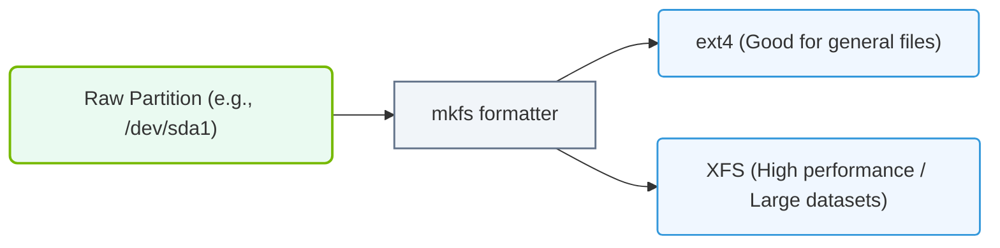

# 5.2c Creating filesystems: mkfs.ext4, mkfs.xfs — choosing for AI workloads

  📦 Operating System Layer
  📖 Storage & Resource Management for AI Workloads

---

## 🧠 Context Introduction

When you provision storage for an AI workload, you are not just formatting a disk — you are making a performance and reliability decision that directly impacts how fast your models train and how safely your data is stored. After partitioning a block device (like an NVMe SSD or a RAID array), the next step is to create a filesystem. The two most common choices on Linux for AI infrastructure are **ext4** and **XFS**. Each has strengths and trade-offs that matter for different stages of the AI pipeline — from data ingestion to model checkpointing.

This guide will help you understand when to use **ext4** and when to use **XFS** for AI workloads, and how to create them using the **mkfs.ext4** and **mkfs.xfs** commands.

---

## ⚙️ What is a Filesystem and Why Does It Matter for AI?

A filesystem is the structure that organizes how data is stored, named, and retrieved on a block device. For AI workloads, the filesystem choice affects:

- **Read/write throughput** — critical for loading large datasets and saving model checkpoints
- **Metadata performance** — important when dealing with millions of small files (e.g., image datasets)
- **Scalability** — how the filesystem handles very large volumes (terabytes to petabytes)
- **Reliability** — crash recovery and data integrity during long training runs

---

## 📊 ext4 — The Reliable Workhorse

**ext4** (Fourth Extended Filesystem) is the default filesystem for many Linux distributions. It is mature, stable, and well-tested.

### ✅ Strengths for AI Workloads

- **Excellent for small to medium datasets** — performs well with many small files (e.g., image classification datasets with thousands of individual images)
- **Strong backward compatibility** — can be mounted on older Linux kernels without issues
- **Good crash recovery** — uses journaling to protect against data corruption during unexpected power loss
- **Simple to manage** — most engineers are familiar with ext4 tools and troubleshooting

### ⚠️ Limitations for AI Workloads

- **Maximum filesystem size** — limited to 50 TB (though practical limits are lower for performance)
- **Metadata performance degrades** with very large directories (over 10,000 files in a single folder)
- **Not ideal for concurrent writes** from multiple processes — can become a bottleneck during distributed training

### 🛠️ When to Choose ext4 for AI

| Scenario | Recommendation |
|----------|----------------|
| Single-GPU training with small datasets (under 1 TB) | ✅ Good choice |
| Image classification with thousands of small files | ✅ Good choice |
| Model checkpoint storage for single-node training | ✅ Good choice |
| Multi-node distributed training with large datasets | ❌ Prefer XFS |
| Very large volumes (over 10 TB) | ❌ Prefer XFS |

---

## 📊 XFS — The High-Performance Scalable Filesystem

**XFS** is a high-performance 64-bit journaling filesystem originally developed by Silicon Graphics (SGI). It excels at handling large files and large volumes.

### ✅ Strengths for AI Workloads

- **Exceptional scalability** — supports filesystems up to 8 exabytes (8 million TB)
- **Excellent for large files** — optimized for sequential I/O patterns common in AI datasets (e.g., large binary files, HDF5, TFRecord)
- **Parallel I/O performance** — handles concurrent reads and writes from multiple processes very well, making it ideal for distributed training
- **Fast crash recovery** — uses delayed logging and can recover very large filesystems in seconds
- **Online defragmentation and resizing** — can be expanded without unmounting

### ⚠️ Limitations for AI Workloads

- **Poor performance with many small files** — metadata operations are slower than ext4 for directories with thousands of tiny files
- **Cannot be shrunk** — once created, an XFS filesystem can only be grown, not reduced
- **Slightly more complex** — tuning parameters require more understanding of I/O patterns

### 🛠️ When to Choose XFS for AI

| Scenario | Recommendation |
|----------|----------------|
| Large datasets (over 10 TB) | ✅ Excellent choice |
| Distributed training across multiple GPUs/nodes | ✅ Excellent choice |
| Large binary files (HDF5, TFRecord, Parquet) | ✅ Excellent choice |
| Model checkpoint storage for multi-node training | ✅ Excellent choice |
| Datasets with millions of tiny files | ❌ Prefer ext4 |
| Storage that may need to be shrunk later | ❌ Prefer ext4 |

---

### 📊 Visual Representation: Filesystem Formatting Lifecycle
This flowchart shows how raw disk partitions are formatted into specific filesystems (ext4, XFS) using mkfs, enabling OS-level file storage.

## 🆚 Comparison Table: ext4 vs XFS for AI Workloads

| Feature | ext4 | XFS |
|---------|------|-----|
| **Maximum filesystem size** | 50 TB | 8 EB |
| **Maximum file size** | 16 TB | 8 EB |
| **Small file performance** | ✅ Excellent | ⚠️ Poor |
| **Large file performance** | ⚠️ Good | ✅ Excellent |
| **Concurrent write performance** | ⚠️ Moderate | ✅ Excellent |
| **Crash recovery speed** | ✅ Fast | ✅ Very fast |
| **Online growth** | ✅ Yes | ✅ Yes |
| **Online shrinkage** | ✅ Yes | ❌ No |
| **Maturity** | ✅ Very mature | ✅ Mature |
| **Ease of tuning** | ✅ Simple | ⚠️ Complex |

---

## 🛠️ Creating the Filesystem — Practical Guidance

When you are ready to create a filesystem on a partition (for example, **/dev/nvme0n1p1**), you will use either **mkfs.ext4** or **mkfs.xfs**. The command is straightforward, but the options you choose can significantly impact AI workload performance.

### 🔧 Creating an ext4 Filesystem

For AI workloads with many small files, consider these tuning options:

- **Enable the "flex_bg" feature** — improves performance for large filesystems by grouping metadata blocks together
- **Set the inode ratio** — controls how many inodes (file entries) are created. For datasets with many small files, increase the number of inodes using a smaller bytes-per-inode value
- **Disable unnecessary journaling features** — if data integrity is less critical than raw speed (e.g., scratch storage), you can use the "data=writeback" mode

### 🔧 Creating an XFS Filesystem

For AI workloads with large files and concurrent access, consider these tuning options:

- **Set the allocation group count** — XFS divides the filesystem into allocation groups (AGs). More AGs improve parallel I/O performance. A good rule is one AG per CPU core
- **Set the stripe unit and stripe width** — if your underlying storage is a RAID array or NVMe SSD, aligning the filesystem to the stripe geometry improves throughput
- **Enable large block sizes** — for very large files, a 64 KB block size can improve sequential read/write performance

---

## 🕵️ Verifying Your Filesystem

After creating the filesystem, you should verify it is correctly formatted and check its parameters. Use the following commands (shown as bolded inline text for reference):

**For ext4:** Use **dumpe2fs** with the **-h** flag on the partition to display filesystem parameters like block size, inode count, and features.

**For XFS:** Use **xfs_info** on the mount point (after mounting) to display allocation group count, block size, and other geometry details.

---

## 📌 Summary: Choosing the Right Filesystem for Your AI Workload

| AI Workload Type | Recommended Filesystem | Reason |
|------------------|------------------------|--------|
| Single-node training with small image datasets | ext4 | Better small file performance |
| Single-node training with large binary datasets | XFS | Better large file and sequential I/O |
| Multi-node distributed training | XFS | Superior concurrent write performance |
| Model checkpoint storage (single node) | ext4 | Simpler, reliable for moderate sizes |
| Model checkpoint storage (multi node) | XFS | Handles concurrent writes from multiple trainers |
| Scratch / temporary storage | ext4 (with writeback mode) | Faster writes, less overhead |
| Long-term dataset archive | XFS | Scales to very large volumes |

---

## 🚀 Final Thoughts

For new engineers entering AI infrastructure, the default choice is often **ext4** because it is familiar and reliable. However, as you scale to larger datasets and multi-node training, **XFS** becomes the better option. The key is to understand your workload's I/O pattern:

- **Many small files?** → ext4
- **Few large files?** → XFS
- **Concurrent access?** → XFS
- **Need to shrink later?** → ext4

Both filesystems are well-supported in the Linux ecosystem and work seamlessly with NVIDIA GPUs and AI frameworks like PyTorch and TensorFlow. Start with ext4 for simplicity, and migrate to XFS when your workloads demand higher scalability and parallel performance.
