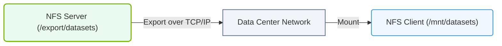

# 5.2e NFS client mounting: automounting shared training datasets

  📦 Operating System Layer
  📖 Storage & Resource Management for AI Workloads

In an AI training environment, datasets are often large and shared across many GPU servers. Instead of copying the same terabytes of data to every machine, engineers use a shared filesystem like NFS (Network File System). Automounting ensures that when a training job starts, the shared dataset is automatically available without manual intervention. This topic covers how to configure NFS client automounting for shared training datasets.

---

## 🧠 Context: Why Automount NFS for AI Training?

- **Shared datasets** — A single copy of training data lives on an NFS server; all GPU nodes access it simultaneously.
- **Avoids duplication** — No need to copy data to each node's local disk.
- **On-demand mounting** — Automounting mounts the NFS share only when it is accessed, saving system resources.
- **Fault tolerance** — If the NFS server temporarily goes down, automounting can retry or fail gracefully without crashing the training job.

---

## ⚙️ How NFS Automounting Works

- The **autofs** service runs on each client machine.
- A **master map file** (usually **/etc/auto.master**) defines which directories trigger automounting.
- **Indirect maps** specify the NFS server and export path for each mount point.
- When a process tries to access a directory under the automount point, autofs mounts the NFS share on demand.
- After a period of inactivity (default 300 seconds), autofs unmounts the share to free resources.

---

## 🛠️ Configuration Steps Overview

1. **Install autofs** on the client machine.
2. **Edit the master map** to define the base automount directory.
3. **Create an indirect map file** that links the subdirectory to the NFS export.
4. **Start and enable the autofs service**.
5. **Test** by accessing the mount point.

---

## 📊 Comparison: Manual Mount vs. Automount

| Feature | Manual Mount (mount command) | Automount (autofs) |
|---------|-----------------------------|---------------------|
| Persistence | Requires entry in /etc/fstab | Configured once in map files |
| Mount timing | Mounted at boot or manually | Mounted on first access |
| Resource usage | Always consumes mount slot | Only mounted when needed |
| Recovery from NFS outage | May hang on boot | Retries on access |
| Best for | Always-needed datasets | Occasionally-used datasets |

---

### 📊 Visual Representation: Network Filesystem (NFS) Client-Server Mount
This diagram shows the connection between a remote NFS server exporting a directory and a local client machine mounting it over the network.

## 🕵️ Key Files and Their Roles

- **/etc/auto.master** — The master configuration file that lists automount base directories and their corresponding map files.
- **/etc/auto.nfs** (or any custom name) — The indirect map file that specifies the NFS server path and mount options for each subdirectory.
- **/etc/autofs.conf** — Contains global autofs settings like timeout duration.

---

## 🔧 Common Mount Options for AI Training Datasets

- **hard** — If the NFS server fails, operations retry indefinitely instead of returning an error. Preferred for training jobs.
- **intr** — Allows interrupting a hung NFS operation with a signal (e.g., Ctrl+C).
- **rw** — Mount the filesystem as read-write (if the dataset needs occasional updates).
- **ro** — Mount as read-only for immutable training datasets.
- **noatime** — Disables updating file access timestamps, improving performance.
- **vers=4.2** — Use NFS version 4.2 for better performance and features.

---

## 🧪 Verification Steps

After configuration, verify automounting works:

- **Check the autofs service status** — Ensure it is active and running.
- **List the automount base directory** — It should appear empty or with a placeholder.
- **Access a dataset path** — For example, change into the dataset directory.
- **Run df -h** — Confirm the NFS share is now mounted.
- **Wait for the timeout period** — Then check again; the mount should disappear.

---

## ⚠️ Troubleshooting Tips

- **Mount not appearing** — Verify the NFS server is reachable and the export path is correct.
- **Permission denied** — Check that the client's user ID matches the server's file ownership.
- **Slow first access** — The first access triggers the mount, which may take a few seconds.
- **Automount not triggering** — Ensure the autofs service is enabled and the master map syntax is correct.

---

## ✅ Summary

Automounting shared training datasets via NFS is a lightweight, efficient way to provide large datasets to multiple GPU servers without manual intervention. By configuring autofs with indirect maps, engineers ensure that datasets are mounted exactly when needed and unmounted when idle — saving resources and simplifying AI infrastructure operations.
