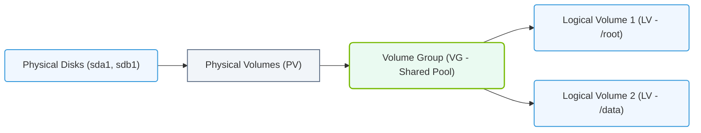

# 5.3a LVM concepts: Physical Volumes (PV), Volume Groups (VG), Logical Volumes (LV)

  📦 Operating System Layer
  📖 Storage & Resource Management for AI Workloads

---

## 🌐 Context Introduction

When managing AI infrastructure, storage flexibility is critical. AI workloads often require dynamic storage resizing, snapshots, and efficient disk space utilization. **Logical Volume Manager (LVM)** is a storage management layer that sits between the physical disks and the file system, allowing engineers to create flexible, resizable storage pools.

Think of LVM as a way to combine multiple physical hard drives into one large virtual pool, then carve out custom-sized chunks from that pool as needed — without worrying about the underlying physical disk boundaries.

---

## ⚙️ What is LVM?

LVM abstracts physical storage into logical units. Instead of working directly with hard disk partitions (like **/dev/sda1**), LVM introduces three key building blocks that work together:

- **Physical Volumes (PV)** — the raw disks or partitions
- **Volume Groups (VG)** — the pool of combined storage
- **Logical Volumes (LV)** — the virtual partitions you actually use

---

## 📦 Physical Volumes (PV) — The Raw Building Blocks

A **Physical Volume** is any block device that LVM can use — typically a hard disk partition (e.g., **/dev/sdb1**) or an entire disk (e.g., **/dev/sdc**).

Key characteristics:
- A PV is created by initializing a disk or partition with LVM metadata
- Each PV is divided into small chunks called **Physical Extents (PE)** — typically 4 MB in size
- Multiple PVs can be added to a single Volume Group

Think of PVs as individual bricks you will use to build a wall.

---

## 🗄️ Volume Groups (VG) — The Storage Pool

A **Volume Group** is a collection of one or more Physical Volumes. It acts as a unified storage pool from which Logical Volumes can be allocated.

Key characteristics:
- A VG can span multiple disks of different sizes
- The total capacity of a VG equals the sum of all its member PVs
- You can add or remove PVs from a VG without disrupting existing data (with some limitations)
- The VG manages the allocation of Physical Extents to Logical Volumes

Think of a VG as a large water tank — you can add more water (disks) to it, and then draw water (storage) from it as needed.

---

## 💾 Logical Volumes (LV) — The Usable Storage

A **Logical Volume** is a virtual block device created from the free space within a Volume Group. This is what you format with a file system (like **ext4** or **xfs**) and mount for use.

Key characteristics:
- LVs can be resized (grown or shrunk) dynamically
- You can create snapshots of LVs for backups or testing
- LVs are accessed via device paths like **/dev/vg_name/lv_name**
- Multiple LVs can exist within a single VG

Think of LVs as buckets you fill from the water tank — you can make them bigger, smaller, or take a snapshot of what's inside.

---

### 📊 Visual Representation: Logical Volume Manager (LVM) Architecture
This diagram maps the structural layers of LVM: physical disks are grouped into a virtual volume group, which is then carved into logical volumes.

## 🛠️ How They Work Together — The LVM Stack

The relationship between PV, VG, and LV is a three-layer hierarchy:

1. **Bottom layer:** Physical disks or partitions become **Physical Volumes (PV)**
2. **Middle layer:** PVs are combined into a **Volume Group (VG)**
3. **Top layer:** From the VG, you create **Logical Volumes (LV)**

**Visual flow:**
- Disk → PV → VG → LV → File System → Mount Point

---

## 📊 Comparison Table: PV vs VG vs LV

| Component | What It Is | Analogy | Can Be Resized? |
|-----------|-----------|---------|-----------------|
| **Physical Volume (PV)** | Initialized disk or partition | A brick | No (fixed size) |
| **Volume Group (VG)** | Pool of one or more PVs | A wall made of bricks | Yes (add/remove bricks) |
| **Logical Volume (LV)** | Virtual partition from VG | A room carved from the wall | Yes (grow or shrink) |

---

## 🕵️ Why LVM Matters for AI Infrastructure

AI workloads have unique storage demands that LVM handles well:

- **Dynamic growth:** Training datasets can grow unexpectedly. With LVM, you can expand a Logical Volume without unmounting or rebooting.
- **Snapshots:** Before running a risky experiment or model update, you can take a read-only snapshot of the LV for quick rollback.
- **Disk replacement:** If a physical disk fails, you can add a new PV to the VG and migrate data without downtime.
- **Pooling:** Combine multiple smaller disks into one large volume group for massive AI datasets.

---

## ✅ Key Takeaways for New Engineers

- **PV** = raw disk ready for LVM
- **VG** = pool of storage from multiple PVs
- **LV** = flexible virtual disk you actually use
- LVM separates physical hardware from logical storage — giving you freedom to resize, snapshot, and reorganize storage without touching hardware
- For AI infrastructure, LVM is a foundational skill for managing growing datasets and model storage efficiently

---

## 📘 Common LVM Workflow (Conceptual)

1. Identify available disks (e.g., **/dev/sdb**, **/dev/sdc**)
2. Initialize them as Physical Volumes
3. Create a Volume Group from those PVs
4. Create a Logical Volume from the VG's free space
5. Format the LV with a file system
6. Mount the LV to a directory (e.g., **/data**)
7. Use the mount point for AI datasets or model storage

---

> 💡 **Pro Tip:** Always check available space in your Volume Group before creating a new Logical Volume. Running out of space in a VG is like trying to fill a bucket from an empty tank.