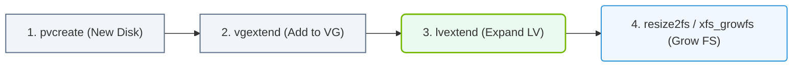

# 5.3b Creating and extending volumes across multiple NVMe drives

<div class="lesson-completion" data-lesson-id="5_3b_extending_volumes_nvme"></div>
<div class="lesson-tags">
  <span class="lesson-tag">📦 Operating System Layer</span>
  <span class="lesson-tag">📖 Storage & Resource Management for AI Workloads</span>
</div>


---

## 🧠 Context Introduction

In AI infrastructure, NVMe drives provide extremely fast storage for data ingestion, model checkpoints, and training datasets. However, a single NVMe drive may not offer enough capacity or performance for large-scale workloads. **Logical Volume Management (LVM)** allows engineers to combine multiple NVMe drives into a single, flexible storage pool. This topic covers how to create a logical volume spanning several NVMe drives and how to extend that volume when more space is needed — all without disrupting running AI workloads.

---

## ⚙️ Key Concepts

- **Physical Volume (PV):** A raw NVMe drive (e.g., `/dev/nvme0n1`) initialized for LVM.
- **Volume Group (VG):** A pool of one or more physical volumes. Storage is allocated from this pool.
- **Logical Volume (LV):** A virtual block device created from the volume group. This is what you format and mount.
- **Extending:** Adding more physical volumes to a volume group, then increasing the logical volume size.

---

## 📊 Comparison: Single Drive vs. LVM Across Multiple NVMe Drives

| Feature | Single NVMe Drive | LVM Across Multiple NVMe Drives |
|---------|-------------------|----------------------------------|
| Capacity | Limited to one drive | Spans multiple drives (e.g., 4 x 2 TB = 8 TB) |
| Performance | Single drive throughput | Striped I/O across drives (higher throughput) |
| Flexibility | Must replace drive to expand | Add drives and extend volume online |
| Downtime for expansion | Usually required | No downtime (online extension) |
| Snapshot support | Limited | Built-in LVM snapshots for backups |

---

## 🛠️ Step-by-Step: Creating a Volume Across Multiple NVMe Drives

### 1️⃣ Prepare the NVMe Drives as Physical Volumes

- Identify your NVMe drives (e.g., `/dev/nvme0n1`, `/dev/nvme1n1`, `/dev/nvme2n1`).
- Initialize each drive as an LVM physical volume.

**For reference:**
```
pvcreate /dev/nvme0n1
pvcreate /dev/nvme1n1
pvcreate /dev/nvme2n1
```
📤 **Output:** Each command returns a confirmation like "Physical volume successfully created."

---

### 2️⃣ Create a Volume Group

- Combine the physical volumes into a single volume group (e.g., `vg_ai_data`).

**For reference:**
```
vgcreate vg_ai_data /dev/nvme0n1 /dev/nvme1n1 /dev/nvme2n1
```
📤 **Output:** "Volume group 'vg_ai_data' successfully created."

---

### 3️⃣ Create a Logical Volume

- Create a logical volume that uses all available space from the volume group (e.g., `lv_training_data`).

**For reference:**
```
lvcreate -l 100%FREE -n lv_training_data vg_ai_data
```
📤 **Output:** "Logical volume 'lv_training_data' created."

---

### 4️⃣ Format and Mount the Logical Volume

- Format the logical volume with a filesystem (e.g., `ext4` or `xfs`).
- Mount it to a directory (e.g., `/mnt/ai_data`).

**For reference:**
```
mkfs.ext4 /dev/vg_ai_data/lv_training_data
mount /dev/vg_ai_data/lv_training_data /mnt/ai_data
```
📤 **Output:** The filesystem is created and mounted. Use `df -h` to verify.

---

### 📊 Visual Representation: LVM Capacity Extension Workflow
This flowchart outlines the steps required to safely expand a logical volume and resize its underlying filesystem on a running system.



## 🚀 Extending the Volume When More Space Is Needed

### 1️⃣ Add a New NVMe Drive

- Physically install a new NVMe drive (e.g., `/dev/nvme3n1`).
- Initialize it as a physical volume.

**For reference:**
```
pvcreate /dev/nvme3n1
```
📤 **Output:** "Physical volume '/dev/nvme3n1' successfully created."

---

### 2️⃣ Extend the Volume Group

- Add the new physical volume to the existing volume group.

**For reference:**
```
vgextend vg_ai_data /dev/nvme3n1
```
📤 **Output:** "Volume group 'vg_ai_data' successfully extended."

---

### 3️⃣ Extend the Logical Volume

- Increase the logical volume size to use the new space. You can specify a size (e.g., `+2TB`) or use all free space.

**For reference:**
```
lvextend -l +100%FREE /dev/vg_ai_data/lv_training_data
```
📤 **Output:** "Size of logical volume vg_ai_data/lv_training_data changed from 6.00 TiB to 8.00 TiB."

---

### 4️⃣ Resize the Filesystem

- After extending the logical volume, resize the filesystem to use the new space.

**For reference:**
```
resize2fs /dev/vg_ai_data/lv_training_data
```
📤 **Output:** "The filesystem on /dev/vg_ai_data/lv_training_data is now 2097152000 (4k) blocks long."

---

## 🕵️ Verification and Monitoring

- **Check physical volumes:** Use `pvs` to see all initialized drives.
- **Check volume group:** Use `vgs` to see total and free space in the pool.
- **Check logical volume:** Use `lvs` to see the size and status of your logical volume.
- **Check mounted storage:** Use `df -h` to confirm the filesystem sees the new capacity.

---

## ✅ Best Practices for AI Workloads

- **Use striping for performance:** When creating the logical volume, consider using `lvcreate --type striped` to spread I/O across all NVMe drives for higher throughput.
- **Monitor drive health:** NVMe drives have limited write endurance. Use `nvme smart-log` to check wear levels.
- **Plan for growth:** Leave some free space in the volume group for snapshots or emergency expansion.
- **Always extend online:** LVM allows extending volumes while the filesystem is mounted and in use — no downtime needed for AI training jobs.

---

## 📝 Summary

Creating and extending volumes across multiple NVMe drives with LVM gives engineers the ability to build large, high-performance storage pools that can grow with AI workloads. The process involves initializing drives as physical volumes, grouping them into a volume group, creating a logical volume, and — when needed — adding more drives and extending both the volume and filesystem without interrupting operations. This flexibility is essential for managing the massive datasets and model checkpoints common in AI infrastructure.
