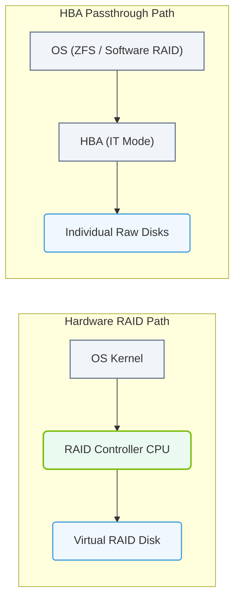

# 5.4c Hardware RAID controllers: HBA passthrough for NVMe performance

  📦 Operating System Layer
  📖 Storage & Resource Management for AI Workloads

## 📖 Context Introduction

When building AI infrastructure, storage performance is critical — especially for workloads like model training and data preprocessing that demand extremely fast read and write speeds. Traditional hardware RAID controllers can introduce latency and bottlenecks when used with NVMe (Non-Volatile Memory Express) drives, which are designed for low-latency, high-throughput access. This is where **HBA passthrough** (Host Bus Adapter passthrough) becomes important. It allows NVMe drives to connect directly to the operating system without RAID controller interference, preserving their native performance. This topic explains how HBA passthrough works, why it matters for AI workloads, and how it differs from traditional RAID configurations.

---

## ⚙️ What is HBA Passthrough?

- **HBA (Host Bus Adapter)** is a hardware card that connects storage devices (like NVMe drives) to a server's motherboard.
- **Passthrough mode** (also called IT mode — "Initiator Target") means the HBA acts as a simple bridge, passing each drive directly to the operating system without any RAID processing.
- In this mode, the operating system sees each NVMe drive as an individual, independent device — not as part of a RAID array.
- This eliminates the latency and overhead introduced by a RAID controller's processor and cache.

---

## 🧠 Why NVMe Performance Matters for AI

- AI workloads, especially training large models, require massive amounts of data to be read from storage into GPU memory quickly.
- NVMe drives already offer speeds up to 5–10x faster than SATA SSDs.
- Adding a hardware RAID controller between the OS and NVMe drives can reduce this speed by 20–40% due to:
  - Controller processing delays.
  - Cache synchronization overhead.
  - Limited PCIe lanes on the RAID card.
- HBA passthrough preserves the full bandwidth and low latency of NVMe drives, which is essential for:
  - Loading large datasets (e.g., terabytes of images or text).
  - Checkpointing model states during training.
  - Streaming data for real-time inference.

---

### 📊 Visual Representation: Hardware RAID Controller vs. Host Bus Adapter (HBA) Data Path
This diagram contrasts the hardware RAID controller path (offloading RAID parity calculations) with HBA IT-mode path (exposing raw disks directly to the OS).

## 🛠️ HBA Passthrough vs. Hardware RAID — A Comparison

| Feature | HBA Passthrough (IT Mode) | Hardware RAID |
|---------|---------------------------|---------------|
| **Performance** | Full NVMe native speed | Reduced due to controller overhead |
| **Latency** | Very low (direct path) | Higher (controller processing) |
| **Redundancy** | Managed by OS (software RAID) | Managed by controller hardware |
| **Flexibility** | High — OS controls drive layout | Low — fixed by RAID card firmware |
| **Complexity** | Simple — no RAID configuration | More complex — requires RAID setup |
| **Best for AI** | Training, data loading, checkpointing | Archival, backup, or mixed workloads |

---

## 🕵️ When to Use HBA Passthrough for NVMe

- **Use HBA passthrough when:**
  - You need maximum read/write speed for AI training or inference.
  - You are using NVMe drives in a high-performance compute cluster.
  - You plan to manage redundancy through software RAID (e.g., Linux mdadm or ZFS).
  - Your workload is I/O intensive and latency-sensitive.

- **Avoid HBA passthrough when:**
  - You need hardware-level RAID protection without OS dependency.
  - You are using older SATA or SAS drives (NVMe passthrough is not applicable).
  - Your server has limited CPU resources to handle software RAID overhead.

---

## 🔧 Practical Considerations for Engineers

- **Check your HBA card:** Not all HBAs support passthrough mode. Look for cards that can be flashed to IT mode (e.g., LSI/Broadcom 9300 or 9400 series).
- **BIOS/UEFI settings:** You may need to configure the HBA to IT mode in the card's firmware interface during boot.
- **Operating system visibility:** After enabling passthrough, each NVMe drive appears as a separate device (e.g., **/dev/nvme0n1**, **/dev/nvme1n1**).
- **Software RAID setup:** Use tools like **mdadm** (Linux) or **ZFS** to combine drives into a RAID array at the OS level if redundancy is needed.
- **Performance testing:** Always benchmark your storage after configuration to confirm you are achieving expected NVMe speeds (e.g., using **fio** or **dd**).

---

## ✅ Key Takeaways

- HBA passthrough is the preferred method for connecting NVMe drives in AI infrastructure because it eliminates RAID controller bottlenecks.
- It provides direct, low-latency access to each drive, preserving the full performance that NVMe technology offers.
- Redundancy can still be achieved through software RAID, but with a slight CPU overhead trade-off.
- For new engineers, understanding when to use passthrough versus hardware RAID is essential for designing storage that meets the demanding performance needs of AI workloads.

---

*This guide is part of the NVIDIA-Certified Associate: AI Infrastructure and Operations curriculum — designed to help new engineers build a strong foundation in storage and resource management for AI.*