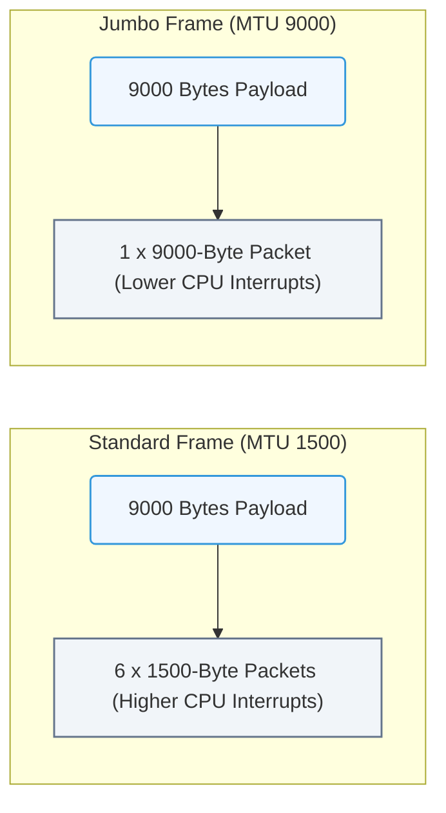

# 6.1e Jumbo frames (MTU 9000): required for high-performance AI network traffic

<div class="lesson-completion" data-lesson-id="6_1e_jumbo_frames"></div>
<div class="lesson-tags">
  <span class="lesson-tag">📦 Operating System Layer</span>
  <span class="lesson-tag">📖 Linux Networking & Security Hardening</span>
</div>


---

## 🌐 Context Introduction

In AI infrastructure, network traffic is massive. When training large models, GPUs constantly exchange data—gradients, parameters, and activations—across the network. Standard Ethernet frames (with a Maximum Transmission Unit, or MTU, of 1500 bytes) create significant overhead because each packet requires CPU processing, header bytes, and interrupt handling.

**Jumbo frames** increase the MTU to **9000 bytes**, allowing each packet to carry up to six times more data. This reduces the number of packets, lowers CPU overhead, and dramatically improves throughput for AI workloads. In high-performance AI clusters—especially those using NVIDIA networking technologies like InfiniBand or high-speed Ethernet—jumbo frames are not optional; they are a baseline requirement.

---

## ⚙️ What Are Jumbo Frames?

- **MTU (Maximum Transmission Unit)** defines the largest single packet that can traverse a network interface.
- Standard Ethernet uses **MTU 1500**.
- Jumbo frames use **MTU 9000** (or sometimes 9216 bytes on certain hardware).
- The term "jumbo" simply means a frame larger than the standard 1500-byte limit.

**Why 9000?** It is a widely supported value across switches, NICs, and storage devices. It balances efficiency gains with compatibility.

---

## 📊 Why Jumbo Frames Matter for AI

| Aspect | Standard MTU (1500) | Jumbo Frames (MTU 9000) |
|--------|---------------------|--------------------------|
| **Packet count for 1 GB data transfer** | ~715,000 packets | ~119,000 packets |
| **Header overhead per packet** | 38 bytes (Ethernet + IP + TCP) | 38 bytes (same) |
| **Total header overhead for 1 GB** | ~27 MB | ~4.5 MB |
| **CPU interrupts per transfer** | Very high | Significantly lower |
| **Network throughput efficiency** | ~94% | ~99%+ |
| **Suitable for AI training traffic** | Poor | Excellent |

**Key takeaway:** Jumbo frames reduce packet processing overhead by over 80%, which directly translates to faster training times and lower latency for distributed AI workloads.

---

## 🛠️ How Jumbo Frames Work in AI Infrastructure

- **End-to-end consistency is critical:** Every device in the data path—NIC, switch, router, and storage target—must support and be configured for the same MTU (typically 9000).
- **If one link in the chain uses MTU 1500**, packets will be fragmented or dropped, causing performance degradation or connectivity failures.
- **NVIDIA networking solutions** (e.g., ConnectX NICs, Spectrum switches) are designed for jumbo frame operation and often default to MTU 9000 in AI-optimized configurations.
- **AI frameworks** (like NVIDIA NeMo, PyTorch Distributed, or TensorFlow) benefit because collective communication operations (e.g., all-reduce) send large messages that fit neatly into jumbo frames.

---

### 📊 Visual Representation: MTU Frame Fragmentation Comparison
This flowchart contrasts standard Ethernet frame transmission (MTU 1500) with Jumbo Frames (MTU 9000), illustrating how large payloads require fewer packets.



## 🕵️ Verifying Jumbo Frame Configuration

To check if a network interface is using jumbo frames, engineers can inspect the MTU value. The expected value for AI workloads is **9000**.

**For reference:**
```bash
ip link show eth0
```
📤 Output: The MTU value appears in the output. Look for `mtu 9000` or `mtu 1500`.

**For reference:**
```bash
cat /sys/class/net/eth0/mtu
```
📤 Output: A number (e.g., `9000` or `1500`).

---

## 🔧 Configuring Jumbo Frames

Configuration must be applied to:
1. **The physical NIC** on every server in the AI cluster.
2. **The switch ports** connecting those servers.
3. **Any virtual interfaces** (e.g., VLANs, bonds) that carry AI traffic.

**For reference (temporary change):**
```bash
ip link set dev eth0 mtu 9000
```

**For reference (persistent change on RHEL/CentOS):**
```bash
# Edit /etc/sysconfig/network-scripts/ifcfg-eth0
# Add or modify: MTU=9000
```

**For reference (persistent change on Ubuntu):**
```bash
# Edit /etc/netplan/01-netcfg.yaml
# Under the interface, add: mtu: 9000
```

**Important:** Always change the MTU on the switch first, then on the server, to avoid packet drops during the transition.

---

## ⚠️ Common Pitfalls and Troubleshooting

- **MTU mismatch:** If one side is 9000 and the other is 1500, large packets will be silently dropped. Use **ping with the "don't fragment" flag** to test.
- **Virtual interfaces:** Bridges, bonds, and VLANs inherit the MTU of their parent interface. Ensure all layers are set to 9000.
- **Storage and management networks:** Do not blindly set MTU 9000 on management interfaces—they often connect to devices that do not support jumbo frames.
- **Driver and firmware:** Outdated NIC drivers may not support jumbo frames correctly. Always verify with the hardware vendor's documentation.

**Testing MTU with ping (conceptual example):**
- Send a ping with a payload of 8972 bytes (which, with headers, equals a 9000-byte frame) and the **don't fragment** flag.
- If the ping succeeds, jumbo frames are working end-to-end.
- If it fails, the path has an MTU bottleneck.

---

## ✅ Summary

- **Jumbo frames (MTU 9000)** are a fundamental requirement for high-performance AI network traffic.
- They reduce packet overhead, CPU load, and latency—critical for distributed GPU training.
- **Configuration must be consistent** across all devices in the data path.
- Engineers should verify MTU settings using simple system commands and test with ping to ensure end-to-end support.
- In NVIDIA-Certified AI infrastructure, jumbo frames are not a "nice-to-have"—they are a baseline expectation for achieving optimal training performance.

---

*Next topic in this section: 6.1f Network bonding and teaming for redundancy and throughput*
