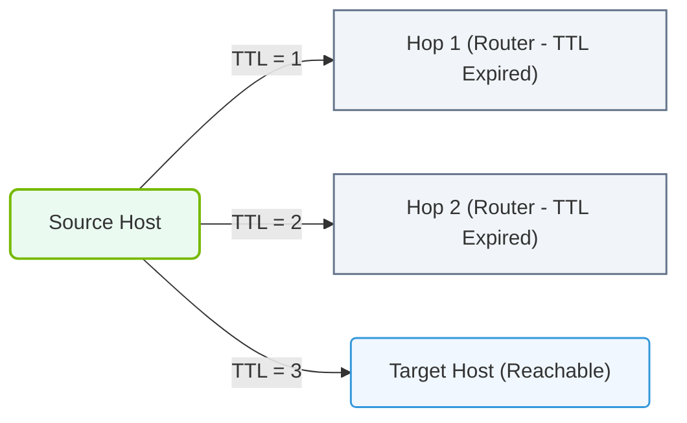

# 6.2c traceroute and mtr: path tracing for latency diagnosis

  📦 Operating System Layer
  📖 Linux Networking & Security Hardening

When training large AI models across multiple GPUs or nodes, network latency between servers can directly impact training performance. Two essential tools for diagnosing where latency or packet loss occurs along the network path are **traceroute** and **mtr** (My Traceroute). These tools help engineers identify problematic hops between their machine and a remote destination.

---

## 🧭 Context: Why Path Tracing Matters in AI Infrastructure

In AI clusters, data must travel between compute nodes, storage systems, and inference endpoints. If a single network hop introduces high latency or drops packets, the entire distributed training job can slow down or fail. Path tracing tools reveal:

- The **route** packets take from source to destination
- **Latency** at each intermediate router or switch
- **Packet loss** at specific hops

This information helps engineers pinpoint whether the problem is in their local network, a provider's backbone, or the destination's infrastructure.

---

## ⚙️ How traceroute Works

**traceroute** sends packets with gradually increasing Time-To-Live (TTL) values. Each router along the path decrements the TTL; when it reaches zero, the router sends back an ICMP Time Exceeded message. By recording the source of these messages, traceroute maps the entire path.

**Key characteristics:**

- Shows each hop (router/switch) by IP address or hostname
- Displays round-trip time (RTT) for each hop
- Useful for identifying where latency spikes occur
- Default behavior sends three probes per hop

**When to use traceroute:**

- You need a one-time snapshot of the network path
- You want to verify routing changes after a configuration update
- You suspect asymmetric routing (different paths for outgoing vs. incoming traffic)

---

## 📊 How mtr (My Traceroute) Works

**mtr** combines the functionality of traceroute and ping into a continuous, real-time diagnostic tool. It repeatedly probes each hop and updates statistics in a live display.

**Key characteristics:**

- Continuously sends probes and updates results
- Shows **average latency**, **loss percentage**, and **standard deviation** per hop
- Runs until manually stopped (Ctrl+C)
- Can output results in report format for analysis

**When to use mtr:**

- You need to monitor a path over time (e.g., during a training job)
- You want to distinguish between transient and persistent packet loss
- You need statistical confidence in latency measurements

---

### 📊 Visual Representation: Traceroute TTL Increment Mechanism
This diagram shows how traceroute identifies hops along a network path by incrementally increasing the IP packet TTL (Time to Live) limit.

## 🛠️ Comparison Table: traceroute vs. mtr

| Feature | traceroute | mtr |
|---------|-----------|-----|
| **Data collection** | One-time snapshot | Continuous, real-time |
| **Latency display** | Per-probe RTT | Average, best, worst, std dev |
| **Packet loss detection** | Limited (3 probes per hop) | Percentage over many probes |
| **Output format** | Terminal output | Live TUI or report |
| **Best for** | Quick path verification | Long-term monitoring and diagnosis |
| **Default probes per hop** | 3 | 10 (configurable) |
| **Installation** | Usually pre-installed | May require package install |

---

## 🕵️ Interpreting Results: What to Look For

When analyzing traceroute or mtr output, focus on these patterns:

**Normal behavior:**
- First hop is your default gateway (low latency, <1ms)
- Subsequent hops show gradually increasing latency
- All hops show 0% packet loss

**Potential issues:**
- **Latency spike at a specific hop**: Indicates a congested or overloaded router
- **Packet loss at a single hop**: May be a router that deprioritizes ICMP (not necessarily a problem)
- **Packet loss at multiple hops**: Likely indicates a real network issue
- **Timeout (* * *) at a hop**: Router configured not to respond to ICMP (common for security)
- **High latency on first hop**: Problem with your local network or switch

**For AI infrastructure specifically:**
- Latency between compute nodes should be very low (sub-millisecond for NVLink/NVSwitch, <10ms for InfiniBand)
- High latency to storage nodes can cause I/O bottlenecks during checkpointing
- Packet loss above 0.1% can significantly degrade NCCL (NVIDIA Collective Communications Library) performance

---

## 📈 Practical Workflow for AI Cluster Troubleshooting

When investigating a performance issue in an AI training job:

1. **Start with mtr** to the problematic node or service
2. **Let it run for 30-60 seconds** to collect enough samples
3. **Look for hops with >1% packet loss** or latency spikes >2x the baseline
4. **Run traceroute** to confirm the path and check for asymmetric routing
5. **Compare results** from multiple source nodes to isolate the faulty device
6. **Generate an mtr report** for escalation to network operations

---

## 📝 Summary

- **traceroute** provides a quick, one-time view of the network path and per-hop latency
- **mtr** offers continuous monitoring with statistical accuracy for latency and packet loss
- Both tools are essential for diagnosing network issues that affect AI training performance
- Focus on latency spikes and packet loss patterns to identify problematic hops
- Use these tools proactively before and during large training runs to ensure network health
