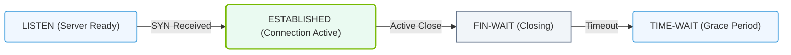

# 6.2d ss (socket statistics): replacing netstat for port and connection analysis

<div class="lesson-completion" data-lesson-id="6_2d_ss_socket_statistics"></div>
<div class="lesson-tags">
  <span class="lesson-tag">📦 Operating System Layer</span>
  <span class="lesson-tag">📖 Linux Networking & Security Hardening</span>
</div>


---

## 🌐 Context Introduction

When managing AI infrastructure, you often need to check which ports are open, which services are listening, and how network connections are behaving. For years, the **netstat** command was the go-to tool for this. However, modern Linux distributions now recommend **ss (socket statistics)** as its faster, more efficient replacement. The `ss` command provides detailed socket information with less overhead — crucial when troubleshooting high-performance AI clusters where every millisecond matters.

---

## ⚙️ Why Replace netstat with ss?

| Feature | netstat | ss |
|---------|---------|----|
| Speed | Slower — reads from `/proc` filesystem | Faster — reads directly from kernel socket information |
| Performance impact | Higher CPU usage | Minimal CPU usage |
| Modern support | Deprecated on many distributions | Actively maintained and recommended |
| Socket types | Limited | Supports UNIX, TCP, UDP, RAW, and more |
| Filtering capabilities | Basic | Advanced filtering with expressions |

For AI infrastructure operators, using `ss` means you can diagnose network issues without adding unnecessary load to already busy GPU nodes.

---

## 🛠️ Basic Usage Concepts

The `ss` command works by querying kernel data structures directly. Here are the fundamental concepts you need to understand:

- **Sockets** are endpoints for network communication — think of them as doors into your system.
- **Listening sockets** are services waiting for incoming connections (like an AI model serving API).
- **Established connections** are active data flows (like a training job sending data to a storage node).
- **Ports** are numbered doorways (e.g., port 22 for SSH, port 8000 for a model server).

---

### 📊 Visual Representation: TCP Connection State Diagram
This flowchart traces the lifecycle of connection socket states (LISTEN, SYN-SENT, ESTABLISHED, TIME-WAIT) tracked by the ss tool.



## 🕵️ Common Analysis Tasks

### 🔍 Viewing All Sockets

To see every socket on your system, you can use the `ss` command without any options. This will display all TCP, UDP, and UNIX sockets currently active.

**For reference:**
```
ss
```

📤 **Output:** A long list of all socket connections, showing local and remote addresses, port numbers, and connection states.

---

### 📡 Checking Listening Ports

When deploying AI services (like TensorFlow Serving or NVIDIA Triton), you need to verify they are listening on the correct port.

**For reference:**
```
ss -tln
```

📤 **Output:** Shows all TCP listening sockets with their port numbers and IP addresses. A service listening on port 8000 would appear as `0.0.0.0:8000` or `*:8000`.

- **-t** = TCP sockets only
- **-l** = listening sockets only
- **-n** = show numeric addresses (no DNS lookups)

---

### 🔗 Viewing Established Connections

For active AI training jobs, you may need to see which remote nodes your system is connected to.

**For reference:**
```
ss -tun
```

📤 **Output:** Displays all TCP and UDP connections that are currently established, including source and destination IP addresses and ports.

- **-u** = UDP sockets
- **-n** = numeric output

---

### 📊 Filtering by Port Number

If you know the specific port your AI service uses (e.g., port 8888 for Jupyter), you can filter directly.

**For reference:**
```
ss -tln sport = :8888
```

📤 **Output:** Shows only sockets where the source port is 8888. You can also use `dport` for destination port filtering.

---

### 🧠 Checking Process Ownership

When multiple services run on an AI node, you need to know which process owns which socket.

**For reference:**
```
ss -tlnp
```

📤 **Output:** Adds the process name and PID to each socket entry. For example, you might see `users:(("python3",pid=12345,fd=3))` next to a listening port.

- **-p** = show process information

---

## 📈 Practical AI Infrastructure Examples

### ✅ Verifying a Model Server is Running

After starting an AI inference server on port 8000, run:

**For reference:**
```
ss -tln sport = :8000
```

📤 **Output:** If the server is running, you will see a line showing `LISTEN` state with port 8000. If nothing appears, the service is not listening.

---

### 🔄 Monitoring Training Job Connections

During distributed training, check connections to your storage server:

**For reference:**
```
ss -tun | grep 10.0.1.50
```

📤 **Output:** Shows all TCP and UDP connections involving the IP address `10.0.1.50`. This helps confirm data transfer is happening.

---

### 🚨 Detecting Port Conflicts

If a new AI service fails to start, check if the port is already in use:

**For reference:**
```
ss -tln | grep :8000
```

📤 **Output:** If another process is using port 8000, you will see it in `LISTEN` state. Use the `-p` option to identify the conflicting process.

---

## 🧪 Summary of Key Options

- **-t** — Show TCP sockets
- **-u** — Show UDP sockets
- **-l** — Show only listening sockets
- **-n** — Show numeric addresses (faster, no DNS)
- **-p** — Show process using the socket
- **-a** — Show all sockets (listening and established)
- **-s** — Print summary statistics

---

## 🎯 Key Takeaways for New Engineers

- **ss is faster and more modern than netstat** — always use `ss` on new systems.
- **Use `-tln` as your default check** for listening services.
- **Add `-p` when you need to know which process owns a socket** — critical for debugging port conflicts.
- **Filter by port with `sport` or `dport`** to quickly find specific services.
- **Combine with `grep`** to search for specific IP addresses or port numbers in large outputs.

By mastering `ss`, you gain a powerful, lightweight tool for network diagnostics that won't slow down your AI infrastructure — even during the most demanding training workloads.
