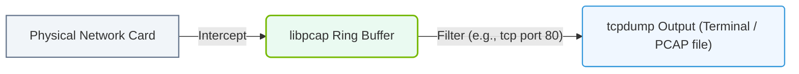

# 6.2e tcpdump: packet capture and filtering for deep network debugging

  📦 Operating System Layer
  📖 Linux Networking & Security Hardening

---

## 🌐 Context Introduction

When AI workloads run across multiple servers—such as during distributed training or data transfer between GPUs—network issues can silently degrade performance. A slow or dropped packet can cause training jobs to stall or fail. **tcpdump** is a powerful command-line tool that captures network packets in real time, allowing engineers to inspect exactly what is happening on the wire. Think of it as a network microscope: it shows every piece of data moving in and out of a server's network interface.

For new engineers, tcpdump is essential for diagnosing connectivity problems, verifying traffic patterns, and understanding how AI cluster communications actually flow.

---

## ⚙️ What is tcpdump?

- **tcpdump** is a packet analyzer that runs on Linux systems.
- It captures raw network traffic from a specific interface (e.g., Ethernet, InfiniBand).
- It can display packet contents in human-readable form or save them to a file for later analysis.
- It works at the network layer (Layer 3) and transport layer (Layer 4) of the OSI model.
- It is non-intrusive: it only listens, it does not modify traffic.

---

## 🕵️ Why Use tcpdump in AI Infrastructure?

- **Verify connectivity** between GPU nodes during distributed training (e.g., NCCL or MPI traffic).
- **Detect packet loss** or retransmissions that slow down data transfers.
- **Inspect latency** by measuring round-trip times between hosts.
- **Identify misconfigured routes** or firewall rules blocking traffic.
- **Debug application-level protocols** like NFS, SSH, or HTTP used in AI pipelines.
- **Monitor bandwidth usage** per connection or per protocol.

---

## 🛠️ Core Concepts for Packet Capture

- **Network Interface**: The physical or virtual port (e.g., **eth0**, **ib0**) where traffic is captured.
- **Packet**: A unit of data transmitted over the network. Each packet has a header (source/destination IP, port, protocol) and a payload (actual data).
- **Capture Filter**: A rule that tells tcpdump which packets to keep (e.g., only traffic to a specific IP or port).
- **Promiscuous Mode**: A mode where the network interface captures all packets, not just those addressed to the host. This is required for full visibility.
- **Verbose Output**: Displaying more details about each packet, such as TCP flags, sequence numbers, or application data.

---

## 📊 Key tcpdump Options for Engineers

| Option | Purpose | Example Use Case |
|--------|---------|------------------|
| **-i** | Specify the network interface to listen on | Capture traffic on **eth0** |
| **-n** | Do not resolve hostnames or port names (faster, cleaner output) | Avoid DNS lookups during capture |
| **-c** | Stop after capturing a specific number of packets | Capture only 100 packets for a quick test |
| **-s** | Set the snapshot length (bytes to capture per packet) | Use **-s 0** to capture the full packet |
| **-w** | Write raw packets to a file for later analysis | Save a capture to **capture.pcap** |
| **-r** | Read packets from a saved file | Analyze a previously saved capture |
| **-v, -vv, -vvv** | Increase verbosity level | See TCP handshake details with **-vv** |
| **-X** | Print packet data in hex and ASCII | Inspect application payloads |

---

### 📊 Visual Representation: tcpdump Packet Inspection and Filtering
This diagram displays how packet streams from physical network cards are intercepted, filtered by pcap, and outputted by the tcpdump tool.

## 🔍 Filtering Traffic with Expressions

Filters allow engineers to focus on relevant traffic and ignore noise. Filters are written using the **Berkeley Packet Filter (BPF)** syntax.

**Common filter examples:**

- **host 192.168.1.10** — Capture only packets to or from that IP address.
- **port 22** — Capture only SSH traffic.
- **src net 10.0.0.0/8** — Capture only packets originating from the 10.x.x.x range.
- **tcp** — Capture only TCP packets (e.g., for NCCL or MPI traffic).
- **udp** — Capture only UDP packets (e.g., for NFS or monitoring traffic).
- **icmp** — Capture only ping (ICMP) packets.
- **and, or, not** — Combine filters: **host 10.0.0.5 and port 5000**

---

## 📝 Practical Workflow for Network Debugging

1. **Identify the interface** to capture on (e.g., **ib0** for InfiniBand or **eth0** for Ethernet).
2. **Start a capture** with a specific filter to reduce noise (e.g., only traffic to a GPU server).
3. **Observe the output** in real time or save it to a file.
4. **Analyze the packets** for anomalies: retransmissions, unexpected IPs, or high latency.
5. **Stop the capture** once enough data is collected.
6. **Review the saved file** using **-r** to dig deeper into specific packets.

---

## 🧠 Tips for New Engineers

- Always use **-n** to avoid slow DNS lookups during live captures.
- Start with a simple filter like **host <IP>** to avoid overwhelming output.
- Save captures to a file with **-w** so you can analyze them later without affecting production.
- Use **-c 10** to capture a small sample before running a full capture.
- Remember that tcpdump requires **root privileges** (use **sudo**).
- For AI clusters, focus on **TCP ports used by NCCL** (typically high ports) or **MPI** (often port range 1024-65535).

---

## ⚠️ Common Pitfalls

- Capturing on the wrong interface (e.g., capturing on **lo** instead of **eth0**).
- Forgetting to use **-n**, causing delays from DNS resolution.
- Using too broad a filter (e.g., no filter at all) on a busy network, which can drop packets or crash the terminal.
- Not saving the capture file before stopping tcpdump, losing evidence.
- Assuming tcpdump shows application-layer data — it shows raw packets, not always decoded application messages.

---

## 🔗 Relationship to AI Infrastructure

In an AI cluster, tcpdump helps engineers:

- Confirm that GPU-to-GPU communication (via NCCL) is using the correct network path.
- Detect if InfiniBand or RoCE (RDMA over Converged Ethernet) traffic is being routed through the wrong interface.
- Identify packet drops caused by buffer overflows or misconfigured switches.
- Validate that firewall rules are not blocking essential training traffic.
- Troubleshoot slow data loading from shared storage (e.g., NFS or Lustre) by inspecting file transfer packets.

---

## ✅ Summary

- **tcpdump** is a foundational tool for deep network debugging in AI infrastructure.
- It captures raw packets and allows filtering by host, port, protocol, and more.
- Engineers use it to verify connectivity, detect issues, and understand traffic patterns.
- Always use filters to focus on relevant traffic, and save captures for later analysis.
- Mastering tcpdump helps engineers quickly isolate network problems that impact AI training performance.

---

*Next step: Practice capturing a few packets between two servers in your lab environment using a simple filter like **host <server-IP>** and review the output to see the TCP handshake.*
