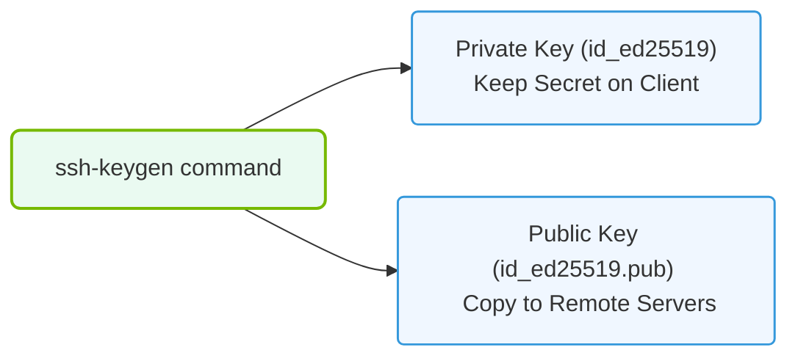

# 6.3b Generating RSA and Ed25519 key pairs with ssh-keygen

<div class="lesson-completion" data-lesson-id="6_3b_ssh_key_generation"></div>
<div class="lesson-tags">
  <span class="lesson-tag">📦 Operating System Layer</span>
  <span class="lesson-tag">📖 Linux Networking & Security Hardening</span>
</div>


---

## 🔍 Context Introduction

When managing AI infrastructure, you will frequently need to connect securely to remote servers, clusters, or GPU nodes. SSH (Secure Shell) is the standard protocol for this, and **key-based authentication** is the most secure and practical method for automated access. Instead of typing a password every time, you generate a pair of cryptographic keys: a **private key** (kept secret on your local machine) and a **public key** (placed on the remote server). The `ssh-keygen` tool creates these key pairs. This section covers the two most common key types: **RSA** (a widely compatible, older standard) and **Ed25519** (a modern, faster, and more secure elliptic-curve algorithm).

---

## ⚙️ What Are RSA and Ed25519 Keys?

- **RSA (Rivest–Shamir–Adleman)**  
  - An older, widely supported algorithm.  
  - Key sizes typically range from 2048 to 4096 bits.  
  - Slower to generate and verify compared to Ed25519.  
  - Still the default on many legacy systems.

- **Ed25519 (Edwards-curve Digital Signature Algorithm)**  
  - A modern elliptic-curve algorithm.  
  - Fixed key size of 256 bits (offers security equivalent to RSA 3072+).  
  - Much faster key generation and signing.  
  - Considered more secure against certain types of attacks.  
  - Recommended for new deployments.

---

## 🛠️ Generating Key Pairs with ssh-keygen

The `ssh-keygen` command is used to create, manage, and convert SSH keys. Below are the steps for generating both RSA and Ed25519 key pairs.

### 🔑 Generating an Ed25519 Key Pair (Recommended)

- Run the command: **ssh-keygen -t ed25519 -C "your_email@example.com"**  
  - The `-t` flag specifies the key type (`ed25519`).  
  - The `-C` flag adds a comment (usually your email) to help identify the key.

- You will be prompted to choose a file location.  
  - Default location: **~/.ssh/id_ed25519** (private key) and **~/.ssh/id_ed25519.pub** (public key).  
  - Press **Enter** to accept the default, or type a custom path.

- You will be prompted to enter a passphrase.  
  - A passphrase adds an extra layer of security (the private key is encrypted on disk).  
  - You can press **Enter** for no passphrase (less secure, but convenient for automation).

- After completion, two files are created:  
  - **~/.ssh/id_ed25519** — your private key (keep this secret, never share it).  
  - **~/.ssh/id_ed25519.pub** — your public key (this goes on remote servers).

### 🔑 Generating an RSA Key Pair (For Legacy Compatibility)

- Run the command: **ssh-keygen -t rsa -b 4096 -C "your_email@example.com"**  
  - The `-t` flag specifies the key type (`rsa`).  
  - The `-b` flag sets the key size in bits (4096 is recommended for strong security).  
  - The `-C` flag adds a comment.

- You will be prompted for file location and passphrase (same as above).  
  - Default location: **~/.ssh/id_rsa** (private) and **~/.ssh/id_rsa.pub** (public).

---

## 📊 Comparison Table: RSA vs. Ed25519

| Feature               | RSA (4096-bit)                  | Ed25519 (256-bit)              |
|-----------------------|---------------------------------|--------------------------------|
| **Key Size**          | 4096 bits (large file)          | 256 bits (compact)             |
| **Generation Speed**  | Slow                            | Very fast                      |
| **Signing Speed**     | Moderate                        | Very fast                      |
| **Security Level**    | Equivalent to ~128-bit symmetric| Equivalent to ~128-bit symmetric|
| **Compatibility**     | Supported everywhere            | Supported by modern SSH clients|
| **Recommended Use**   | Legacy systems, strict policies | New deployments, performance   |

---

### 📊 Visual Representation: SSH Key-Pair Cryptography
This diagram displays the relationship between the private key (kept secret on the client) and the public key (shared with target servers) generated by ssh-keygen.



## 🕵️ Verifying Your Key Pair

After generating the keys, you can verify their contents and fingerprints.

- To view the public key (to copy to a remote server):  
  **cat ~/.ssh/id_ed25519.pub**  
  Output will look like:  
  📤 **Output:** `ssh-ed25519 AAAAC3NzaC1lZDI1NTE5AAAAI... your_email@example.com`

- To view the key fingerprint (a shorter, human-readable hash):  
  **ssh-keygen -lf ~/.ssh/id_ed25519.pub**  
  Output will look like:  
  📤 **Output:** `256 SHA256:abc123def456... your_email@example.com (ED25519)`

- To verify the private key file is valid:  
  **ssh-keygen -y -f ~/.ssh/id_ed25519**  
  This will print the corresponding public key. If the private key is encrypted, you will be prompted for the passphrase.

---

## ✅ Best Practices for New Engineers

- **Always use Ed25519** unless you must connect to a very old server that only supports RSA.  
- **Protect your private key** — never share it, and set file permissions to **600** (read/write for owner only).  
  - Use the command: **chmod 600 ~/.ssh/id_ed25519**  
- **Use a strong passphrase** for keys used on personal workstations. For automated scripts or CI/CD pipelines, you may omit the passphrase but store the key securely.  
- **Name your keys descriptively** — use the `-C` comment flag to label keys (e.g., "my-gpu-cluster-key").  
- **Test your key** before relying on it for automation:  
  **ssh -i ~/.ssh/id_ed25519 user@remote-server**  
- **Backup your keys** — store a copy of the private key in a secure password manager or encrypted vault.

---

## 🧪 For Reference: Example ssh-keygen Commands

```
ssh-keygen -t ed25519 -C "ai-operator@example.com"
ssh-keygen -t rsa -b 4096 -C "ai-operator@example.com"
ssh-keygen -lf ~/.ssh/id_ed25519.pub
ssh-keygen -y -f ~/.ssh/id_ed25519
```

---

## 📌 Summary

- **ssh-keygen** is the standard tool for generating SSH key pairs.  
- **Ed25519** is the modern, recommended choice for new AI infrastructure deployments.  
- **RSA** remains useful for compatibility with older systems.  
- Always keep your private key secret and your public key on the remote server.  
- Use passphrases for additional security on personal machines.  

By mastering key generation, you enable secure, passwordless access to your AI clusters — a foundational skill for operating and automating infrastructure.
