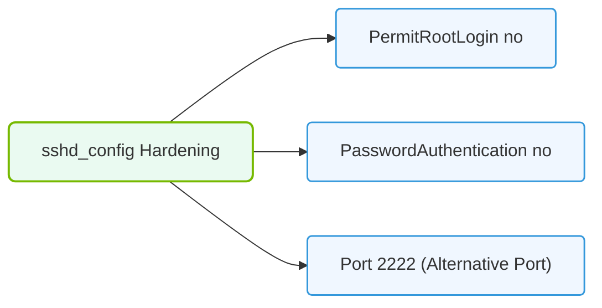

# 6.3d /etc/ssh/sshd_config: disabling password auth, changing port, AllowUsers

<div class="lesson-completion" data-lesson-id="6_3d_sshd_config_hardening"></div>
<div class="lesson-tags">
  <span class="lesson-tag">📦 Operating System Layer</span>
  <span class="lesson-tag">📖 Linux Networking & Security Hardening</span>
</div>


---

## 🔍 Context Introduction

When managing AI infrastructure, secure remote access is critical. The SSH (Secure Shell) service is the primary gateway for engineers to connect to servers, manage clusters, and troubleshoot issues. By default, SSH may allow password-based logins and listen on the standard port (22), which can expose your systems to brute-force attacks. This topic covers three essential hardening steps in the **/etc/ssh/sshd_config** file: disabling password authentication, changing the default SSH port, and restricting access to specific users with **AllowUsers**.

---

## ⚙️ What is /etc/ssh/sshd_config?

This is the main configuration file for the SSH daemon (sshd) on Linux systems. Every time an SSH connection request arrives, the daemon reads this file to determine how to handle it. Engineers modify this file to enforce security policies.

---

## 🛠️ Disabling Password Authentication

**Why disable it?**  
Passwords can be guessed, stolen, or brute-forced. AI infrastructure often uses SSH keys (a pair of cryptographic files) for authentication, which is far more secure.

**What happens when disabled?**  
Only users with a valid SSH key pair can log in. Password prompts will be rejected.

**Key configuration line:**  
**PasswordAuthentication no**

**Effect:**  
- No password prompts during SSH login.  
- Users must have their public key installed on the server (in **~/.ssh/authorized_keys**).  
- Reduces attack surface significantly.

---

## 🔄 Changing the Default SSH Port

**Why change the port?**  
Port 22 is the default SSH port and is constantly scanned by automated bots. Changing it to a non-standard port (e.g., 2222, 8022) reduces automated attack attempts.

**Key configuration line:**  
**Port 2222** (or any unused port number between 1024 and 65535)

**Important considerations:**  
- Choose a port that does not conflict with other services (check with **netstat -tuln**).  
- Update firewall rules to allow the new port.  
- Inform all engineers of the new port number.  
- Keep the old port commented out to avoid confusion.

---

### 📊 Visual Representation: sshd Configuration Hardening Rules
This diagram lists key configuration directives in sshd_config deployed to secure server access against brute-force attacks.



## 👥 Restricting Access with AllowUsers

**Why use AllowUsers?**  
By default, any user account on the system can attempt SSH login. **AllowUsers** restricts access to only specified usernames, preventing unauthorized accounts from even attempting authentication.

**Key configuration line:**  
**AllowUsers alice bob charlie**

**How it works:**  
- Only users **alice**, **bob**, and **charlie** can connect via SSH.  
- All other users are rejected before any authentication attempt.  
- Multiple users can be listed, separated by spaces.  
- You can also use patterns like **AllowUsers *@admin.example.com** to allow users from a specific domain.

---

## 📊 Comparison Table: Before vs. After Hardening

| Setting | Before (Default) | After (Hardened) | Benefit |
|----------|------------------|------------------|---------|
| Password Authentication | **PasswordAuthentication yes** | **PasswordAuthentication no** | Prevents brute-force password attacks |
| SSH Port | **Port 22** | **Port 2222** (example) | Reduces automated scanning attempts |
| User Access | All users allowed | **AllowUsers alice bob** | Limits access to authorized personnel only |

---

## 🕵️ Verification Steps (After Changes)

After modifying **/etc/ssh/sshd_config**, you must verify the configuration and restart the SSH service.

**For reference:**
```
sudo sshd -t
```
📤 **Output:** No output means syntax is valid. If there are errors, they will be displayed.

**For reference:**
```
sudo systemctl restart sshd
```
📤 **Output:** No output on success. Check status with **sudo systemctl status sshd**.

---

## ⚠️ Important Warnings for Engineers

- **Always test SSH key-based login before disabling password authentication.** If you lock yourself out, you may need physical console access or out-of-band management (iLO, iDRAC, IPMI).
- **Keep a backup of the original file:** Copy **/etc/ssh/sshd_config** to **/etc/ssh/sshd_config.backup** before editing.
- **Do not close your current SSH session** until you have verified that a new session works with the new settings.
- **Update firewall rules** (iptables, firewalld, or cloud security groups) to allow the new port and block the old one.
- **Document the new port number** in your team's knowledge base or inventory system.

---

## 🧠 Key Takeaways for New Engineers

- **/etc/ssh/sshd_config** controls how SSH daemon behaves.  
- **Disabling password auth** forces key-based login, which is more secure.  
- **Changing the port** reduces noise from automated scanners.  
- **AllowUsers** creates a whitelist of who can connect.  
- Always test changes in a safe manner before applying to production systems.  
- These three settings together form a strong foundation for SSH security in AI infrastructure operations.