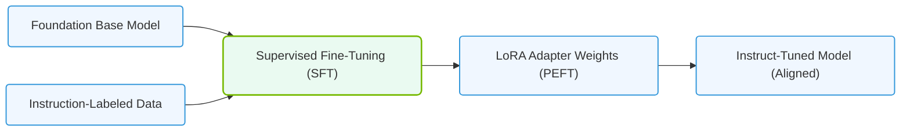

# 7.2d Fine-Tuning: adapting a pre-trained model to a specific domain or task

  📦 Mathematical Imperative
  📖 Deconstructing Artificial Intelligence Workloads

---

## 🧠 Context Introduction

Imagine you have a brilliant chef who knows how to cook thousands of dishes from around the world. Now, you want that chef to specialize in making the perfect sushi. Instead of teaching them everything from scratch (how to hold a knife, what heat does to food, etc.), you simply show them a few dozen sushi recipes and let them practice. This is exactly what **fine-tuning** does for AI models.

Fine-tuning takes a **pre-trained model** — one that has already learned general patterns from massive datasets (like the entire internet) — and adapts it to a specific domain or task using a much smaller, specialized dataset. This saves enormous time, compute resources, and money compared to training a model from scratch.

---

## ⚙️ What is Fine-Tuning?

Fine-tuning is the process of taking a pre-trained neural network and continuing the training process on a new, smaller dataset that is specific to your target task. The pre-trained model already understands general features (edges, shapes, language syntax, etc.), and fine-tuning adjusts its weights slightly so it becomes an expert in your particular domain.

**Key characteristics:**
- ✅ Uses a pre-trained model as a starting point
- ✅ Requires much less data than training from scratch
- ✅ Requires less compute power and time
- ✅ Preserves the general knowledge of the base model
- ✅ Adapts the model to specialized vocabulary, styles, or patterns

---

## 🛠️ When Should You Use Fine-Tuning?

| Scenario | Train from Scratch | Fine-Tune |
|----------|-------------------|-----------|
| You have 1 million+ labeled examples | ✅ Possible | ✅ Better |
| You have only 1,000 labeled examples | ❌ Not feasible | ✅ Ideal |
| You need a model for medical diagnosis | ❌ Too expensive | ✅ Perfect |
| You want to classify customer support tickets | ❌ Overkill | ✅ Efficient |
| You need a model that speaks legal jargon | ❌ Impractical | ✅ Recommended |
| You have limited GPU budget | ❌ Too costly | ✅ Affordable |

---

## 📊 The Fine-Tuning Process — Step by Step

### 1️⃣ Select a Pre-Trained Base Model
Choose a model that was trained on a large, general dataset relevant to your domain. For example:
- **For text:** BERT, GPT, Llama, or T5
- **For images:** ResNet, EfficientNet, or Vision Transformer
- **For speech:** Whisper or Wav2Vec2

### 2️⃣ Prepare Your Domain-Specific Dataset
Collect and label a smaller dataset (hundreds to thousands of examples) that represents your specific task. Ensure it is clean, balanced, and representative of real-world scenarios.

### 3️⃣ Freeze or Unfreeze Layers
Decide how much of the original model to update:
- **Full fine-tuning:** Update all model weights (requires more compute)
- **Partial fine-tuning:** Freeze early layers (which capture general features) and only update later layers (which capture task-specific patterns)
- **Adapter-based fine-tuning:** Insert small trainable modules between frozen layers (very efficient)

### 4️⃣ Set a Lower Learning Rate
Since the model is already well-trained, use a learning rate that is **10x to 100x smaller** than what you would use for training from scratch. This prevents the model from "forgetting" its general knowledge.

### 5️⃣ Train on Your Dataset
Run the training loop for a few epochs (typically 2–10). Monitor validation loss to avoid overfitting.

### 6️⃣ Evaluate and Iterate
Test the fine-tuned model on a held-out validation set. If performance is poor, adjust hyperparameters (learning rate, number of frozen layers, dataset size) and retry.

---

### 📊 Visual Representation: Supervised Fine-Tuning (SFT) and parameter-efficient LoRA
This diagram displays how a general foundation base model is adapted to specific domains using labeled datasets and Parameter-Efficient Fine-Tuning (PEFT/LoRA).

## 🕵️ Real-World Example: Fine-Tuning a Legal Document Classifier

**Scenario:** A law firm wants to automatically classify court documents into categories (motion, brief, order, etc.).

**Step 1:** Start with a pre-trained BERT model (trained on Wikipedia and books).

**Step 2:** Collect 2,000 labeled legal documents from the firm's archives.

**Step 3:** Freeze the first 6 layers of BERT (which understand general English) and unfreeze the last 6 layers (which will learn legal terminology).

**Step 4:** Set learning rate to **2e-5** (compared to 2e-4 for training from scratch).

**Step 5:** Train for 5 epochs on 4 NVIDIA A100 GPUs (takes ~30 minutes instead of weeks).

**Step 6:** Achieve 94% accuracy on legal document classification — without needing to train a model from scratch.

---

## 📈 Benefits of Fine-Tuning for Engineers

- **🚀 Faster time to deployment:** Fine-tuning can take hours or days instead of weeks or months
- **💰 Lower infrastructure costs:** Requires fewer GPUs and less training time
- **📉 Smaller data requirements:** Works well with as few as 100–500 labeled examples
- **🔧 Easier iteration:** You can quickly test multiple base models and hyperparameters
- **🌐 Leverages community knowledge:** Benefit from models trained by large organizations (Google, Meta, OpenAI, NVIDIA)

---

## ⚠️ Common Pitfalls to Avoid

- **❌ Catastrophic forgetting:** Using too high a learning rate can cause the model to forget its general knowledge
- **❌ Overfitting:** Training for too many epochs on a small dataset
- **❌ Wrong base model:** Choosing a model that is too different from your domain (e.g., using a code model for medical text)
- **❌ Ignoring data quality:** Garbage in = garbage out, even with fine-tuning
- **❌ Not validating properly:** Always hold out a test set that the model has never seen

---

## 🧰 Tools and Frameworks for Fine-Tuning

- **Hugging Face Transformers:** The most popular library for fine-tuning NLP models
- **PyTorch Lightning:** Simplifies training loops and distributed training
- **NVIDIA NeMo:** Enterprise-grade framework for fine-tuning large language models
- **TensorFlow Keras:** Good for computer vision fine-tuning
- **LoRA (Low-Rank Adaptation):** A memory-efficient fine-tuning technique that trains small adapter matrices instead of full weights

---

## 🔑 Key Takeaway

Fine-tuning is the **secret weapon** of modern AI engineering. It allows you to build highly specialized, production-ready models without the astronomical cost of training from scratch. As an engineer, mastering fine-tuning means you can deliver domain-specific AI solutions faster, cheaper, and with less data — making you invaluable to any organization deploying AI at scale.

**Remember:** The best model for your task is often not one you train from scratch, but one you adapt from something already great.
