# 7.3a The Transformer architecture: attention mechanisms explained intuitively

  📦 Mathematical Imperative
  📖 Deconstructing Artificial Intelligence Workloads

---

## 🧠 Context Introduction

Before Transformers, most language models processed text one word at a time, in order. This was slow and struggled with long sentences. The Transformer architecture, introduced in 2017, changed everything by using a clever mechanism called **attention**. Think of attention as a spotlight that helps the model decide which parts of the input are most important at any given moment. This guide explains attention intuitively for engineers new to AI infrastructure.

---

## ⚙️ The Core Idea: What is Attention?

Attention allows a model to look at all words in a sentence simultaneously and weigh their importance relative to each other. Instead of reading left-to-right, the model can "attend" to relevant words anywhere in the sequence.

- **Intuitive analogy**: Imagine reading a sentence and highlighting words that connect to each other. For the sentence *"The cat sat on the mat because it was tired"*, attention helps the model understand that *"it"* refers to *"the cat"*, not *"the mat"*.
- **Key benefit**: Transformers process all words in parallel, making them much faster to train than older models like RNNs.

---

## 🕵️ How Attention Works (Step-by-Step)

The attention mechanism has three main components: **Query**, **Key**, and **Value**. These are like a search system.

| Component | Role | Intuitive Explanation |
|-----------|------|----------------------|
| **Query** | What you are looking for | Like a search question |
| **Key** | What each word offers | Like a search index or tag |
| **Value** | The actual information | Like the search result content |

**Step-by-step flow:**

1. **Create Queries, Keys, and Values**: For each word in the input, the model creates three vectors (lists of numbers) — a Query, a Key, and a Value.
2. **Score each pair**: The model compares every Query with every Key using a dot product (a simple math operation). Higher scores mean stronger relevance.
3. **Normalize scores**: These scores are converted into probabilities (0 to 1) using a softmax function. This tells the model how much attention to pay to each word.
4. **Weighted sum**: The model multiplies each Value by its attention probability and sums them up. This produces a new representation for each word that includes context from the whole sentence.

**Visual example**: For the word *"bank"* in *"river bank"* vs *"money bank"*, attention would give higher weight to *"river"* or *"money"* depending on context.

---

## 📊 Self-Attention vs Cross-Attention

Transformers use two types of attention:

| Type | Where Used | What It Does |
|------|------------|--------------|
| **Self-Attention** | Encoder and Decoder | Each word attends to all other words in the same sentence |
| **Cross-Attention** | Decoder only | Decoder words attend to encoder output words (e.g., translation) |

- **Self-attention** helps the model understand relationships within a single sentence.
- **Cross-attention** helps the model connect two different sequences (like source and target languages).

---

## 🛠️ Multi-Head Attention: Why One Head Isn't Enough

Instead of having one attention mechanism, Transformers use **multiple heads** (typically 8 to 16). Each head learns to focus on different types of relationships.

- **Head 1** might focus on syntactic relationships (subject-verb agreement).
- **Head 2** might focus on semantic relationships (synonyms).
- **Head 3** might focus on positional relationships (nearby words).

**How it works**: The model runs attention multiple times in parallel, each with different learned weights. The outputs from all heads are concatenated and projected into a single representation.

**Intuitive analogy**: It's like having multiple experts analyze the same sentence — one looks at grammar, another at meaning, another at tone — then combining their insights.

---

### 📊 Visual Representation: Transformer Encoder-Decoder Blocks
This diagram displays the structural components of the standard Transformer block (Multi-Head Attention, Residual connections, and FFN).

```mermaid
flowchart LR
    Input["Input Tokens"] --> Embed["Positional Embedding"]
    Embed --> MHA["Multi-Head Self-Attention"]
    MHA --> AddNorm1["Add & LayerNorm"]
    AddNorm1 --> FFN["Feed-Forward Network (FFN)"]
    FFN --> AddNorm2["Add & LayerNorm"]
    AddNorm2 --> Output["Logits / Probability"]

    classDef cpu fill:#eafaf1,stroke:#76b900,stroke-width:2px,rx:6px,ry:6px;
    classDef memory fill:#f0f7ff,stroke:#3498db,stroke-width:1.5px,rx:4px,ry:4px;
    classDef system fill:#f1f5f9,stroke:#64748b,stroke-width:1.5px;

    class MHA,FFN cpu;
    class Input,Embed,Output memory;
    class AddNorm1,AddNorm2 system;
```

## 📐 Positional Encoding: Why Order Matters

Attention processes all words in parallel, so it has no built-in sense of word order. To fix this, Transformers add **positional encodings** — unique signals that tell the model where each word sits in the sequence.

- **How it works**: A mathematical pattern (sine and cosine functions) is added to each word's embedding. Words close together get similar positional signals.
- **Why it matters**: Without this, *"The dog bit the man"* and *"The man bit the dog"* would look identical to the model.

---

## 🏗️ The Full Transformer Architecture (Simplified)

A Transformer has two main parts:

**Encoder** (left side):
- Takes input text
- Uses self-attention + feed-forward layers
- Outputs a rich representation of the input

**Decoder** (right side):
- Generates output text one word at a time
- Uses self-attention (masked to prevent looking ahead) + cross-attention (to encoder) + feed-forward layers

**Key point for engineers**: The encoder can be run once for all input tokens in parallel. The decoder must run sequentially (one token at a time), which affects inference latency.

---

## 🔍 Why Attention Matters for AI Infrastructure

Understanding attention helps engineers optimize deployment:

- **Memory usage**: Attention requires storing all Key and Value vectors for every token in the sequence. For long sequences (e.g., 8,000 tokens), this consumes significant GPU memory.
- **Compute requirements**: The dot product calculations scale quadratically with sequence length. A 2,000-token sequence requires 4 million comparisons per head.
- **Parallelization**: Unlike RNNs, Transformers can parallelize training across all tokens, making them ideal for GPU clusters.

**Practical implication**: When engineers see high memory usage or slow inference for long prompts, attention is often the bottleneck.

---

## ✅ Summary: Key Takeaways for New Engineers

- **Attention** lets models weigh the importance of all words in a sequence simultaneously.
- **Query, Key, Value** are the three components that make attention work.
- **Multi-head attention** allows the model to learn different types of relationships.
- **Positional encoding** gives the model awareness of word order.
- **Self-attention** is used within a single sequence; **cross-attention** connects two sequences.
- Attention is the most compute-intensive and memory-heavy part of Transformers — understanding it helps you diagnose performance issues.

---

## 📚 Further Learning Path

1. Read the original paper: *"Attention Is All You Need"* (Vaswani et al., 2017)
2. Experiment with small Transformer models using PyTorch or TensorFlow
3. Monitor GPU memory usage during inference with long prompts
4. Explore optimized attention implementations (FlashAttention, sparse attention) for production workloads

---

*This guide provides an intuitive foundation. As you work with AI infrastructure, you'll encounter attention in every modern LLM — from BERT to GPT-4 to Llama.*