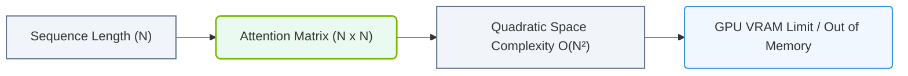

# 7.3d Context windows: why longer context requires quadratically more memory

  📦 Mathematical Imperative
  📖 Deconstructing Artificial Intelligence Workloads

---

## 🔍 Context Introduction

When you ask a Large Language Model (LLM) to process a long document, summarize a book, or hold a multi-turn conversation, the model needs to "remember" everything you've said so far. This memory span is called the **context window**. You might think doubling the context length would simply double the memory needed — but in reality, it **quadruples** it. This section explains why that happens and why it matters for engineers working with AI infrastructure.

---

## ⚙️ What Is a Context Window?

- The **context window** is the maximum number of tokens (words, subwords, or characters) an LLM can process at once.
- Think of it as the model's short-term memory — it can only "see" and reason about tokens within this window.
- Common context window sizes:
  - **GPT-3**: 2,048 tokens
  - **GPT-4**: 8,192 to 32,768 tokens
  - **Claude 3**: up to 200,000 tokens
  - **Gemini 1.5**: up to 1,000,000 tokens

---

## 📊 The Core Problem: Attention Is Quadratic

The reason longer contexts require quadratically more memory lies in the **self-attention mechanism** — the heart of every transformer-based LLM.

### How Self-Attention Works (Simplified)

1. For every token in the input, the model computes how much it should "pay attention" to every other token.
2. This creates an **attention matrix** where:
   - Rows = each token
   - Columns = each token
   - Each cell = the attention weight between two tokens

### The Quadratic Growth

- If you have **N tokens**, the attention matrix has **N × N** cells.
- Memory required for this matrix grows with **N²** (quadratically).

| Context Length (N) | Attention Matrix Size (N²) | Memory Multiplier |
|-------------------|---------------------------|-------------------|
| 1,000 tokens      | 1,000,000 cells           | 1x (baseline)     |
| 2,000 tokens      | 4,000,000 cells           | 4x                |
| 4,000 tokens      | 16,000,000 cells          | 16x               |
| 8,000 tokens      | 64,000,000 cells          | 64x               |
| 16,000 tokens     | 256,000,000 cells         | 256x              |

**Key takeaway**: Doubling the context length **quadruples** the memory needed for attention.

---

### 📊 Visual Representation: Context Window Scaling Memory Overhead
This diagram displays the relationship between input/output sequence length and the quadratic scaling memory footprint of standard Self-Attention.

## 🛠️ Why This Matters for Engineers

### Memory Bottlenecks

- **GPU VRAM** is the most expensive and limited resource in AI infrastructure.
- A single attention matrix for 32,000 tokens with 32-bit floating point precision requires:
  - 32,000 × 32,000 = 1.024 billion cells
  - Each cell = 4 bytes (32-bit float)
  - Total = **~4 GB** just for one attention matrix
  - Real models have multiple attention heads (e.g., 32 heads), multiplying this by 32x

### Practical Implications

- **Longer documents** require more GPUs or more expensive GPUs with higher VRAM.
- **Batch processing** becomes harder — you can fit fewer long sequences in memory at once.
- **Inference latency** increases because computing all pairwise attention scores takes longer.

---

## 🕵️ How Engineers Work Around This

Engineers use several techniques to manage the quadratic memory problem:

### 1. Sparse Attention
- Instead of computing attention for all token pairs, only compute for nearby tokens or a subset.
- Reduces memory from N² to N × log(N) or N × k (where k is a small constant).

### 2. Sliding Window Attention
- Each token only attends to its immediate neighbors (e.g., 1,024 tokens to the left).
- Memory grows linearly with window size, not quadratically with total context.

### 3. Flash Attention
- A software technique that computes attention in chunks, never storing the full N×N matrix in memory.
- Reduces memory usage from N² to N × block_size.

### 4. Context Caching
- For long conversations, store and reuse attention computations from previous turns.
- Avoids recomputing the entire attention matrix for every new token.

### 5. Model Architecture Changes
- **Linear attention** variants (e.g., Mamba, RWKV) replace quadratic attention with linear operations.
- These models can handle much longer contexts with the same memory budget.

---

## 📈 Real-World Impact: A Comparison

| Scenario | Context Length | Memory Needed (Attention Only) | Feasibility |
|----------|---------------|-------------------------------|-------------|
| Short email | 512 tokens | ~1 MB | Fits on any GPU |
| Research paper | 8,000 tokens | ~256 MB | Fits on most GPUs |
| Book chapter | 32,000 tokens | ~4 GB | Requires high-end GPU |
| Full novel | 100,000 tokens | ~40 GB | Requires multiple GPUs or special techniques |
| Multi-hour meeting transcript | 500,000 tokens | ~1 TB | Requires distributed systems or sparse attention |

---

## ✅ Summary for New Engineers

- **Context windows** define how much text an LLM can process at once.
- **Self-attention** creates an N×N matrix, causing memory to grow **quadratically** with context length.
- **Doubling context = 4x memory** — this is the fundamental scaling challenge.
- Engineers use **sparse attention, sliding windows, Flash Attention, and caching** to work around this limit.
- When planning AI infrastructure, always calculate memory requirements for your expected context length — it's the most common bottleneck.

---

> **Remember**: The quadratic memory problem is why most production LLMs use context windows of 4K–32K tokens, even though research models can handle millions. As an engineer, understanding this trade-off helps you choose the right model, hardware, and optimization techniques for your workload.