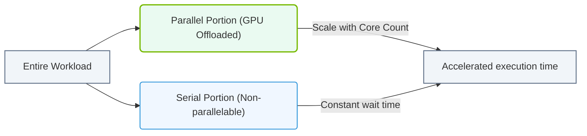

# 8.1d Amdahl's Law: the diminishing returns of parallelism and its AI implications

  📦 Mathematical Imperative
  📖 The CPU-GPU Compute Divide

---

## 🧠 Context Introduction

Imagine you're baking a cake. You can have one person mix the batter, another person preheat the oven, and a third person prepare the frosting — all at the same time. This is **parallel processing**. But at some point, you must wait for the cake to bake in the oven — that step cannot be sped up by adding more people.

**Amdahl's Law** is a mathematical formula that describes this exact problem in computing. It tells us that no matter how many processors or GPUs we add, the overall speedup of a task is limited by the portion that **must be done sequentially** (one step at a time). For AI engineers, understanding this law is critical because it explains why throwing more hardware at a problem eventually stops helping.

---

## ⚙️ What is Amdahl's Law?

Amdahl's Law states:

> **The maximum speedup of a task is limited by the fraction of the task that cannot be parallelized.**

The formula is:

**Speedup = 1 / ( (1 - P) + (P / N) )**

Where:
- **P** = the proportion of the task that can be parallelized (e.g., 0.8 = 80%)
- **N** = the number of processors (or cores, or GPUs)
- **(1 - P)** = the serial portion (cannot be parallelized)

---

## 📊 The Diminishing Returns — A Simple Example

Let's say you have a task where **90% can be parallelized** (P = 0.9) and **10% must be done sequentially**.

| Number of Processors (N) | Speedup | Time Saved vs. 1 Processor |
|--------------------------|---------|----------------------------|
| 1                        | 1.0x    | 0%                         |
| 2                        | 1.82x   | 45%                        |
| 4                        | 3.08x   | 67%                        |
| 8                        | 4.71x   | 79%                        |
| 16                       | 6.40x   | 84%                        |
| 32                       | 7.80x   | 87%                        |
| 64                       | 8.77x   | 89%                        |
| 128                      | 9.30x   | 89%                        |
| ∞ (infinite)             | 10.0x   | 90%                        |

**Key observation:** Even with 128 processors, you only get a 9.3x speedup — not 128x. The **10% serial portion** creates a hard ceiling. No matter how many processors you add, you can never exceed a 10x speedup.

---

## 🕵️ Why This Matters for AI

AI workloads — especially training large neural networks — seem perfectly parallelizable. But in practice, several **serial bottlenecks** appear:

### 1. 🧩 Data Loading and Preprocessing
- Reading data from disk or network is often sequential.
- If data loading takes 5% of total time, that 5% limits your maximum speedup to 20x — even with 1,000 GPUs.

### 2. 🔗 Synchronization Barriers
- During distributed training, all GPUs must synchronize gradients after each batch.
- The slowest GPU forces all others to wait — this is a serial bottleneck.

### 3. 📏 Model Architecture Constraints
- Some layers (e.g., recurrent layers, attention mechanisms) have sequential dependencies.
- You cannot parallelize the processing of a sequence of tokens in a transformer — each token depends on the previous one.

### 4. 🧠 Communication Overhead
- Sending data between GPUs or nodes takes time.
- As you add more GPUs, communication time grows, eating into the parallel gains.

---

### 📊 Visual Representation: Amdahl's Law Speedup Limits
This flowchart displays how the maximum performance speedup of parallel systems is limited by the non-parallelizable, serial portion of the code.

## 🛠️ Practical Implications for AI Engineers

### 🚫 The "More GPUs = Faster" Myth
- Adding more GPUs does **not** linearly reduce training time.
- At some point, adding more hardware gives negligible returns.

### ✅ What You Can Do
- **Profile your pipeline** — Identify the serial portions (data loading, preprocessing, synchronization).
- **Optimize the serial parts first** — Improving the 10% serial portion by 50% gives more benefit than doubling the number of GPUs.
- **Use asynchronous operations** — Overlap data loading with computation to hide serial delays.
- **Choose the right batch size** — Larger batches improve parallelism but may hurt model convergence.

### 📉 Real-World Example
A team trains a model on 8 GPUs and sees a 6x speedup (not 8x). They profile and find:
- 85% of time is parallelizable (P = 0.85)
- 15% is serial (data loading + synchronization)

According to Amdahl's Law:
- With 8 GPUs: Speedup = 1 / (0.15 + 0.85/8) = 1 / (0.15 + 0.106) = 1 / 0.256 = **3.9x**

They expected 8x but got 3.9x — the serial portion is the culprit.

---

## 🧪 Quick Mental Check for Engineers

When planning a distributed AI workload, ask yourself:

- **What fraction of my pipeline is inherently serial?** (Data loading? Preprocessing? Synchronization?)
- **What is the maximum speedup I can realistically achieve?** (Use the formula above)
- **Is adding more hardware worth the cost?** (Compare the expected speedup vs. hardware and energy costs)

---

## 📌 Key Takeaways

- **Amdahl's Law** mathematically proves that parallelism has diminishing returns.
- The **serial portion** of any task creates a hard speedup limit.
- In AI, serial bottlenecks include data loading, synchronization, and model architecture constraints.
- **Optimize the serial parts first** — they are the biggest lever for performance improvement.
- **Don't blindly add more GPUs** — profile your workload and understand where the real bottlenecks are.

---

## 🔍 Further Exploration

- **Gustafson's Law** — A counterpoint that argues larger problems can be parallelized more effectively.
- **Profiling tools** — Use tools like NVIDIA Nsight Systems or PyTorch Profiler to identify serial bottlenecks in your AI pipelines.
- **Pipeline parallelism** — A technique to overlap computation and communication, reducing the impact of serial portions.

---

*Remember: Amdahl's Law doesn't say parallelism is useless — it says we must be smart about where we invest our parallelization efforts.*
