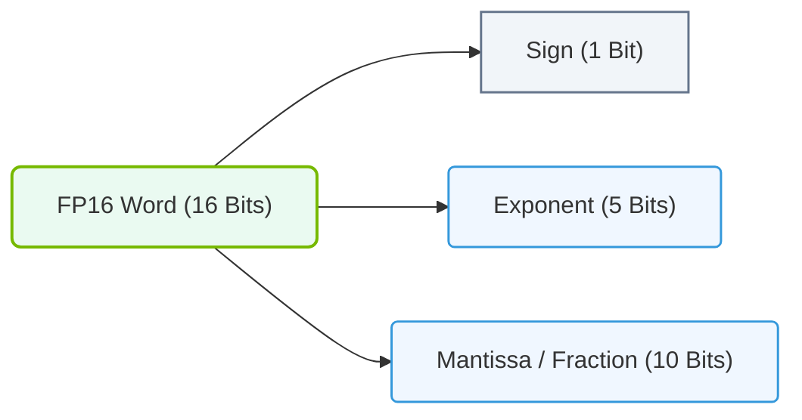

# 9.3c FP16 (half precision): 16-bit — 2x storage savings, 2x bandwidth, with stability risks

  📦 Mathematical Imperative
  📖 The Mathematics of Deep Learning

## 📘 Context Introduction

When training large neural networks, engineers often face a trade-off: use high-precision numbers (like FP32) for accuracy, or use lower-precision numbers (like FP16) for speed and memory savings. FP16, or half-precision floating-point, uses only **16 bits** to represent a number — half the bits of FP32. This gives you **2x storage savings** and **2x memory bandwidth**, but it comes with a catch: **stability risks** due to reduced numerical range and precision.

This topic is crucial for engineers working with NVIDIA GPUs (like A100, H100, or V100) because FP16 is a common choice for mixed-precision training, where you use FP16 for most operations and FP32 for critical parts.

---

## ⚙️ What is FP16?

FP16 is a 16-bit floating-point format defined by the IEEE 754 standard. It consists of:

- **1 sign bit** (positive or negative)
- **5 exponent bits** (range of values)
- **10 mantissa bits** (precision of values)

Compared to FP32 (1 sign, 8 exponent, 23 mantissa), FP16 has:
- **Smaller range**: Maximum value ~65,504 (vs. ~3.4×10³⁸ for FP32)
- **Lower precision**: About 3.3 decimal digits (vs. ~7.2 for FP32)

---

## 📊 Key Benefits — 2x Storage and Bandwidth

| Feature | FP32 (32-bit) | FP16 (16-bit) | Savings |
|---------|---------------|---------------|---------|
| **Memory per parameter** | 4 bytes | 2 bytes | **2x less memory** |
| **Bandwidth per transfer** | 32 bits | 16 bits | **2x faster transfers** |
| **GPU throughput (theoretical)** | 1x | 2x | **2x more operations per second** |

**Why this matters for engineers:**
- You can fit **larger models** or **larger batch sizes** in GPU memory.
- Training runs **faster** because data moves between GPU memory and compute units in half the time.
- For large language models or computer vision tasks, this can cut training time from weeks to days.

---

## 🕵️ The Stability Risks

FP16's smaller range and precision create two main problems:

### 1. 🧨 Overflow and Underflow
- **Overflow**: Numbers larger than ~65,504 become infinity (NaN).
- **Underflow**: Numbers smaller than ~6×10⁻⁸ become zero.
- **Impact**: Gradients during backpropagation can vanish (underflow) or explode (overflow), causing training to fail.

### 2. 🎯 Precision Loss
- Small updates to weights (e.g., 0.0001) may be rounded to zero.
- Accumulated errors can degrade model accuracy.

**Real-world example**: In a transformer model, attention scores might be very small (e.g., 1e-7). In FP16, these become zero, breaking the attention mechanism.

---

### 📊 Visual Representation: Half Precision (FP16) Bit Breakdown
This diagram details the bit allocations (1 sign bit, 5 exponent bits, 10 mantissa bits) of IEEE 754 Half Precision float formats.

## 🛠️ How Engineers Mitigate Risks — Mixed Precision Training

NVIDIA's solution is **mixed precision training** (using FP16 with FP32 master weights). Here's the typical workflow:

1. **Forward pass**: Compute in FP16 (fast, memory-efficient).
2. **Loss scaling**: Multiply the loss by a scale factor (e.g., 1024) to prevent underflow in gradients.
3. **Backward pass**: Compute gradients in FP16.
4. **Weight update**: Convert gradients to FP32, apply to FP32 master weights, then convert back to FP16 for next iteration.

**Tools that handle this automatically:**
- **NVIDIA Apex** (AMP — Automatic Mixed Precision)
- **PyTorch AMP** (torch.cuda.amp)
- **TensorFlow mixed precision** (tf.keras.mixed_precision)

---

## 📈 When to Use FP16 vs. FP32

| Scenario | Recommended Precision | Reason |
|----------|----------------------|--------|
| Training large models (>1B parameters) | FP16 + mixed precision | Memory savings enable fitting the model |
| Inference on edge devices | FP16 | Lower power, faster throughput |
| Training with very small gradients | FP32 | Avoid underflow in gradients |
| Fine-tuning pretrained models | FP16 (with loss scaling) | Usually stable, faster |
| Scientific computing (e.g., physics simulations) | FP32 or FP64 | Need high precision |

---

## 🧪 Quick Check for New Engineers

**If you're starting with FP16, remember these three rules:**

1. **Always use loss scaling** — it's not optional for most models.
2. **Monitor for NaN/Inf values** — if you see them, switch to FP32 or adjust scaling.
3. **Test on a small subset first** — verify that FP16 doesn't degrade accuracy before scaling up.

**Common mistake**: Assuming FP16 works out-of-the-box for all models. It doesn't — always validate with your specific architecture.

---

## 🔍 Summary

- **FP16** gives you **2x memory savings** and **2x bandwidth** compared to FP32.
- **Stability risks** come from overflow, underflow, and precision loss.
- **Mixed precision training** (FP16 + FP32 master weights) is the standard mitigation.
- **NVIDIA GPUs** have dedicated FP16 hardware (Tensor Cores) that make this efficient.
- **Always test** — some models (e.g., those with very small gradients) may need FP32.

As an engineer, mastering FP16 is essential for scaling AI workloads efficiently. Start with automatic mixed precision tools, monitor your gradients, and you'll unlock significant performance gains.
