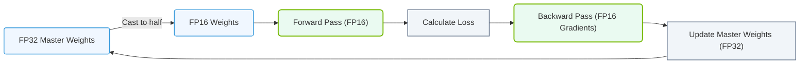

# 9.3g Mixed-precision training: using FP16/BF16 for forward pass, FP32 for master weights

  📦 Mathematical Imperative
  📖 The Mathematics of Deep Learning

---

## 🌱 Context Introduction

When training large neural networks, engineers face a fundamental tradeoff: **speed versus accuracy**. Using lower-precision data types like FP16 (16-bit floating point) or BF16 (bfloat16) makes calculations faster and uses less memory, but can cause numerical instability. Using full FP32 (32-bit) is stable but slower and more memory-intensive.

**Mixed-precision training** solves this by combining both approaches: it uses lower precision for the forward pass (the calculations that predict outputs) while keeping a separate copy of the model weights in full FP32 precision. This gives you the speed of lower precision with the stability of higher precision.

---

## ⚙️ How It Works — The Core Idea

In standard training, all calculations happen in FP32. In mixed-precision training, the process is split:

- **Forward pass** (calculating predictions): Uses FP16 or BF16 — faster, less memory
- **Backward pass** (calculating gradients): Uses FP16 or BF16 — same speed benefits
- **Weight updates** (optimizer step): Uses FP32 master weights — maintains accuracy

The key insight is that **gradients are accumulated in FP32** before updating the master weights, preventing the small updates from being lost due to lower precision.

---

## 📊 FP16 vs BF16 vs FP32 — Quick Comparison

| Feature | FP32 | FP16 | BF16 |
|---------|------|------|------|
| **Bit width** | 32 bits | 16 bits | 16 bits |
| **Memory usage** | 4 bytes per value | 2 bytes per value | 2 bytes per value |
| **Dynamic range** | ~3.4e38 | ~6.5e4 | ~3.4e38 (same as FP32) |
| **Precision (mantissa bits)** | 23 bits | 10 bits | 7 bits |
| **Training speed** | Baseline | ~2x faster | ~2x faster |
| **Numerical stability** | Excellent | Moderate | Good (due to range) |

**Why BF16 is special:** BF16 keeps the same exponent range as FP32, meaning it can represent the same very large and very small numbers. It only sacrifices precision (fewer decimal places). This makes it more stable than FP16 for training.

---

## 🛠️ The Master Weights Concept

The "master weights" are a separate copy of all model parameters stored in **FP32 precision**. Here's why they matter:

- **During forward pass:** The model uses FP16/BF16 weights for fast computation
- **During backward pass:** Gradients are computed in FP16/BF16
- **During optimizer update:** The FP32 master weights receive the accumulated gradient updates, then are copied back to FP16/BF16 for the next forward pass

This prevents a problem called **gradient underflow** — where small weight updates (like 0.000001) would be rounded to zero in FP16 but are preserved in FP32.

---

### 📊 Visual Representation: Mixed Precision (FP16/FP32) Training Loop
This flowchart shows the mixed precision training step, running forward/backward passes in FP16 while maintaining a master copy of weights in FP32.

## 🕵️ Step-by-Step Flow

1. **Start:** Master weights exist in FP32
2. **Copy down:** Master weights are converted to FP16/BF16 for the forward pass
3. **Forward pass:** Model computes predictions using FP16/BF16 weights
4. **Loss calculation:** Loss is computed (usually in FP32 for stability)
5. **Backward pass:** Gradients are computed in FP16/BF16
6. **Gradient scaling** (optional): Gradients are multiplied by a scale factor to prevent underflow
7. **Update master weights:** Gradients are converted to FP32 and applied to the master weights
8. **Repeat:** Go back to step 2

---

## 📈 Why Engineers Use This Approach

- **Memory savings:** FP16/BF16 uses half the memory of FP32, allowing larger models or batch sizes
- **Speed improvement:** NVIDIA GPUs with Tensor Cores can perform FP16/BF16 operations 2-8x faster than FP32
- **Accuracy preservation:** The FP32 master weights ensure that small weight updates are not lost
- **Scalability:** Enables training of very large models (like GPT, BERT) that would not fit in memory with full FP32

---

## 🧪 Practical Example (Conceptual)

Imagine training a neural network with 1 billion parameters:

- **Full FP32:** Requires ~4 GB of memory just for weights
- **Mixed-precision:** Requires ~2 GB for the forward pass weights (FP16) + ~4 GB for master weights (FP32) = ~6 GB total

Wait — that's more memory? Yes, but the tradeoff is worth it because:
- The forward/backward pass runs 2x faster
- You can use larger batch sizes (more data per step)
- The overall training time is significantly reduced

---

## 🔧 Key Considerations for New Engineers

- **Gradient scaling:** FP16 has a very small dynamic range. Engineers often use a **loss scale factor** (multiply loss by a large number before backward pass) to prevent gradients from underflowing to zero
- **Hardware support:** NVIDIA GPUs with Tensor Cores (Volta architecture and later) are optimized for mixed-precision training
- **Framework support:** PyTorch and TensorFlow have built-in automatic mixed-precision (AMP) libraries that handle the complexity for you
- **Validation:** Always monitor training loss curves — if they diverge from FP32 baseline, your mixed-precision setup may need tuning

---

## 🧠 Summary

Mixed-precision training with FP16/BF16 for forward pass and FP32 for master weights is the **standard approach** for training modern deep learning models efficiently. It balances speed and accuracy by using lower precision where it's safe (forward/backward calculations) and higher precision where it's critical (weight updates). For new engineers, understanding this concept is essential for working with large-scale AI infrastructure.
