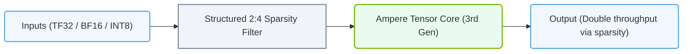

# 10.4c Second-gen Tensor Cores (Turing/Ampere): INT8, INT4, TF32, BF16

  📦 Nvidia GPU Architecture
  📖 GPU Microarchitecture

## 🧠 Context Introduction

Tensor Cores are specialized hardware units inside NVIDIA GPUs designed to perform **matrix multiply-and-accumulate operations** extremely fast. These operations are the foundation of deep learning — every neural network layer (convolution, fully connected, attention) relies on them.

The **second-generation Tensor Cores** arrived with the **Turing architecture** (2018) and were significantly enhanced in the **Ampere architecture** (2020). The key evolution was the introduction of **mixed-precision and lower-precision data types**: INT8, INT4, TF32, and BF16.

Why does this matter? Lower precision means smaller memory footprint and faster computation — but you must balance speed with accuracy. These Tensor Cores give you the flexibility to choose the right precision for your workload.

---

## ⚙️ What Are Second-Gen Tensor Cores?

Second-gen Tensor Cores are hardware accelerators that perform **D = A × B + C** operations (matrix multiply + accumulate) in a single clock cycle. They are physically located inside each **Streaming Multiprocessor (SM)** of the GPU.

Key improvements over first-gen (Volta):
- **More data types supported** — INT8, INT4, TF32, BF16 (in addition to FP16)
- **Higher throughput** — up to 2x performance per SM compared to Volta
- **Sparsity support** (Ampere) — can skip zero values for 2x speedup

---

## 📊 Supported Data Types and Their Use Cases

| Data Type | Bit Width | Range | Typical Use Case | Performance Gain vs FP32 |
|-----------|-----------|-------|------------------|--------------------------|
| **TF32** | 19 bits (10 exponent, 8 mantissa) | ~FP32 range | Training (drop-in replacement for FP32) | ~8x faster |
| **BF16** | 16 bits (8 exponent, 7 mantissa) | Same range as FP32 | Training (stable gradients) | ~2x faster than FP16 |
| **INT8** | 8 bits | -128 to 127 | Inference (quantized models) | ~16x faster than FP32 |
| **INT4** | 4 bits | -8 to 7 | Extreme inference (edge devices) | ~32x faster than FP32 |

---

## 🕵️ Deep Dive: Each Precision Type

### 🔢 TF32 (Tensor Float 32)
- **Introduced in:** Ampere (A100, A30)
- **How it works:** Uses the same 8-bit exponent as FP32 (so it covers the same dynamic range) but only 10 bits for the mantissa (vs 23 bits in FP32)
- **Why engineers use it:** You can replace **FP32** code with **TF32** without changing any code — it's a drop-in replacement. The GPU automatically converts FP32 inputs to TF32 inside the Tensor Core.
- **Trade-off:** Slightly lower precision than FP32, but often negligible for training convergence.

### 🔢 BF16 (Brain Floating Point 16)
- **Introduced in:** Ampere (A100, A30)
- **How it works:** Same 8-bit exponent as FP32, but only 7 bits for mantissa
- **Why engineers use it:** Excellent for training because the wide exponent range prevents gradient underflow (very small numbers don't vanish to zero)
- **Trade-off:** Lower precision than FP16 for small numbers, but better for large dynamic ranges

### 🔢 INT8 (Integer 8-bit)
- **Introduced in:** Turing (T4, RTX 20 series)
- **How it works:** Uses 8-bit integers instead of floating-point numbers
- **Why engineers use it:** Inference workloads can often tolerate lower precision. You **quantize** a trained FP32 model to INT8 — this reduces model size by 4x and speeds up inference by up to 16x
- **Trade-off:** Requires calibration to avoid accuracy loss

### 🔢 INT4 (Integer 4-bit)
- **Introduced in:** Ampere (A100, A30)
- **How it works:** Uses 4-bit integers — extremely aggressive quantization
- **Why engineers use it:** For edge deployment or when latency is critical (e.g., real-time video processing)
- **Trade-off:** Significant accuracy loss; requires careful quantization-aware training

---

### 📊 Visual Representation: Ampere 3rd Gen Tensor Core Precision Expansion
This diagram details the third-generation Tensor Core in Ampere, expanding precision formats to support TF32, BF16, and structured 2:4 sparsity.

## 🛠️ How Engineers Use These in Practice

### For Training
- **Default choice:** Use **TF32** for most layers — it's the safest and fastest drop-in for FP32
- **For very deep networks:** Use **BF16** to avoid gradient vanishing
- **For memory-bound models:** Use **FP16** (first-gen Tensor Cores still work well)

### For Inference
- **High accuracy needed:** Use **FP16** or **TF32**
- **Balanced speed/accuracy:** Use **INT8** with calibration
- **Maximum throughput:** Use **INT4** with quantization-aware training

### Example Workflow (No Code Blocks)

**Step 1:** Train your model in FP32 or TF32
**Step 2:** Evaluate accuracy
**Step 3:** Quantize to INT8 using NVIDIA's TensorRT
**Step 4:** Validate accuracy — if acceptable, deploy with INT8
**Step 5:** If accuracy drops too much, try BF16 or FP16 instead

---

## 📈 Performance Comparison (Relative to FP32)

| Operation | FP32 | TF32 (Ampere) | BF16 (Ampere) | INT8 (Turing/Ampere) | INT4 (Ampere) |
|-----------|------|---------------|---------------|----------------------|---------------|
| **Matrix Multiply (1x)** | 1x | ~8x | ~16x | ~32x | ~64x |
| **Memory Bandwidth** | 1x | ~2x | ~2x | ~4x | ~8x |
| **Model Size** | 1x | ~0.6x | ~0.5x | ~0.25x | ~0.125x |

---

## 🧪 Key Takeaways for New Engineers

- **Second-gen Tensor Cores are not just about speed** — they give you a **precision spectrum** to optimize for your specific workload
- **TF32 is your friend for training** — it's the easiest way to get a speed boost without changing code
- **INT8 is your friend for inference** — it's the most common quantization target for production deployments
- **BF16 is your friend for stability** — use it when training very deep networks or with large batch sizes
- **INT4 is experimental** — only use it if you have expertise in quantization-aware training

---

## 🔗 Related Topics to Explore Next

- **10.4a First-gen Tensor Cores (Volta): FP16** — The foundation
- **10.4b Tensor Core Programming Model** — How to call Tensor Cores from CUDA
- **10.4d Sparsity in Ampere Tensor Cores** — How skipping zeros doubles performance
- **10.4e Tensor Core Usage in Popular Frameworks** — PyTorch, TensorFlow, JAX

---

*Remember: The best precision is the lowest one that still gives you acceptable accuracy. Start with FP32/TF32, then gradually lower precision until accuracy drops — that's your sweet spot.*
